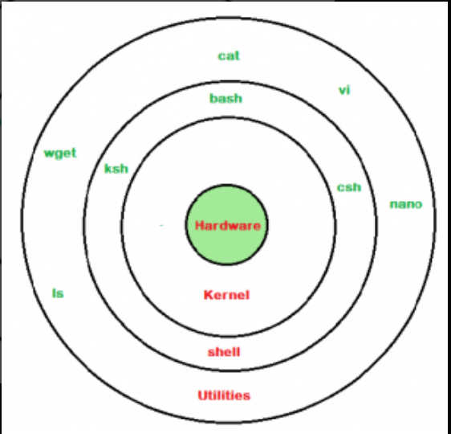
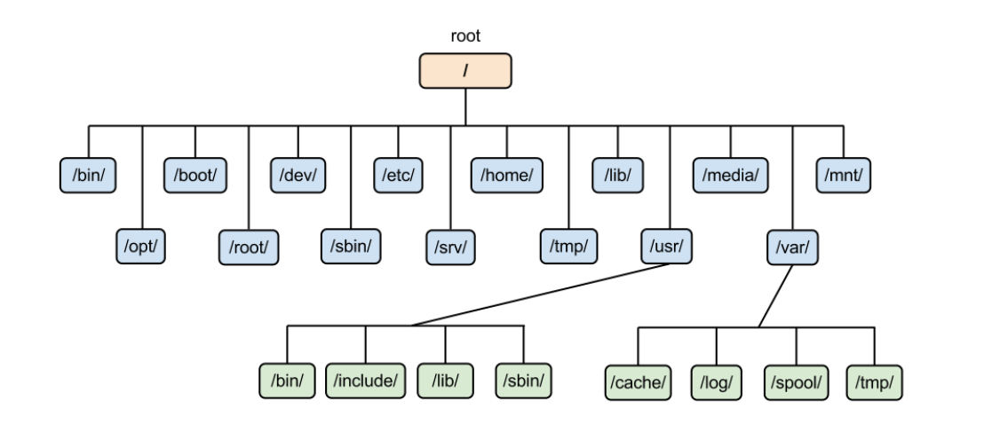
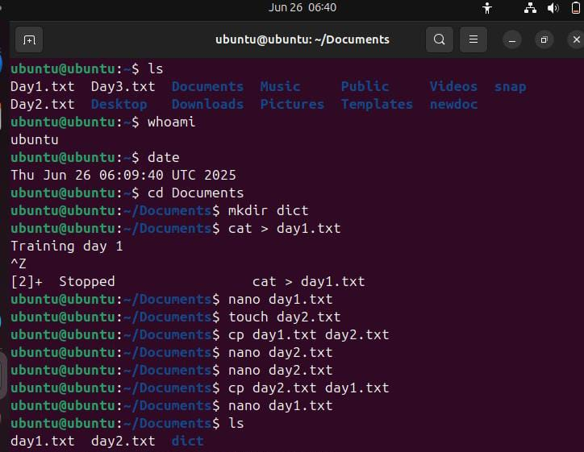
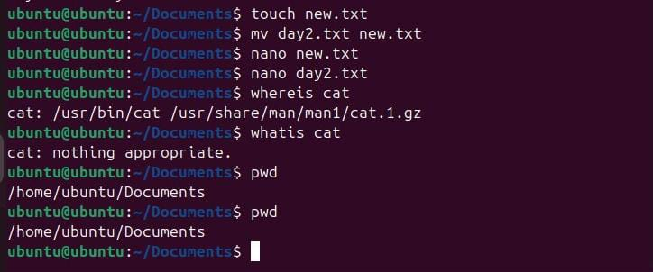

# Daily Report
## Training day :- 01
I am **Kanika**. Today was my first day of summer training in the **Computer Science Department(Parent branch)** . I was very excited about this training . Firstly there was an **orientation program** conducted for us in the **auditorium** . Here , I interacted with **Dr. Priyanka** who is professor in **Computer Scienec department** . She gave all the necessary information that was required and also welcomed all the students who are going to be part of the parent branch . She told us about socities , attendance creteria and many other things . Then , I interacted with **Head of Department, Dr. Kiran Jyoti** along with all the students . She also introduced a new scheme for **2024 year onwards students**. After this valuable interaction , all the students shifted to their respective labs . In the lab , our teacher explained the syllabus of this training that all the students will study in further days . Then she said that first day we will discuss about **Linux**.
Firstly i learned about **Linux** & **its importance** then why most of the **companies** & **coders** use **Linux** over **Windows** ? Following are the reasons behind it :- 
- Linux is **more secure** due to its permission-based system and fewer malware targets than windows.
- Linux is **open source** , so it can be easily available.
- Linux is **free** , while windows required paid license.
- Linux has large community.

---
  
  ### Difference between linux and window
  | Feature | Linux | Window |
  |---------|-------|--------|
  |   Type	|Open-source OS	|Proprietary OS|
  |  Cost	  | Free to use	  |Paid (license required)|
  |Security	| More secure,less virus-prone	|More vulnerable to malware|
  |Customization |	Highly customizable	| Limited customization|
  |Command Line	|Command line used often (Terminal)|Mostly GUI-based| 
  |Performance	|Lightweight, works well on older systems	|Requires more system resources|
  |User Interface |Depends on distro (e.g., Ubuntu, Fedora)|Standard and consistent UI|
  |Support for Software|Limited for some commercial software|Widely supported software (e.g., MS Office)|
  |Best for |	Developers, programmers, servers|General users, gamers, businesses|

  ---
  ### Uses of linux :-
  - Servers
  - Programming
  - Cybersecurity
  - Education
  - Cloud Computing
  - Networking
---
Here are **career opportunities with Linux** in short points:

1. **Linux System Administrator** – Manage Linux servers and systems.
2. **DevOps Engineer** – Automate deployment and infrastructure.
3. **Cloud Engineer** – Work with AWS, Azure, GCP using Linux servers.
4. **Cybersecurity Analyst** – Use Linux for ethical hacking and security.
5. **Software Developer** – Develop apps and tools on Linux platforms.
6. **Linux Support Engineer** – Troubleshoot Linux systems and provide tech support.
7. **Embedded Systems Engineer** – Build Linux-based systems for IoT, robotics.
8. **Data Scientist** – Use Linux for big data processing and analysis.
9. **Open Source Contributor** – Contribute to Linux and open-source projects.
10. **IT Trainer** – Teach Linux skills and prepare others for certifications.
----
  ### Installation of linux
  - Step 1: Download and Install VirtualBox
  - Step 2: Download Microsoft Visual C++ Redistributable
  - Step 3: Download Ubuntu ISO
  - Step 4: Create a Virtual Machine and Install Ubuntu

  ### Resources

1.  [Download Oracle Virtual Box](https://www.virtualbox.org)

2.  [Download Latest Visual C++ Redistributable](https://learn.microsoft.com/en-US/cpp/windows/latest-supported-vc-redist)

3.  [Download Ubuntu](https://tinyurl.com/csegndec)

  
---

### Study of Product-based company and Service-based comapany

- **Product-based Company**:- A company that builds and sells its **own products** like software,apps, or devices. **E.g.**:- Google , Microsoft.

- **Service-based Company**:- A comapny that provides **services to other companies** like software development,support or consulting. **E.g.**:- TCS , Infosys.

---
## Booting and its types 
I have also learned about booting and types-

### 🖥️ What is Booting?

**Booting** is the process of starting a computer.
When you switch on your computer, the system loads the operating system (like Windows or Linux) from the hard drive into the RAM (memory), so you can use the computer.

### 🔁 Booting Process :

1. **Power On** – You turn on the computer.
2. **POST (Power-On Self-Test)** – System checks hardware (RAM, keyboard, etc.).
3. **BIOS/UEFI Loads** – Basic system firmware starts.
4. **Boot Loader Activated** – BIOS/UEFI finds and runs the boot loader.
5. **OS Loading** – Boot loader loads the operating system into RAM.
6. **System Ready** – Operating system starts, and the computer is ready to use.

---

### 🧾 Types of Booting:

🔄 1. **Cold Booting (Hard Booting):**

➡️ **Meaning**: Starting the computer when it is completely turned off.

➡️ **Example**: You press the **power button** to turn on your computer after it was shut down – that's **cold booting**.

🔁 2. **Warm Booting (Soft Booting)**:

➡️ **Meaning**: Restarting the computer without turning off the power.

➡️ **Example**: You press **Ctrl + Alt + Del** or click **Restart** on Windows – that's **warm booting**.

🔧 3. **Dual Booting**:

➡️ **Meaning**: Having **two operating systems** installed and choosing one to run.

➡️ **Example**: Your laptop has Windows and Linux installed. At startup, you choose which one to use.

☁️ 4. **Network Booting (PXE Booting)**:

➡️ **Meaning**: Booting a computer from a **network server** instead of **local storage**.

➡️ **Example**: In a computer lab, systems boot from the college server using a LAN cable.

---

## Training Day :- 02
---
Day **two** of the **summer training program** picked up right where we left off , diving deeper into the concepts introduced yesterday. It brought with a fresh set of challenges and exciting new information . The instructor continued to provide insightful explanations making complex concepts easy to grasp . It was a productive day thaT further fueled my enthusiasm for the rest of the training .

---
## Structure of Linux shell



----

### Study of Kernel
The kernel is the core part of an operating system.

It manages the communication between hardware and software.

Also, it manages the following resources of the linux system :-

- Memory management
- File manangement
- Device management
- Process management
- I/O management etc

-----------------------------------

### Study of Shell

The shell is a program that acts as an interface between the user and the operating system.

It takes user commands and tells the operating system to perform tasks.

It lets you type commands to tell the computer what to do , like opening files , mananging programs.
 
 ### Types of Shell

Shells are mainly divided into two categories:

 **1. Command-Line Interface (CLI) Shells**

User interacts by typing commands

Fast and powerful for developers and system admins

Examples (Types of CLI Shells):

|Shell Name	|          Description                 |
|-----------|--------------------------------------|
|     sh	  |Bourne Shell (original Unix shell)    |
|    bash   |	Bourne Again Shell (most popular)    |
|   csh     |	      C Shell (C-like syntax)        |
|    ksh    |	   Korn Shell (advanced features)    |
|    zsh    |Z Shell (user-friendly & customizable)|
|-----------|--------------------------------------|

**2. Graphical User Interface (GUI) Shells**

User interacts using windows, icons, and buttons

Easy for beginners

**Example** : GNOME, KDE (on Linux)

----

## 📁 Linux File System Structure 

A file system structure is the way an operating system organizes and manages data (files and folders) on a storage device like a hard disk or SSD.

It defines:

    How files are stored

    How folders (directories) are arranged

    How the system keeps track of file locations and permissions

The Linux file system is organized **like a tree**, starting from the **root** directory `/`.  
All files and folders are inside this root, even if they are on different drives.



The file system structure is like a **digital cabinet** that helps the OS and users **to keep data organized and easy to access**

### 🌳 Main Folders in Linux File System

| Directory | Meaning |
|-----------|---------|
| `/`       | **Root** – Starting point of the file system |
| `/bin`    | Essential **binaries** (like `ls`, `cp`, etc.) |
| `/boot`   | Files needed to **boot** the system |
| `/etc`    | System **configuration** files |
| `/home`   | Personal folders for **users** (like `/home/kanika`) |
| `/lib`    | Shared **libraries** for programs |
| `/media`  | Used to mount **USB drives, CDs** etc. |
| `/opt`    | **Optional software** packages |
| `/root`   | **Home directory** of the root user |
| `/sbin`   | System **admin commands** |
| `/tmp`    | Temporary files (auto-deleted) |
| `/usr`    | User-related programs and data |
| `/var`    | Variable data (like **logs**, mails) |

---

#### 📌 Key Points

- The top-level directory is `/` (called **root**).
- Everything is organized under `/` like branches of a tree.
- Linux does **not** use drive letters like Windows (C:, D:) — everything is part of the same tree.

  -----
  
## 🖥️ Basic Shell Commands in Linux (With Syntax)

| Command | Description | Syntax | Example |
|--------|-------------|--------|---------|
| `ls` | Lists files and folders | `ls [options]` | `ls -l` |
| `cd` | Changes directory | `cd [directory]` | `cd /home/user` |
| `mkdir` | Creates a new folder | `mkdir [folder_name]` | `mkdir myfolder` |
| `rmdir` | Removes an empty folder | `rmdir [folder_name]` | `rmdir myfolder` |
| `touch` | Creates a new empty file | `touch [file_name]` | `touch file.txt` |
| `rm` | Removes files or folders | `rm [file/folder]` | `rm file.txt` |
| `cp` | Copies files/folders | `cp [source] [destination]` | `cp file.txt /home/user/` |
| `mv` | Moves or renames files/folders | `mv [source] [destination]` | `mv file.txt newname.txt` |
| `cat` | Displays contents of a file | `cat [file_name]` | `cat file.txt` |
| `whatis` | Gives a one-line description of a command | `whatis [command]` | `whatis ls` |
| `whereis` | Shows location of binary, source, and man page | `whereis [command]` | `whereis gcc` |
| `clear` | Clears the terminal screen | `clear` | `clear` |
| `man` | Shows manual/help for a command | `man [command]` | `man ls` |
| `exit` | Closes the terminal session | `exit` | `exit` |
| `pwd` | Shows current directory path | `pwd` | `pwd` |

---





📌 Use these commands in the terminal to manage files, navigate folders, and control your Linux system.

**To use terminal command Ctrl + Alt + T**

# Training Day :- 03
No problem! Here's the **complete, short, and attractive note** including `chmod`, `chmod 444`, `chmod 644`, and also `chown`, formatted for your **GitHub profile (Markdown)**:

---

## 🔐 Linux File Permission Commands – `chmod`, `chmod 444`, `chmod 644`, `chown`

---

### ✅ **1. `chmod` (Change File Permissions)**

`chmod` is used to change read, write, and execute permissions of a file or directory.

#### 🔸 **Syntax**:

```bash
chmod [permissions] [file_name]
```
**For example:** chmod + x filename.sh

#### 🔢 **Octal Permission Codes**:

| Number | Symbol | Meaning              |
| ------ | ------ | -------------------- |
| 7      | rwx    | Read, Write, Execute |
| 6      | rw-    | Read, Write          |
| 5      | r-x    | Read, Execute        |
| 4      | r--    | Read only            |
| 0      | ---    | No permissions       |

---

### 🧪 **Examples**:

#### 🔹 `chmod 444 file.txt`

* **Read-only for everyone**

```bash
chmod 444 file.txt
```

⟶ `r-- r-- r--`

#### 🔹 `chmod 644 file.txt`

* **User: Read & Write, Others: Read-only**

```bash
chmod 644 file.txt
```

⟶ `rw- r-- r--`

#### 🔹 `chmod 755 script.sh`

* **User: Full access, Others: Read & Execute**

```bash
chmod 755 script.sh
```

⟶ `rwx r-x r-x`

---

### ✅ **2. `chown` (Change File Owner)** [ASSIGNMENT]

`chown` changes the **owner** or **group** of a file or directory.

#### 🔸 **Syntax**:

```bash
chown [new_owner] [file_name]
```

#### 🔸 **Change Owner and Group**:

```bash
chown user:group file.txt
```

#### 🧪 **Example**:

```bash
chown kanika file.txt
```

⟶ Sets `kanika` as the new owner of `file.txt`

---

### 📎 **Check Permissions**:

```bash
ls -l file.txt
```

---

> 🔁 **Quick Tip**:
> `chmod` = change permissions
> `chown` = change owner

---

Let me know if you want a visual table or icon-enhanced version for your GitHub README!


