# Daily Report
## Training day :- 01
I am **Kanika**. Today was my first day of summer training in the **Computer Science Department(Parent branch)** . I was very excited about this training . Firstly there was an **orientation program** conducted for us in the **auditorium** . Here , I interacted with **Dr. Priyanka** who is professor in **Computer Scienec department** . She gave all the necessary information that was required and also welcomed all the students who are going to be part of the parent branch . She told us about socities , attendance creteria and many other things . Then , I interacted with **Head of Department, Dr. Kiran Jyoti** along with all the students . She also introduced a new scheme for **2024 year onwards students**. After this valuable interaction , all the students shifted to their respective labs . In the lab , our teacher explained the syllabus of this training that all the students will study in further days . Then she said that first day we will discuss about **Linux**.
Firstly i learned about **Linux** & **its importance** then why most of the **companies** & **coders** use **Linux** over **Windows** ? Following are the reasons behind it :- 
- Linux is **more secure** due to its permission-based system and fewer malware targets than windows.
- Linux is **open source** , so it can be easily available.
- Linux is **free** , while windows required paid license.
- Linux has large community.

---
  
  ### Difference between linux and window
  | Feature | Linux | Window |
  |---------|-------|--------|
  |   Type	|Open-source OS	|Proprietary OS|
  |  Cost	  | Free to use	  |Paid (license required)|
  |Security	| More secure,less virus-prone	|More vulnerable to malware|
  |Customization |	Highly customizable	| Limited customization|
  |Command Line	|Command line used often (Terminal)|Mostly GUI-based| 
  |Performance	|Lightweight, works well on older systems	|Requires more system resources|
  |User Interface |Depends on distro (e.g., Ubuntu, Fedora)|Standard and consistent UI|
  |Support for Software|Limited for some commercial software|Widely supported software (e.g., MS Office)|
  |Best for |	Developers, programmers, servers|General users, gamers, businesses|

  ---
  ### Uses of linux :-
  - Servers
  - Programming
  - Cybersecurity
  - Education
  - Cloud Computing
  - Networking
---
Here are **career opportunities with Linux** in short points:

1. **Linux System Administrator** – Manage Linux servers and systems.
2. **DevOps Engineer** – Automate deployment and infrastructure.
3. **Cloud Engineer** – Work with AWS, Azure, GCP using Linux servers.
4. **Cybersecurity Analyst** – Use Linux for ethical hacking and security.
5. **Software Developer** – Develop apps and tools on Linux platforms.
6. **Linux Support Engineer** – Troubleshoot Linux systems and provide tech support.
7. **Embedded Systems Engineer** – Build Linux-based systems for IoT, robotics.
8. **Data Scientist** – Use Linux for big data processing and analysis.
9. **Open Source Contributor** – Contribute to Linux and open-source projects.
10. **IT Trainer** – Teach Linux skills and prepare others for certifications.
----
  ### Installation of linux
  - Step 1: Download and Install VirtualBox
  - Step 2: Download Microsoft Visual C++ Redistributable
  - Step 3: Download Ubuntu ISO
  - Step 4: Create a Virtual Machine and Install Ubuntu

  ### Resources

1.  [Download Oracle Virtual Box](https://www.virtualbox.org)

2.  [Download Latest Visual C++ Redistributable](https://learn.microsoft.com/en-US/cpp/windows/latest-supported-vc-redist)

3.  [Download Ubuntu](https://tinyurl.com/csegndec)

  
---

### Study of Product-based company and Service-based comapany

- **Product-based Company**:- A company that builds and sells its **own products** like software,apps, or devices. **E.g.**:- Google , Microsoft.

- **Service-based Company**:- A comapny that provides **services to other companies** like software development,support or consulting. **E.g.**:- TCS , Infosys.

---
## Booting and its types 
I have also learned about booting and types-

### 🖥️ What is Booting?

**Booting** is the process of starting a computer.
When you switch on your computer, the system loads the operating system (like Windows or Linux) from the hard drive into the RAM (memory), so you can use the computer.

### 🔁 Booting Process :

1. **Power On** – You turn on the computer.
2. **POST (Power-On Self-Test)** – System checks hardware (RAM, keyboard, etc.).
3. **BIOS/UEFI Loads** – Basic system firmware starts.
4. **Boot Loader Activated** – BIOS/UEFI finds and runs the boot loader.
5. **OS Loading** – Boot loader loads the operating system into RAM.
6. **System Ready** – Operating system starts, and the computer is ready to use.

---

### 🧾 Types of Booting:

🔄 1. **Cold Booting (Hard Booting):**

➡️ **Meaning**: Starting the computer when it is completely turned off.

➡️ **Example**: You press the **power button** to turn on your computer after it was shut down – that's **cold booting**.

🔁 2. **Warm Booting (Soft Booting)**:

➡️ **Meaning**: Restarting the computer without turning off the power.

➡️ **Example**: You press **Ctrl + Alt + Del** or click **Restart** on Windows – that's **warm booting**.

🔧 3. **Dual Booting**:

➡️ **Meaning**: Having **two operating systems** installed and choosing one to run.

➡️ **Example**: Your laptop has Windows and Linux installed. At startup, you choose which one to use.

☁️ 4. **Network Booting (PXE Booting)**:

➡️ **Meaning**: Booting a computer from a **network server** instead of **local storage**.

➡️ **Example**: In a computer lab, systems boot from the college server using a LAN cable.

---

## Training Day :- 02
---
Day **two** of the **summer training program** picked up right where we left off , diving deeper into the concepts introduced yesterday. It brought with a fresh set of challenges and exciting new information . The instructor continued to provide insightful explanations making complex concepts easy to grasp . It was a productive day thaT further fueled my enthusiasm for the rest of the training .

---
## Structure of Linux shell


----

### Study of Kernel
The kernel is the core part of an operating system.

It manages the communication between hardware and software.

Also, it manages the following resources of the linux system :-

- Memory management
- File manangement
- Device management
- Process management
- I/O management etc

-----------------------------------

### Study of Shell

The shell is a program that acts as an interface between the user and the operating system.

It takes user commands and tells the operating system to perform tasks.

It lets you type commands to tell the computer what to do , like opening files , mananging programs.
 
 ### Types of Shell

Shells are mainly divided into two categories:

 **1. Command-Line Interface (CLI) Shells**

User interacts by typing commands

Fast and powerful for developers and system admins

Examples (Types of CLI Shells):

|Shell Name	|          Description                 |
|-----------|--------------------------------------|
|     sh	  |Bourne Shell (original Unix shell)    |
|    bash   |	Bourne Again Shell (most popular)    |
|   csh     |	      C Shell (C-like syntax)        |
|    ksh    |	   Korn Shell (advanced features)    |
|    zsh    |Z Shell (user-friendly & customizable)|
|-----------|--------------------------------------|

### 🐚 What is **Bash**?

**Bash** stands for **Bourne Again SHell**.
It is a **command-line shell** used in **Linux** and **Unix-based systems** to **interact with the operating system**.

---

### 🔹 **Simple Definition:**

> **Bash** is a program that lets you **type commands** to control your computer without using the mouse.

---

### ✅ **Key Features:**

* Used to **run commands** like creating files, copying, moving, or deleting.
* Supports **scripting**, so you can **automate tasks** with `.sh` files.
* Built-in on **Linux**, **macOS**, and available for **Windows** (via WSL or Git Bash).

---

### 🧠 **Example Bash Commands:**

```bash
ls       # list files
cd       # change directory
mkdir    # make a new folder
rm       # remove files/folders
echo     # print text
```

---

### 📜 **Example of a Bash Script:**

```bash
#!/bin/bash
echo "Hello, Kanika!"
mkdir my_folder
cd my_folder
touch file.txt
```

---

### 🔁 **Why Bash is Important:**

* Core part of **Linux system administration**.
* Helps in **automation** (via shell scripting).
* Essential for **DevOps**, **ethical hacking**, **software development**, and more.

---

Let me know if you want a **Bash cheat sheet** or beginner guide PDF!

**2. Graphical User Interface (GUI) Shells**

User interacts using windows, icons, and buttons

Easy for beginners

**Example** : GNOME, KDE (on Linux)

----

## 📁 Linux File System Structure 

A file system structure is the way an operating system organizes and manages data (files and folders) on a storage device like a hard disk or SSD.

It defines:

   * How files are stored

   * How folders (directories) are arranged

   * How the system keeps track of file locations and permissions

The Linux file system is organized **like a tree**, starting from the **root** directory `/`.  
All files and folders are inside this root, even if they are on different drives.


The file system structure is like a **digital cabinet** that helps the OS and users **to keep data organized and easy to access**

### 🌳 Main Folders in Linux File System

| Directory | Meaning |
|-----------|---------|
| `/`       | **Root** – Starting point of the file system |
| `/bin`    | Essential **binaries** (like `ls`, `cp`, etc.) |
| `/boot`   | Files needed to **boot** the system |
| `/etc`    | System **configuration** files |
| `/home`   | Personal folders for **users** (like `/home/kanika`) |
| `/lib`    | Shared **libraries** for programs |
| `/media`  | Used to mount **USB drives, CDs** etc. |
| `/opt`    | **Optional software** packages |
| `/root`   | **Home directory** of the root user |
| `/sbin`   | System **admin commands** |
| `/tmp`    | Temporary files (auto-deleted) |
| `/usr`    | User-related programs and data |
| `/var`    | Variable data (like **logs**, mails) |

---

#### 📌 Key Points

- The top-level directory is `/` (called **root**).
- Everything is organized under `/` like branches of a tree.
- Linux does **not** use drive letters like Windows (C:, D:) — everything is part of the same tree.

  -----
## 💽 What is Slash Full Disk in Linux?

In Linux, when someone says **"slash full disk"** or **"/ is full"**, it means the **root directory (`/`)** has **no free space left**.

---

### ✅ What is `/` (Slash) in Linux?

- `/` is called the **root directory**.
- It is the **starting point** of the entire Linux file system.
- All other folders like `/home`, `/etc`, `/bin`, etc., exist inside `/`.

---

### 🚨 What Does "Slash Full Disk" Mean?

- The **main partition** of Linux (where it’s installed) is **completely full**.
- No space is available to save files, install software, or update the system.

---

### ⚠️ Why Is It a Problem?

- System becomes **slow** or may **crash**.
- You can’t install or update software.
- Some apps and services may stop working.

---

### 🛠️ How to Check If `/` Is Full?
           df -h /
          
📌 Quick Summary
|  Term  | Meaning |
|--------|---------|
| / (Slash)|	Root directory (main Linux filesystem)|
|Slash Full Disk|	The root disk is full – no free space left|
## 🖥️ Basic Shell Commands in Linux (With Syntax)

| Command | Description | Syntax | Example |
|--------|-------------|--------|---------|
| `ls` | Lists files and folders | `ls [options]` | `ls -l` |
| `cd` | Changes directory | `cd [directory]` | `cd /home/user` |
| `mkdir` | Creates a new folder | `mkdir [folder_name]` | `mkdir myfolder` |
| `rmdir` | Removes an empty folder | `rmdir [folder_name]` | `rmdir myfolder` |
| `touch` | Creates a new empty file | `touch [file_name]` | `touch file.txt` |
| `rm` | Removes files or folders | `rm [file/folder]` | `rm file.txt` |
| `cp` | Copies files/folders | `cp [source] [destination]` | `cp file.txt /home/user/` |
| `mv` | Moves or renames files/folders | `mv [source] [destination]` | `mv file.txt newname.txt` |
| `cat` | Displays contents of a file | `cat [file_name]` | `cat file.txt` |
| `whatis` | Gives a one-line description of a command | `whatis [command]` | `whatis ls` |
| `whereis` | Shows location of binary, source, and man page | `whereis [command]` | `whereis gcc` |
| `clear` | Clears the terminal screen | `clear` | `clear` |
| `man` | Shows manual/help for a command | `man [command]` | `man ls` |
| `exit` | Closes the terminal session | `exit` | `exit` |
| `pwd` | Shows current directory path | `pwd` | `pwd` |

**Point to remember** : 
    
    **cd ..** (moves up one directory that means it will take out of that box and into the box it was placed inside)
  
**Example**:
  
  If you are currently in: /home/user/documents/reports/
  Typing cd .. will take you to: /home/user/documents/

---


**nano** command :

   - A text editor in linux
   - Beginner-friendly
   - Simple and clear

*Important shortcut keys*:

 - Ctrl + O → Save the file (O for Output)
 - Ctrl + X → Exit
 - Ctrl + K → Cut a line
 - Ctrl + U → Paste

**vi editor**:

    It is also a text editor
    The older, more powerful one
    Comes pre-installed in all Linux systems
    Harder for beginners


📌 Use these commands in the terminal to manage files, navigate folders, and control your Linux system.

**To use terminal command , Press Ctrl + Alt + T**

## 🖥️ VMware vs VirtualBox – Simple Difference

Both **VMware** and **VirtualBox** are **virtualization software**.  
They let you **run another operating system** (like Linux) **inside your current OS** (like Windows), without removing or changing anything.

---

### ✅ What Do They Mean?

| Software     | Meaning                                                                 |
|--------------|-------------------------------------------------------------------------|
| **VMware**   | A professional virtualization tool used for creating and managing VMs. |
| **VirtualBox** | A free, open-source virtualization tool made by Oracle.                |

---

### 🔁 Main Difference :

| Feature             | **VirtualBox**                          | **VMware**                              |
|---------------------|-----------------------------------------|-----------------------------------------|
| Cost                | ✅ Free (Open Source)                   | ⚠️ Some versions are paid (e.g., Workstation Pro) |
| User Friendly       | ✅ Beginner-friendly                    | ✅ Professional features, less beginner-focused |
| Performance         | ⚠️ Good but slightly lower             | 🚀 Generally faster and smoother         |
| OS Support          | ✅ Windows, Linux, macOS                | ✅ Windows, Linux (macOS limited)         |
| Ideal For           | Students, learners, open-source fans   | Professional users, enterprise setups   |

---

### 💡 Summary:

> Both let you create **virtual machines (VMs)**.  
> Use **VirtualBox** for learning and free use.  
> Use **VMware** if you want more speed and pro features.

## 📦 What is an ISO File?

An **ISO file** (also called an **ISO image**) is a **complete copy or digital version of a CD, DVD, or other disk**, stored in a **single file**.  
It contains **all the data, files, and folders** needed to create a full copy of the original disk.

---

### ✅ In Linux, What Is It Used For?

- ISO files are used to **distribute operating systems** like **Ubuntu**, **Fedora**, **Kali**, etc.
- You download the ISO file and then **write it to a USB drive** to install Linux on your system.

---
### 📌 Key Points:

| Feature        | Description                                               |
|----------------|-----------------------------------------------------------|
| File Extension | `.iso`                                                    |
| Contains       | Full copy of an OS or disk (bootable installer)           |
| Common Use     | To install Linux, Windows, or other operating systems     |

----

## 🖥️ What is Bare Metal Installation in Linux?

**Bare Metal Installation** means installing Linux **directly on a computer's hardware** — not inside any other operating system or virtual machine.

You are installing Linux on a **fresh or empty computer**, just like installing Windows on a new laptop.

---

### ✅ Why is it called "Bare Metal"?

Because the installation is done **on the actual physical machine** — the "bare metal" — without any layers like:

- No Windows
- No VirtualBox
- No VMware

---

**🛠️ Simple Example: Installing Ubuntu on Bare Metal**

#### 📌 Where Bare Metal is Used:

- In **servers** (no need for Windows)
- For **learning real Linux**
- In **offices or companies** that use Linux systems
- When you want **full performance** (no lag from virtual machines)

---

#### 🔁 Difference (Simple Table)

| Feature           | Bare Metal Linux     | Virtual Machine Linux     |
|------------------|----------------------|----------------------------|
| Runs directly on hardware | ✅ Yes           | ❌ No (runs inside another OS) |
| Needs Windows?   | ❌ No                 | ✅ Yes (as host OS)         |
| Speed            | 🚀 Fast               | 🐢 Slower (shared resources) |
| Good for         | Real use, servers     | Practice, testing          |

---

### 💡 Tip:

> If you want to use Linux like a real system (not inside Windows), go for **bare metal installation**. It's faster and gives you full control over the machine.

---

# Training Day :- 03

---
### 💾 What is a **Partitioning Scheme**?

> A **partitioning scheme** is a method used to **organize a hard drive** into parts, so operating systems can manage and access data properly.

---

### 🔹 **Why Partitioning is Needed?**

* To **install multiple OS** (e.g., Linux + Windows).
* To **separate system files and personal files**.
* For **better data management and backup**.
* To **improve performance** and **security**.

---

### 🧱 **Common Partitioning Schemes:**

| Scheme                           | Description                                   | Max Partitions | OS Support            |
| -------------------------------- | --------------------------------------------- | -------------- | --------------------- |
| **MBR** (Master Boot Record)     | Older scheme, supports BIOS booting           | 4 primary      | Windows, Linux        |
| **GPT** (GUID Partition Table)   | Modern, supports UEFI booting and large disks | 128 primary    | Windows, Linux, macOS |
| **LVM** (Logical Volume Manager) | Used in Linux, flexible for resizing          | Dynamic        | Linux only            |

---

### 📌 **Example:**

When you install Linux:

* You create a partition for **root (`/`)**
* One for **home (`/home`)**
* One for **swap**

That setup is based on a **Linux partitioning scheme**.

---

## 🔐 Linux File Permission Commands – `chmod`, `chmod 444`, `chmod 644`, `chown`

Linux uses file permissions to control **who can read, write, or execute files and directories**. The `chmod` command allows us to modify these permissions. Every file and directory has **permissions** assigned to three types of users — **owner(u)**, **group(g)**, and **others(o)**. These permissions determine whether a user can **read**, **write**, or **execute** the file.

---

### ✅ **1. `chmod` (Change File Permissions)**
To **change file or directory permissions** in Linux for the owner, group, and others.

#### 🔸 **Syntax**:

```bash
chmod [permissions] [file_name]
```
**For example:** chmod + x filename.sh

## 🔧 `chmod +x filename.sh`

### 📘 What Does It Do?
The command `chmod +x filename.sh` is used to **add execute permission** to a file (usually a script like `.sh`), so it can be **run as a program**.

---

### 🔍 Syntax Breakdown

| Component     | Description                                                  |
| ------------- | ------------------------------------------------------------ |
| `chmod`       | Stands for **Change Mode** – used to change file permissions |
| `+x`          | Adds **execute** permission                                  |
| `filename.sh` | The name of the shell script file                            |

---

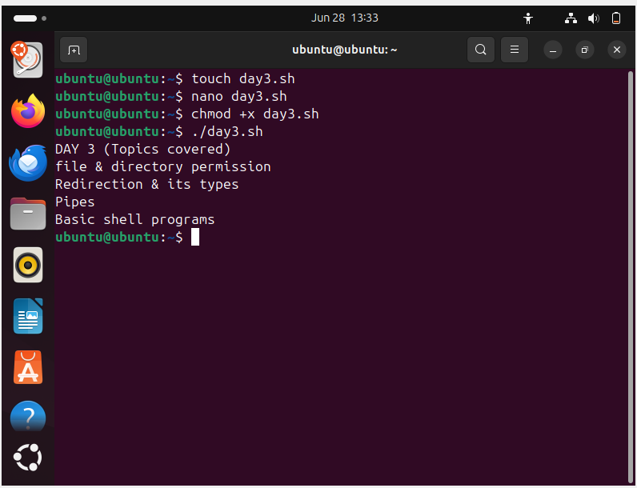

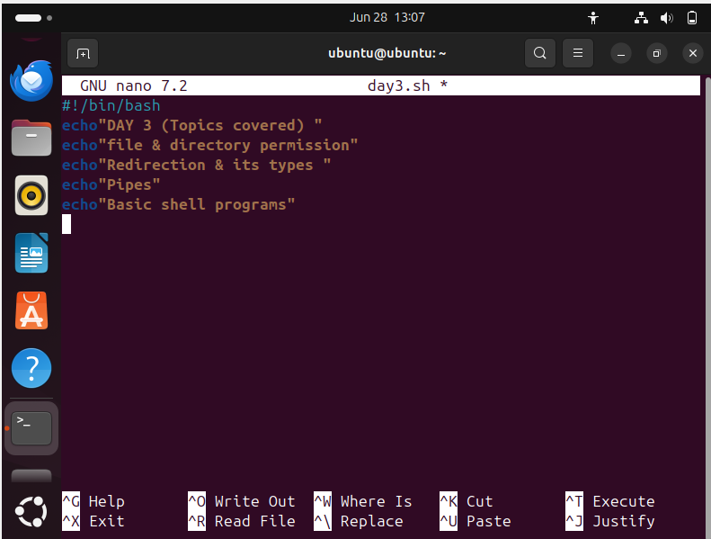


### ✅ Purpose

This command makes a file **executable** by the **user, group, and others (by default)**.
You can then run the script directly using:

```bash
./filename.sh
```

Without execute permission, you'll see:

```
bash: ./filename.sh: Permission denied

```
### 💡 Pro Tip

To give execute permission **only to the file owner**, use:

```bash
chmod u+x filename.sh
```
This is a safer option when sharing code in teams or on public systems.

---


#### 🔢 **Octal Permission Codes**:

| Number | Symbol | Meaning              |
| ------ | ------ | -------------------- |
| 7      | rwx    | Read, Write, Execute |
| 6      | rw-    | Read, Write          |
| 5      | r-x    | Read, Execute        |
| 4      | r--    | Read only            |
| 0      | ---    | No permissions       |

---

### 🧪 **Examples**:

#### 🔹 `chmod 444 file.txt`
To make a file **read-only** for everyone (owner, group, and others). Prevents editing or deletion.


```bash
chmod 444 file.txt
```

⟶ `r-- r-- r--`


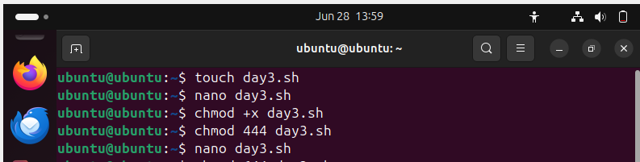

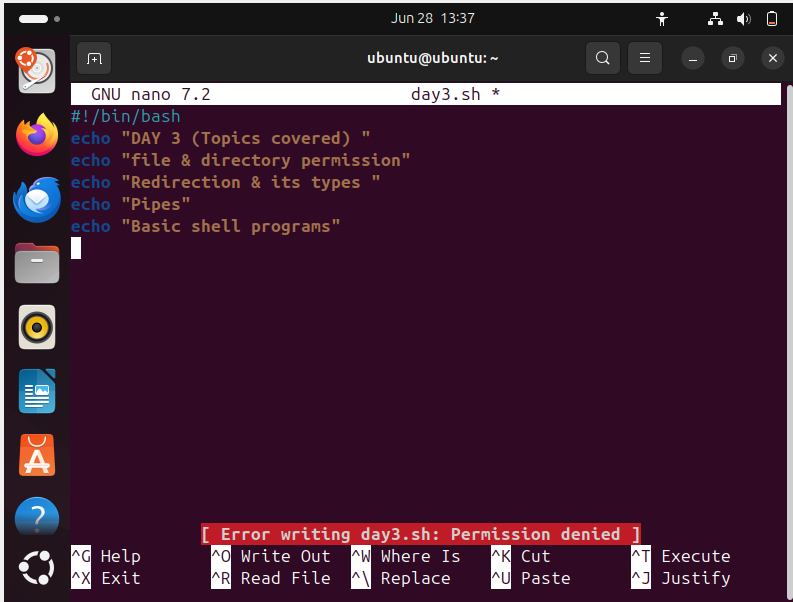


#### 🔹 `chmod 644 file.txt`

To allow the owner to **read and write**, and **group & others to only read**. Commonly used for text/config files.
🔸 Now only the owner can edit, while others can only read the file.

```bash
chmod 644 file.txt
```

⟶ `rw- r-- r--`

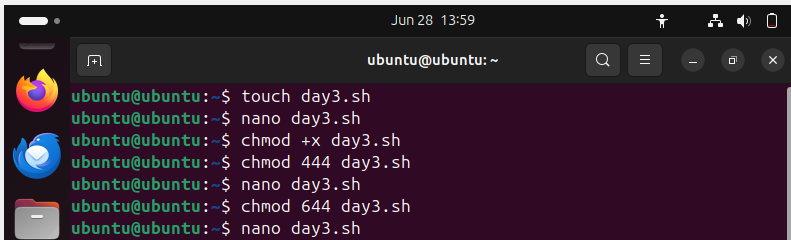

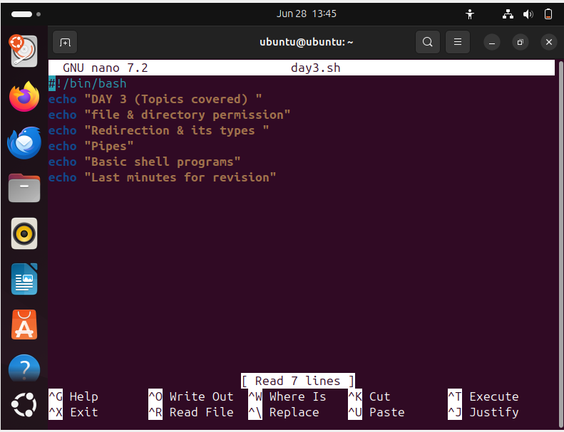

### ✅ **2. `chown` (Change File Owner)** [ASSIGNMENT]

`chown` changes the **owner** or **group** of a file or directory.

**Syntax**:
#### 🔸**change owner**:

```bash
chown [new_owner] [file_name]
```
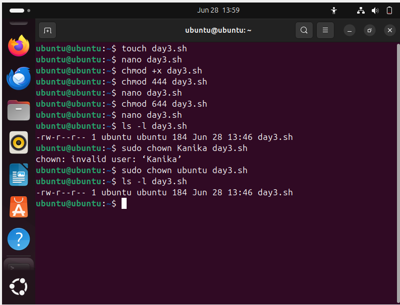

#### 🔸 **Change Owner and Group**:

```bash
chown user:group file.txt
```

✅ **Examples**:

    chown kanika file.txt → Changes the owner to kanika

    chown root:admin file.txt → Changes owner to root and group to admin
---

### 📎 **Check Permissions**:
✅ *Tip*: Use ls -l to view current permissions:

 ```bash
 ls -l file.txt
 ```
---

> 🔁 **Quick Tip**:

> `chmod` = change permissions

> `chown` = change owner

**Point to remember**:

When working with system files, it's often necessary to use **sudo** to **execute chmod** with root privileges.

---
## 🔄 Redirection in Linux

In Linux, **redirection** is a powerful feature used to control **input and output** of commands. It allows you to **save output to files, read from files, or even combine and filter output streams**. This is widely used in scripting and system automation. Redirection operator is ">"

### 🔄 Types of Redirection in Linux

Redirection is used in Linux to control where input comes from and where output or error messages go. It helps in saving outputs to files, reading inputs from files, and managing errors effectively.

--

| **Operator** | **Meaning**                    | **Example**                        | **Result**                                             |
|--------------|--------------------------------|------------------------------------|--------------------------------------------------------|
| `>`          | Output redirection             | `ls > files.txt`                   | Saves output to `files.txt` (overwrites if it exists)  |
| `>>`         | Append output                  | `echo "Hello" >> notes.txt`        | Adds `"Hello"` to end of `notes.txt`                  |
| `<`          | Input redirection              | `wc -l < notes.txt`                | Reads input from `notes.txt` instead of keyboard       |

> 🧠 **Tip**: Use redirection to log outputs, handle errors gracefully, and automate input/output in shell scripts.

## 📢 `echo` Command in Linux

The `echo` command is used to **display text, strings, or variables** on the terminal. It’s one of the most commonly used commands in **shell scripting, logging, and debugging**.

---

### ✅ What Does `echo` Do?

- Prints **text or output** to the screen.
- Displays the value of **environment variables**.
- Writes output to **files using redirection**.
- Supports **escape characters** for formatting.

---

### 📌 Syntax:
```bash
echo [option] [string or variable]
````

---

### 🔹 Basic Examples

| **Command**          | **Description**            | **Output**           |
| -------------------- | -------------------------- | -------------------- |
| `echo Hello, Linux!` | Print a simple message     | `Hello, Linux!`      |
| `echo $USER`         | Show current username      | `kanika` *(example)* |
| `echo "Home: $HOME"` | Print environment variable | `Home: /home/kanika` |

---

### 🔍 Formatting Output with `-e` Flag

Use `-e` to interpret special escape characters like new lines or tabs.

| **Escape** | **Meaning** | **Example**                 | **Output**       |
| ---------- | ----------- | --------------------------- | ---------------- |
| `\n`       | New Line    | `echo -e "Line1\nLine2"`    | Line1 <br> Line2 |
| `\t`       | Tab space   | `echo -e "Name:\tKanika"`   | Name: Kanika     |
| `\\`       | Backslash   | `echo -e "Path: C:\\Users"` | Path: C:\Users   |

---

### 💡 Pro Tips

* Use `echo` in shell scripts to print progress or debug messages.
* Combine with `>` or `>>` for **logging** outputs to files.
* Works with **variables**, **escape sequences**, and **redirection**.

---

## 🚰 Pipe (`|`) in Linux

In Linux, the **pipe operator (`|`)** is used to **pass the output of one command as input to another**.  
It helps you build powerful command chains by combining simple commands to perform complex tasks.

---

### ✅ What Does a Pipe Do?

- Connects **stdout (output)** of one command to the **stdin (input)** of another.
- Helps create efficient **one-liners** without the need for intermediate files.
- Commonly used in **filtering**, **sorting**, **counting**, and **processing data**.

---

### 📌 Syntax:

```bash
command1 | command2
````

➡ The output of `command1` becomes the input of `command2`.

---
**Example**: sort – Sort file content

    cat file.txt | sort

✅ What it does:

  - Reads the content of file.txt
  - Sorts the lines alphabetically using sort

📤 Output:
Sorted version of the file content, line by line.

### 🧠 Pro Tips:

* Pipes work **left to right**: output of the left command goes to the right.

* You can **chain multiple pipes**

## Shell Programs

### Program 1 : To display name , age and city

.png)

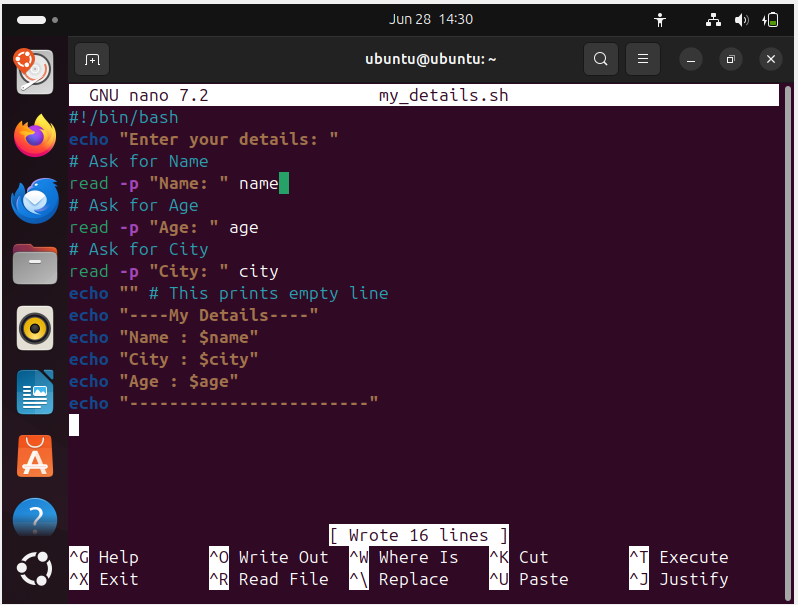


### Program 2 : To print multiplication table

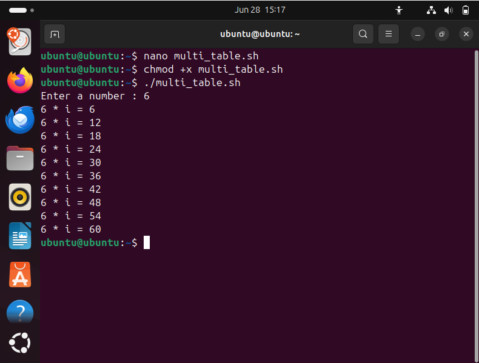

.png)


### Program 3 : To compare two numbers

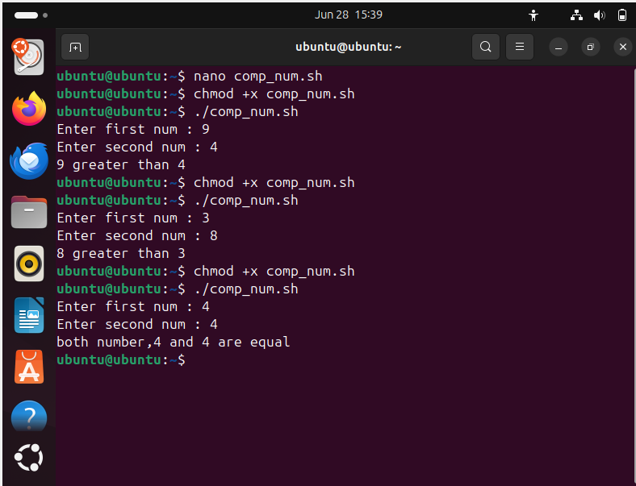

.png)

## 📦 File Compression

File compression is the process of **reducing the size of a file or group of files**. This is done to save storage space or make files easier and faster to transfer over the internet.

**🧠 Why Compress Files?**

    ✅ Saves disk space

    ✅ Speeds up file transfer

    ✅ Reduces bandwidth usage

    ✅ Helps in organizing multiple files together (archiving)

### 📦 File Compression using `gzip`

`gzip` (GNU zip) is a popular **lossless file compression** utility used mainly in **Linux/Unix** systems. It uses the **DEFLATE** algorithm to reduce file size without losing data.

### 🔍 Purpose of `gzip`

- Reduce file size to save disk space
- Speed up file transfer (especially over networks)
- Commonly used with `tar` for folder compression (`.tar.gz`)

---

### 🔧 Basic Syntax & Usage

#### 👉 Compress a file

**gzip filename**

 * Compresses filename to filename.gz

 * Output: filename.gz

 * By default, replaces the original file

### 👉 Decompress a file

**gunzip filename.gz**

 * Restores the original `filename`

---

### ⚙️ Common `gzip` Options

| Option | Description                              |
| ------ | ---------------------------------------- |
| `-d`   | Decompress (same as `gunzip`)            |
| `-k`   | Keep the original file after compression |
| `-r`   | Compress files recursively (folders)     |
| `-v`   | Verbose – show the compression process   |
| `-l`   | Display compression statistics/info      |

### 🔸 Example:

**gzip -kv myfile.txt**

* Compresses `myfile.txt` to `myfile.txt.gz`
* Keeps the original file
* Displays compression details

#### 📁 Compressing Folders using 'tar' + 'gzip'

Since gzip works on **individual files**, use 'tar' to archive folders first:

#### 👉 Compress a directory:

'tar -czvf archive.tar.gz foldername/'
   
  * c: Create archive

  * z: Compress using gzip

  * v: Verbose

  * f: Output file name

### 👉 Extract .tar.gz archive:

'tar -xzvf archive.tar.gz'

### ✅ Advantages of `gzip`

* Fast and efficient
* Widely available on Linux systems
* Ideal for logs, backups, and file distribution

---

### 📚 Bonus Tip (Check Compression Info)

**gzip -l filename.gz**

* Shows original size, compressed size, and compression ratio.

---
## 🐧 Wildcards ( globbing characters) in Linux

**Wildcards** are special characters used in Linux shell (like Bash) to represent **multiple files or patterns**. They make it easier to **search, match, or operate on files/directories** without typing full names.

### 🔑 Why Use Wildcards?

| ✅ Benefit                  |     🔍 Description                           |
|-----------------------------|-----------------------------------------------|
| **Save time**               | Operate on multiple files with one command    |
| **Flexible file selection** | Match files by patterns (e.g., extensions)    |
| **Automation**              | Useful in scripting and batch operations      |

---
## 🐧 Wildcards in Linux 

| Wildcard | Meaning                                      | Example Command                        | Matches / Description                               |
|----------|----------------------------------------------|----------------------------------------|-----------------------------------------------------|
| `*`      | Matches **zero or more** characters          | `ls *.txt`                             | Lists all files ending with `.txt`                  |
| `?`      | Matches **exactly one** character            | `rm file?.sh`                          | Deletes files like `file1.sh`, `fileA.sh`          |
| `[ ]`    | Matches **one character** inside brackets    | `cp file[1-3].txt backup/`             | Copies `file1.txt`, `file2.txt`, `file3.txt`       |
| `[^ ]`   | Matches **one character not** in brackets    | `ls file[^0-9].txt`                    | Lists files like `filea.txt`, `file_.txt`          |
| `{}`     | Matches **comma-separated patterns**         | `ls file.{txt,jpg}`                    | Matches `file.txt`, `file.jpg`                     |
| Combined | Use multiple wildcards together              | `ls log_[0-9]*.log`                    | Matches `log_1.log`, `log_22.log`, `log123.log`    |

---

### 🚫 Caution

Always **double-check** with `echo` or `ls` before using `rm` with wildcards:

  * 'echo *.txt'  # safe check before deleting
  
  * 'rm *.txt'  # ← Use only if you're sure

---

### 📚 Bonus Tip: Escaping wildcards

If you want to **treat wildcards as normal characters**, use **backslash (`\`)** or quotes:

'echo "*.txt"'      # Prints *.txt
' echo \*.txt'       # Same result

---

## 🛡️ Escaping Characters in Linux (Shell) [ASSIGNMENT]

In Linux shell (like **bash**), **special characters** (such as `*`, `$`, `"`, `'`, `\`) have **special meanings**. To use them as **normal text**, we need to **escape** them.

## 🔑 Why Escape Characters?

| Purpose                            | Example                          |
|------------------------------------|----------------------------------|
| Prevent shell from interpreting them | Show `*` as literal asterisk     |
| Include spaces or special chars in file names | Handle `My File.txt` correctly |
| Use variables literally (not expand `$`) | Display `$HOME` as text         |

----

## ⚙️ Common Escape Methods

| Method       | Description                                 | Example                     | Output / Use Case                  |
|--------------|---------------------------------------------|-----------------------------|------------------------------------|
| `\` (backslash) | Escapes the next character                  | `echo \$HOME`               | Prints `$HOME` as text             |
| `' '` (single quotes) | Prevents **all** expansion (strong quoting) | `echo '$USER'`             | Prints `$USER` as-is               |
| `" "` (double quotes) | Allows variable expansion but blocks most others | `echo "Hello $USER"`     | Expands `$USER`, treats space as literal |
| `\\`         | Escapes a backslash                          | `echo "\\"`                 | Prints `\`                         |
| `\n`, `\t`   | Escapes for newline and tab in `echo -e`     | `echo -e "Line1\nLine2"`    | Prints on two lines                |

---


## 🧪 Examples

### 👉 Prevent wildcard expansion:

* echo \*.txt

📤 Output: `*.txt`

### 👉 Show a dollar sign without expanding the variable:

* echo \$PATH

📤 Output: `$PATH`

### 👉 Use quotes to handle spaces:

* touch "My File.txt"

* ls My\ File.txt

---

## 📝 Quoting in Linux [ASSIGNMENT] 

In Linux, **quoting** is used to protect **special characters**, **spaces**, and **variables** from being changed or expanded by the shell.

### 📌 Why Use Quoting?

| Reason                  | Example                          |
|-------------------------|----------------------------------|
| To protect spaces       | `My File.txt` → `"My File.txt"` |
| To stop variable expansion | `$HOME` → `'$HOME'`           |
| To safely use symbols   | `$`, `*`, `&`, etc.              |

---

## 🔒 Types of Quotes

| Quote Type      | Use                     | Example                | Output                     |
|------------------|--------------------------|-------------------------|----------------------------|
| `'single quotes'` | Everything inside stays **exactly the same** | `echo '$HOME'`     | `$HOME` (not expanded)     |
| `"double quotes"` | Expands **variables**, but protects spaces | `echo "My home is $HOME"` | My home is /home/user      |
| `\ backslash`     | Escapes **one special character**     | `echo \$HOME`         | `$HOME` (not expanded)     |

---

## 📚 Examples

### 👉 Handling spaces:

* touch "My File.txt"
* ls My\ File.txt


### 👉 Protecting variables:

* echo '$USER'
Output: $USER

* echo "$USER"
Output: your_username

---

> ✅ Tip: Always use quotes when your file names have spaces or special characters.

### 🐚 What is Shell Scripting?

**Shell scripting** is writing a **series of Linux/Unix commands** in a **text file** (called a script) so they can be **executed together automatically** by the shell.

🧠 In Simple Words:

 A **shell script** is like a **recipe** — instead of typing each step (command) manually, you write them all in a file and run the file.

 ----

 ## Training Day :- 04

 ### Hardware


## 🧠 1. What is Computer Hardware?

Hardware refers to the **physical components** of a computer — things you can **see and touch** like CPU, motherboard, RAM, hard disk, ports, etc.

----

## 🧠 2. Motherboard – Central Hub of the System

The **motherboard** is the main printed circuit board that connects all parts of a computer.

### Basic Structure of a Motherboard

The motherboard is a flatboard made of printed circuits. It has many small parts on it. These parts include slots, sockets, and connectors. Each section of the motherboard has a specific role. **For example**:

  - The **CPU socket** holds the central processing unit (CPU).
  - RAM slots are used for memory modules.
  - Other connectors help attach storage devices and graphics cards.


### Function of Motherboard

The primary function of a motherboard is to provide a central platform where different components like the processor (CPU), memory modules (RAM), storage drives (HDD/SSD), and expansion cards can be integrated and work together seamlessly. It manages the data, instructions, and power flow between these connected devices.

In simpler terms, you can think of a motherboard as the command centre that allows the different parts of a computer to talk to each other and function as a complete system. It houses vital components like the CPU socket (where the processor is installed), memory slots (for RAM modules), and various ports/interfaces to connect peripherals. The motherboard also distributes power from the power supply unit (PSU) to all the connected components.

### 🔷 Key Components

| Component              | Description                                   |
| ---------------------- | --------------------------------------------- |
| **CPU Socket**         | Holds the processor (brain of computer)       |
| **Memory Slots (RAM)** | Slots for RAM chips (DDR4/DDR5)               |
| **Expansion Slots**    | Add-ons like GPU, sound card, LAN adapter     |
| **Chipset**            | Controls communication between CPU, RAM, I/O  |
| ➤ Northbridge          | Connects CPU ↔ RAM, Graphics                  |
| ➤ Southbridge          | Connects CPU ↔ I/O (USB, HDD, audio, etc.)    |
| **BIOS Chip**          | Stores firmware to start the computer         |
| **Power Connectors**   | Supplies power to motherboard from PSU        |
| **Cooling System**     | Includes fan/heat sink to prevent overheating |

> 🧠 If motherboard is faulty → **Replace ✔** (Not repair ❌)

---

## ⚡ 3. Power Supply (SMPS)

* Converts **AC ↔ DC** (Switch Mode Power Supply)
* Provides power to all components
* Works with CMOS Battery to:

  * Keep BIOS settings
  * Maintain system clock even when PC is off

---

## ⚙️ 4. Booting Process (Power ON to OS)

1. Power goes to ROM
2. **Bootstrap loader** is activated
3. OS is copied from **Hard Disk → RAM**
4. CPU starts processing via **registers** and **cache**

> ✅ This startup process is called **Booting**

---

## 📚 5. Memory Hierarchy

| Memory Type      | Speed     | Size     | Use                          |
| ---------------- | --------- | -------- | ---------------------------- |
| **Registers**    | Fastest   | Smallest | CPU instruction handling     |
| **Cache Memory** | Very Fast | Small    | Frequently used data for CPU |
| **RAM**          | Fast      | Medium   | Temporary working memory     |
| **Hard Disk**    | Slow      | Large    | Permanent storage            |

  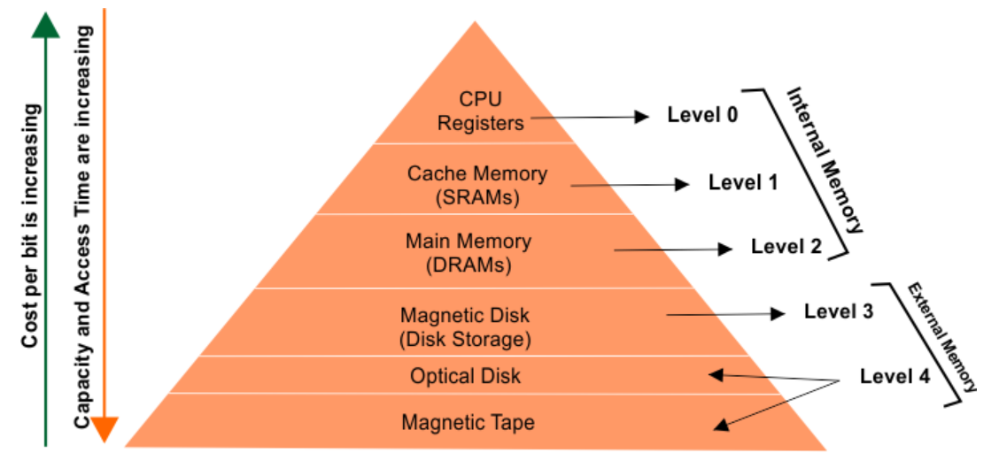

---

## ⚡ 6. Cache Memory

* Between CPU and RAM
* Holds **frequently accessed data**
* Reduces speed mismatch
* Saves CPU time by **fetching data faster than RAM**

> ✅ Cache memory is **faster** than RAM
> ✅ Most required data is kept in cache

## 🧠 Why Do We Need Cache Memory? 

1.  Cache memory reduces the speed gap between the fast CPU and slower main memory (RAM).  
2.  It stores frequently accessed data and instructions for quicker access.  
3.  It minimizes the time the CPU spends waiting for data, improving efficiency.  
4.  It increases overall system performance by reducing memory access delays.  
5.  It decreases the load on main memory by handling repeated data access.  
6.  It speeds up the execution of loops and functions by keeping them readily available.


---

## 💾 7. RAM Types

| Type     | Full Form   | Feature                            |
| -------- | ----------- | ---------------------------------- |
| **SRAM** | Static RAM  | No refresh, fast, costly           |
| **DRAM** | Dynamic RAM | Needs refresh, slower, widely used |

---

## 💿 8. Storage Devices

| Device           | Use                                 |
| ---------------- | ----------------------------------- |
| **Hard Disk**    | Main permanent storage              |
| **SSD**          | Faster version of HDD (Solid State) |
| **DVD Drive**    | Optical disk reading                |
| **Blu-ray Disc** | New version of DVD (double layer)   |
| **Floppy Disk**  | Very old data storage               |
| **Pen Drive**    | Portable data transfer              |

---

## 🌐 9. Input/Output Ports & Interfaces

| Port/Device     | Purpose                                   |
| --------------- | ----------------------------------------- |
| **HDMI Port**   | High-quality video/audio output           |
| **VGA Port**    | Old analog display (needs converter)      |
| **LAN Adapter** | Connects to local network                 |
| **NIC**         | Enables networking/internet               |
| **USB Ports**   | Connects pen drives, keyboard, mouse etc. |
| **Data Cables** | Usually copper wires used for transfer    |

---

## 🔧 10. BIOS, Firmware, and Drivers

| Term          | Explanation                                    |
| ------------- | ---------------------------------------------- |
| **BIOS/UEFI** | Firmware stored in ROM; runs before OS starts  |
| **Drivers**   | Utility software that enables hardware working |

---

## 🔌 11. Extra Hardware Concepts

| Concept       | Description                                             |
| ------------- | ------------------------------------------------------- |
| **Modem**     | Converts analog ↔ digital signals                       |
| **UPS**       | Backup power source (uses battery)                      |
| **SMPS**      | Converts voltage (AC ↔ DC)                              |
| **Bootstrap** | Startup instructions in ROM to load OS                  |
| **Registers** | Tiny memory in CPU; faster than RAM, used for execution |

---

## 🧠 12. Chipset & Bridges (Detailed)

| Bridge          | Function                                           |
| --------------- | -------------------------------------------------- |
| **Northbridge** | Connects CPU to RAM, GPU, cache                    |
| **Southbridge** | Connects CPU to I/O devices like USB, HDD, network |

🧩 These two bridges together form the **motherboard chipset** – managing data flow inside the system.


