# Daily Report
## Training day :- 01
I am **Kanika**. Today was my first day of summer training in the **Computer Science Department(Parent branch)** . I was very excited about this training . Firstly there was an **orientation program** conducted for us in the **auditorium** . Here , I interacted with **Dr. Priyanka** who is professor in **Computer Scienec department** . She gave all the necessary information that was required and also welcomed all the students who are going to be part of the parent branch . She told us about socities , attendance creteria and many other things . Then , I interacted with **Head of Department, Dr. Kiran Jyoti** along with all the students . She also introduced a new scheme for **2024 year onwards students**. After this valuable interaction , all the students shifted to their respective labs . In the lab , our teacher explained the syllabus of this training that all the students will study in further days . Then she said that first day we will discuss about **Linux**.
Firstly i learned about **Linux** & **its importance** then why most of the **companies** & **coders** use **Linux** over **Windows** ? Following are the reasons behind it :- 
- Linux is **more secure** due to its permission-based system and fewer malware targets than windows.
- Linux is **open source** , so it can be easily available.
- Linux is **free** , while windows required paid license.
- Linux has large community.

---
  
  ### Difference between linux and window
  | Feature | Linux | Window |
  |---------|-------|--------|
  |   Type	|Open-source OS	|Proprietary OS|
  |  Cost	  | Free to use	  |Paid (license required)|
  |Security	| More secure,less virus-prone	|More vulnerable to malware|
  |Customization |	Highly customizable	| Limited customization|
  |Command Line	|Command line used often (Terminal)|Mostly GUI-based| 
  |Performance	|Lightweight, works well on older systems	|Requires more system resources|
  |User Interface |Depends on distro (e.g., Ubuntu, Fedora)|Standard and
  consistent UI|
  |Support for Software|Limited for some commercial software|Widely supported software (e.g., MS Office)|
  |Best for |	Developers, programmers, servers|General users, gamers, businesses|

  ---
  ### Uses of linux :-
  - Servers
  - Programming
  - Cybersecurity
  - Education
  - Cloud Computing
  - Networking
---
Here are **career opportunities with Linux** in short points:

1. **Linux System Administrator** – Manage Linux servers and systems.
2. **DevOps Engineer** – Automate deployment and infrastructure.
3. **Cloud Engineer** – Work with AWS, Azure, GCP using Linux servers.
4. **Cybersecurity Analyst** – Use Linux for ethical hacking and security.
5. **Software Developer** – Develop apps and tools on Linux platforms.
6. **Linux Support Engineer** – Troubleshoot Linux systems and provide tech support.
7. **Embedded Systems Engineer** – Build Linux-based systems for IoT, robotics.
8. **Data Scientist** – Use Linux for big data processing and analysis.
9. **Open Source Contributor** – Contribute to Linux and open-source projects.
10. **IT Trainer** – Teach Linux skills and prepare others for certifications.
----
  ### Installation of linux
  - Step 1: Download and Install VirtualBox
  - Step 2: Download Microsoft Visual C++ Redistributable
  - Step 3: Download Ubuntu ISO
  - Step 4: Create a Virtual Machine and Install Ubuntu

  ### Resources

1.  [Download Oracle Virtual Box](https://www.virtualbox.org)

2.  [Download Latest Visual C++ Redistributable](https://learn.microsoft.com/en-US/cpp/windows/latest-supported-vc-redist)

3.  [Download Ubuntu](https://tinyurl.com/csegndec)

  
---

### Study of Product-based company and Service-based comapany

- **Product-based Company**:- A company that builds and sells its **own products** like software,apps, or devices. **E.g.**:- Google , Microsoft.

- **Service-based Company**:- A comapny that provides **services to other companies** like software development,support or consulting. **E.g.**:- TCS , Infosys.

---
## Booting and its types 
I have also learned about booting and types-

### 🖥️ What is Booting?

**Booting** is the process of starting a computer.
When you switch on your computer, the system loads the operating system (like Windows or Linux) from the hard drive into the RAM (memory), so you can use the computer.

### 🔁 Booting Process :

1. **Power On** – You turn on the computer.
2. **POST (Power-On Self-Test)** – System checks hardware (RAM, keyboard, etc.).
3. **BIOS/UEFI Loads** – Basic system firmware starts.
4. **Boot Loader Activated** – BIOS/UEFI finds and runs the boot loader.
5. **OS Loading** – Boot loader loads the operating system into RAM.
6. **System Ready** – Operating system starts, and the computer is ready to use.

---

### üßæ Types of Booting:

🔄 1. **Cold Booting (Hard Booting):**

‚û° **Meaning**: Starting the computer when it is completely turned off.

   **Example**: You press the **power button** to turn on your computer after it was shut down – that's **cold booting**.

🔁 2. **Warm Booting (Soft Booting)**:

‚û° **Meaning**: Restarting the computer without turning off the power.

   **Example**: You press **Ctrl + Alt + Del** or click **Restart** on Windows – that's **warm booting**.

üîß 3. **Dual Booting**:

‚û° **Meaning**: Having **two operating systems** installed and choosing one to run.

  **Example**: Your laptop has Windows and Linux installed. At startup, you choose which one to use.

☁️ 4. **Network Booting (PXE Booting)**:

‚û° **Meaning**: Booting a computer from a **network server** instead of **local storage**.

   **Example**: In a computer lab, systems boot from the college server using a LAN cable.

---

## Training Day :- 02
---
Day **two** of the **summer training program** picked up right where we left off , diving deeper into the concepts introduced yesterday. It brought with a fresh set of challenges and exciting new information . The instructor continued to provide insightful explanations making complex concepts easy to grasp . It was a productive day thaT further fueled my enthusiasm for the rest of the training .

---
## Structure of Linux shell


----

### Study of Kernel
The kernel is the core part of an operating system.

It manages the communication between hardware and software.

Also, it manages the following resources of the linux system :-

- Memory management
- File manangement
- Device management
- Process management
- I/O management etc

-----------------------------------

### Study of Shell

The shell is a program that acts as an interface between the user and the operating system.

It takes user commands and tells the operating system to perform tasks.

It lets you type commands to tell the computer what to do , like opening files , mananging programs.
 
 ### Types of Shell

Shells are mainly divided into two categories:

 **1. Command-Line Interface (CLI) Shells**

User interacts by typing commands

Fast and powerful for developers and system admins

Examples (Types of CLI Shells):

|Shell Name	|          Description                 |
|-----------|--------------------------------------|
|     sh	  |Bourne Shell (original Unix shell)    |
|    bash   |	Bourne Again Shell (most popular)    |
|   csh     |	      C Shell (C-like syntax)        |
|    ksh    |	   Korn Shell (advanced features)    |
|    zsh    |Z Shell (user-friendly & customizable)|


### üêö What is **Bash**?

**Bash** stands for **Bourne Again SHell**.
It is a **command-line shell** used in **Linux** and **Unix-based systems** to **interact with the operating system**.

---

### üîπ **Simple Definition:**

> **Bash** is a program that lets you **type commands** to control your computer without using the mouse.

---

### ‚úÖ **Key Features:**

* Used to **run commands** like creating files, copying, moving, or deleting.
* Supports **scripting**, so you can **automate tasks** with `.sh` files.
* Built-in on **Linux**, **macOS**, and available for **Windows** (via WSL or Git Bash).

---

### 🧠 **Example Bash Commands:**

```bash
ls       # list files
cd       # change directory
mkdir    # make a new folder
rm       # remove files/folders
echo     # print text
```

---

### üìú **Example of a Bash Script:**

```bash
#!/bin/bash
echo "Hello, Kanika!"
mkdir my_folder
cd my_folder
touch file.txt
```

---

### 🔁 **Why Bash is Important:**

* Core part of **Linux system administration**.
* Helps in **automation** (via shell scripting).
* Essential for **DevOps**, **ethical hacking**, **software development**, and more.

---

**2. Graphical User Interface (GUI) Shells**

User interacts using windows, icons, and buttons

Easy for beginners

**Example** : GNOME, KDE (on Linux)

----

## 📁 Linux File System Structure 

A file system structure is the way an operating system organizes and manages data (files and folders) on a storage device like a hard disk or SSD.

It defines:

   * How files are stored

   * How folders (directories) are arranged

   * How the system keeps track of file locations and permissions

The Linux file system is organized **like a tree**, starting from the **root** directory `/`.  
All files and folders are inside this root, even if they are on different drives.


The file system structure is like a **digital cabinet** that helps the OS and users **to keep data organized and easy to access**

### üå≥ Main Folders in Linux File System

| Directory | Meaning |
|-----------|---------|
| `/`       | **Root** – Starting point of the file system |
| `/bin`    | Essential **binaries** (like `ls`, `cp`, etc.) |
| `/boot`   | Files needed to **boot** the system |
| `/etc`    | System **configuration** files |
| `/home`   | Personal folders for **users** (like `/home/kanika`) |
| `/lib`    | Shared **libraries** for programs |
| `/media`  | Used to mount **USB drives, CDs** etc. |
| `/opt`    | **Optional software** packages |
| `/root`   | **Home directory** of the root user |
| `/sbin`   | System **admin commands** |
| `/tmp`    | Temporary files (auto-deleted) |
| `/usr`    | User-related programs and data |
| `/var`    | Variable data (like **logs**, mails) |

#### üìå Key Points

- The top-level directory is `/` (called **root**).
- Everything is organized under `/` like branches of a tree.
- Linux does **not** use drive letters like Windows (C:, D:) — everything is part of the same tree.

  -----
  
## üíΩ What is Slash Full Disk in Linux?

In Linux, when someone says **"slash full disk"** or **"/ is full"**, it means the **root directory (`/`)** has **no free space left**.

### ‚úÖ What is `/` (Slash) in Linux?

- `/` is called the **root directory**.
- It is the **starting point** of the entire Linux file system.
- All other folders like `/home`, `/etc`, `/bin`, etc., exist inside `/`.

### üö® What Does "Slash Full Disk" Mean?

- The **main partition** of Linux (where it’s installed) is **completely full**.
- No space is available to save files, install software, or update the system.

### ⚠️ Why Is It a Problem?

- System becomes **slow** or may **crash**.
- You can’t install or update software.
- Some apps and services may stop working.

### 🛠️ How to Check If `/` Is Full?
           df -h / 
        
------ 
           
üìå Quick Summary
|  Term  | Meaning |
|--------|---------|
| / (Slash)|	Root directory (main Linux filesystem)|
|Slash Full Disk|	The root disk is full – no free space left|

----

## 🖥️ Basic Shell Commands in Linux (With Syntax)

| Command | Description | Syntax | Example |
|--------|-------------|--------|---------|
| `ls` | Lists files and folders | `ls [options]` | `ls -l` |
|whoami|Display current logged-in user|	whoami| whoami|
| `cd` | Changes directory | `cd [directory]` | `cd /home/user` |
| `mkdir` | Creates a new folder | `mkdir [folder_name]` | `mkdir myfolder` |
| `rmdir` | Removes an empty folder | `rmdir [folder_name]` | `rmdir myfolder` |
| `touch` | Creates a new empty file | `touch [file_name]` | `touch file.txt` |
| `rm` | Removes files or folders | `rm [file/folder]` | `rm file.txt` |
| `cp` | Copies files/folders | `cp [source] [destination]` | `cp file.txt /home/user/` |
| `mv` | Moves or renames files/folders | `mv [source] [destination]` | `mv file.txt newname.txt` |
| `cat` | Displays contents of a file | `cat [file_name]` | `cat file.txt` |
| `whatis` | Gives a one-line description of a command | `whatis [command]` | `whatis ls` |
| `whereis` | Shows location of binary, source, and man page | `whereis [command]` | `whereis gcc` |
| `clear` | Clears the terminal screen | `clear` | `clear` |
| `man` | Shows manual/help for a command | `man [command]` | `man ls` |
| `exit` | Closes the terminal session | `exit` | `exit` |
| `pwd` | Shows current directory path | `pwd` | `pwd` |

**Point to remember** : 
    
    **cd ..** (moves up one directory that means it will take out of that box and into the box it was placed inside)
  
**Example**:
  
  If you are currently in: /home/user/documents/reports/
  Typing cd .. will take you to: /home/user/documents/

---


**nano** command :

   - A text editor in linux
   - Beginner-friendly
   - Simple and clear

*Important shortcut keys*:

 - Ctrl + O ‚Üí Save the file (O for Output)
 - Ctrl + X ‚Üí Exit
 - Ctrl + K ‚Üí Cut a line
 - Ctrl + U ‚Üí Paste

**vi editor**:

    It is also a text editor
    The older, more powerful one
    Comes pre-installed in all Linux systems
    Harder for beginners


üìå Use these commands in the terminal to manage files, navigate folders, and control your Linux system.

**To use terminal command , Press Ctrl + Alt + T**

## 🖥️ VMware vs VirtualBox – Simple Difference

Both **VMware** and **VirtualBox** are **virtualization software**.  
They let you **run another operating system** (like Linux) **inside your current OS** (like Windows), without removing or changing anything.

---

### ‚úÖ What Do They Mean?

| Software     | Meaning                                                                 |
|--------------|-------------------------------------------------------------------------|
| **VMware**   | A professional virtualization tool used for creating and managing VMs. |
| **VirtualBox** | A free, open-source virtualization tool made by Oracle.                |

---

### 🔁 Main Difference :

| Feature             | **VirtualBox**                          | **VMware**                              |
|---------------------|-----------------------------------------|-----------------------------------------|
| Cost                | ✅ Free (Open Source)                   | ⚠️ Some versions are paid (e.g., Workstation Pro) |
| User Friendly       | ‚úÖ Beginner-friendly                    | ‚úÖ Professional features, less beginner-focused |
| Performance         | ⚠️ Good but slightly lower             | 🚀 Generally faster and smoother         |
| OS Support          | ‚úÖ Windows, Linux, macOS                | ‚úÖ Windows, Linux (macOS limited)         |
| Ideal For           | Students, learners, open-source fans   | Professional users, enterprise setups   |

---

### üí° Summary:

> Both let you create **virtual machines (VMs)**.  
> Use **VirtualBox** for learning and free use.  
> Use **VMware** if you want more speed and pro features.

## 📦 What is an ISO File?

An **ISO file** (also called an **ISO image**) is a **complete copy or digital version of a CD, DVD, or other disk**, stored in a **single file**.  
It contains **all the data, files, and folders** needed to create a full copy of the original disk.

---

### ‚úÖ In Linux, What Is It Used For?

- ISO files are used to **distribute operating systems** like **Ubuntu**, **Fedora**, **Kali**, etc.
- You download the ISO file and then **write it to a USB drive** to install Linux on your system.

---
### üìå Key Points:

| Feature        | Description                                               |
|----------------|-----------------------------------------------------------|
| File Extension | `.iso`                                                    |
| Contains       | Full copy of an OS or disk (bootable installer)           |
| Common Use     | To install Linux, Windows, or other operating systems     |

----

## 🖥️ What is Bare Metal Installation in Linux?

**Bare Metal Installation** means installing Linux **directly on a computer's hardware** — not inside any other operating system or virtual machine.

You are installing Linux on a **fresh or empty computer**, just like installing Windows on a new laptop.

---

### ‚úÖ Why is it called "Bare Metal"?

Because the installation is done **on the actual physical machine** — the "bare metal" — without any layers like:

- No Windows
- No VirtualBox
- No VMware

---

**🛠️ Simple Example: Installing Ubuntu on Bare Metal**

#### üìå Where Bare Metal is Used:

- In **servers** (no need for Windows)
- For **learning real Linux**
- In **offices or companies** that use Linux systems
- When you want **full performance** (no lag from virtual machines)

---

#### 🔁 Difference (Simple Table)

| Feature           | Bare Metal Linux     | Virtual Machine Linux     |
|------------------|----------------------|----------------------------|
| Runs directly on hardware | ‚úÖ Yes           | ‚ùå No (runs inside another OS) |
| Needs Windows?   | ‚ùå No                 | ‚úÖ Yes (as host OS)         |
| Speed            | 🚀 Fast               | 🐢 Slower (shared resources) |
| Good for         | Real use, servers     | Practice, testing          |

---

### üí° Tip:

> If you want to use Linux like a real system (not inside Windows), go for **bare metal installation**. It's faster and gives you full control over the machine.

---

# Training Day :- 03

---
### üíæ What is a **Partitioning Scheme**?

> A **partitioning scheme** is a method used to **organize a hard drive** into parts, so operating systems can manage and access data properly.

---

### üîπ **Why Partitioning is Needed?**

* To **install multiple OS** (e.g., Linux + Windows).
* To **separate system files and personal files**.
* For **better data management and backup**.
* To **improve performance** and **security**.

---

### üß± **Common Partitioning Schemes:**

| Scheme                           | Description                                   | Max Partitions | OS Support            |
| -------------------------------- | --------------------------------------------- | -------------- | --------------------- |
| **MBR** (Master Boot Record)     | Older scheme, supports BIOS booting           | 4 primary      | Windows, Linux        |
| **GPT** (GUID Partition Table)   | Modern, supports UEFI booting and large disks | 128 primary    | Windows, Linux, macOS |
| **LVM** (Logical Volume Manager) | Used in Linux, flexible for resizing          | Dynamic        | Linux only            |

---

### üìå **Example:**

When you install Linux:

* You create a partition for **root (`/`)**
* One for **home (`/home`)**
* One for **swap**

That setup is based on a **Linux partitioning scheme**.

---

## 🔐 Linux File Permission Commands – `chmod`, `chmod 444`, `chmod 644`, `chown`

Linux uses file permissions to control **who can read, write, or execute files and directories**. The `chmod` command allows us to modify these permissions. Every file and directory has **permissions** assigned to three types of users — **owner(u)**, **group(g)**, and **others(o)**. These permissions determine whether a user can **read**, **write**, or **execute** the file.

---

### ‚úÖ **1. `chmod` (Change File Permissions)**
To **change file or directory permissions** in Linux for the owner, group, and others.

#### üî∏ **Syntax**:

```bash
chmod [permissions] [file_name]
```
**For example:** chmod + x filename.sh

## üîß `chmod +x filename.sh`

### üìò What Does It Do?
The command `chmod +x filename.sh` is used to **add execute permission** to a file (usually a script like `.sh`), so it can be **run as a program**.

---

### üîç Syntax Breakdown

| Component     | Description                                                  |
| ------------- | ------------------------------------------------------------ |
| `chmod`       | Stands for **Change Mode** – used to change file permissions |
| `+x`          | Adds **execute** permission                                  |
| `filename.sh` | The name of the shell script file                            |

---


### ‚úÖ Purpose

This command makes a file **executable** by the **user, group, and others (by default)**.
You can then run the script directly using:

```bash
./filename.sh
```

Without execute permission, you'll see:

```
bash: ./filename.sh: Permission denied

```
### üí° Pro Tip

To give execute permission **only to the file owner**, use:

```bash
chmod u+x filename.sh
```
This is a safer option when sharing code in teams or on public systems.

---


#### 🔢 **Octal Permission Codes**:

| Number | Symbol | Meaning              |
| ------ | ------ | -------------------- |
| 7      | rwx    | Read, Write, Execute |
| 6      | rw-    | Read, Write          |
| 5      | r-x    | Read, Execute        |
| 4      | r--    | Read only            |
| 0      | ---    | No permissions       |

---

### üß™ **Examples**:

#### üîπ `chmod 444 file.txt`
To make a file **read-only** for everyone (owner, group, and others). Prevents editing or deletion.


```bash
chmod 444 file.txt
```

‚ü∂ `r-- r-- r--`


#### üîπ `chmod 644 file.txt`

To allow the owner to **read and write**, and **group & others to only read**. Commonly used for text/config files.
üî∏ Now only the owner can edit, while others can only read the file.

```bash
chmod 644 file.txt
```

‚ü∂ `rw- r-- r--`

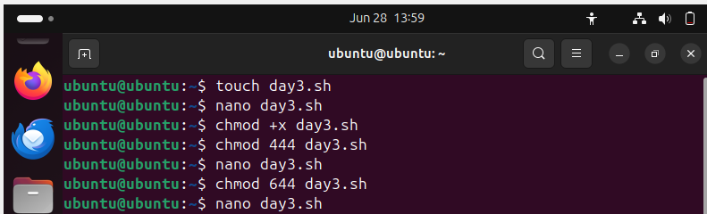

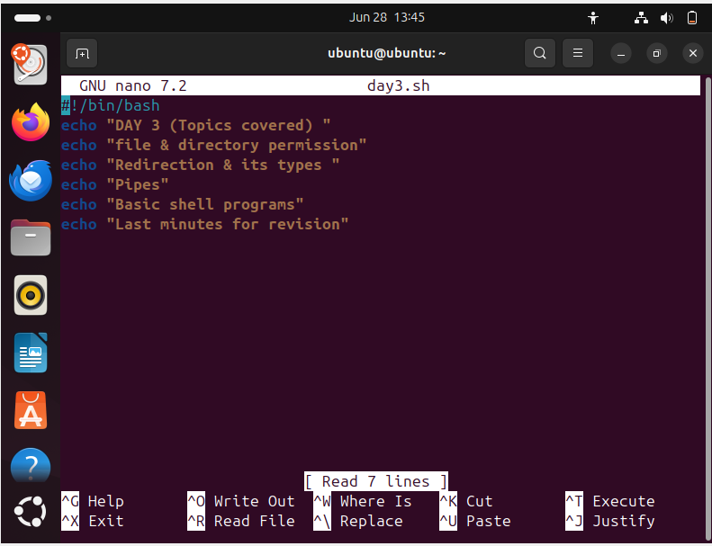

### ‚úÖ **2. `chown` (Change File Owner)** [ASSIGNMENT]

`chown` changes the **owner** or **group** of a file or directory.

**Syntax**:
#### üî∏**change owner**:

```bash
chown [new_owner] [file_name]
```


#### üî∏ **Change Owner and Group**:

```bash
chown user:group file.txt
```

‚úÖ **Examples**:

    chown kanika file.txt ‚Üí Changes the owner to kanika

    chown root:admin file.txt ‚Üí Changes owner to root and group to admin
---

### üìé **Check Permissions**:
‚úÖ *Tip*: Use ls -l to view current permissions:

 ```bash
 ls -l file.txt
 ```
---

> 🔁 **Quick Tip**:

> `chmod` = change permissions

> `chown` = change owner

**Point to remember**:

When working with system files, it's often necessary to use **sudo** to **execute chmod** with root privileges.

---
## 🔄 Redirection in Linux

In Linux, **redirection** is a powerful feature used to control **input and output** of commands. It allows you to **save output to files, read from files, or even combine and filter output streams**. This is widely used in scripting and system automation. Redirection operator is ">"

### 🔄 Types of Redirection in Linux

Redirection is used in Linux to control where input comes from and where output or error messages go. It helps in saving outputs to files, reading inputs from files, and managing errors effectively.

--

| **Operator** | **Meaning**                    | **Example**                        | **Result**                                             |
|--------------|--------------------------------|------------------------------------|--------------------------------------------------------|
| `>`          | Output redirection             | `ls > files.txt`                   | Saves output to `files.txt` (overwrites if it exists)  |
| `>>`         | Append output                  | `echo "Hello" >> notes.txt`        | Adds `"Hello"` to end of `notes.txt`                  |
| `<`          | Input redirection              | `wc -l < notes.txt`                | Reads input from `notes.txt` instead of keyboard       |

> 🧠 **Tip**: Use redirection to log outputs, handle errors gracefully, and automate input/output in shell scripts.

## 📢 `echo` Command in Linux

The `echo` command is used to **display text, strings, or variables** on the terminal. It’s one of the most commonly used commands in **shell scripting, logging, and debugging**.

---

### ‚úÖ What Does `echo` Do?

- Prints **text or output** to the screen.
- Displays the value of **environment variables**.
- Writes output to **files using redirection**.
- Supports **escape characters** for formatting.

---

### üìå Syntax:
```bash
echo [option] [string or variable]
````

---

### üîπ Basic Examples

| **Command**          | **Description**            | **Output**           |
| -------------------- | -------------------------- | -------------------- |
| `echo Hello, Linux!` | Print a simple message     | `Hello, Linux!`      |
| `echo $USER`         | Show current username      | `kanika` *(example)* |
| `echo "Home: $HOME"` | Print environment variable | `Home: /home/kanika` |

---

### üîç Formatting Output with `-e` Flag

Use `-e` to interpret special escape characters like new lines or tabs.

| **Escape** | **Meaning** | **Example**                 | **Output**       |
| ---------- | ----------- | --------------------------- | ---------------- |
| `\n`       | New Line    | `echo -e "Line1\nLine2"`    | Line1 <br> Line2 |
| `\t`       | Tab space   | `echo -e "Name:\tKanika"`   | Name:‚ÄÉKanika     |
| `\\`       | Backslash   | `echo -e "Path: C:\\Users"` | Path: C:\Users   |

---

### üí° Pro Tips

* Use `echo` in shell scripts to print progress or debug messages.
* Combine with `>` or `>>` for **logging** outputs to files.
* Works with **variables**, **escape sequences**, and **redirection**.

---

## üö∞ Pipe (`|`) in Linux

In Linux, the **pipe operator (`|`)** is used to **pass the output of one command as input to another**.  
It helps you build powerful command chains by combining simple commands to perform complex tasks.

---

### ‚úÖ What Does a Pipe Do?

- Connects **stdout (output)** of one command to the **stdin (input)** of another.
- Helps create efficient **one-liners** without the need for intermediate files.
- Commonly used in **filtering**, **sorting**, **counting**, and **processing data**.

---

### üìå Syntax:

```bash
command1 | command2
````

‚û° The output of `command1` becomes the input of `command2`.

---
**Example**: sort – Sort file content

    cat file.txt | sort

‚úÖ What it does:

  - Reads the content of file.txt
  - Sorts the lines alphabetically using sort

📤 Output:
Sorted version of the file content, line by line.

### 🧠 Pro Tips:

* Pipes work **left to right**: output of the left command goes to the right.

* You can **chain multiple pipes**

## Shell Programs

### Program 1 : To display name , age and city

.png)


### Program 2 : To print multiplication table

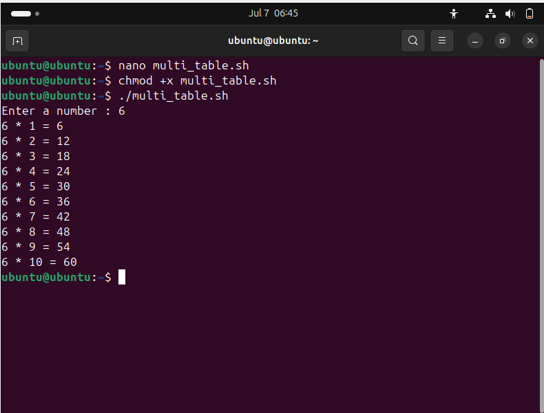

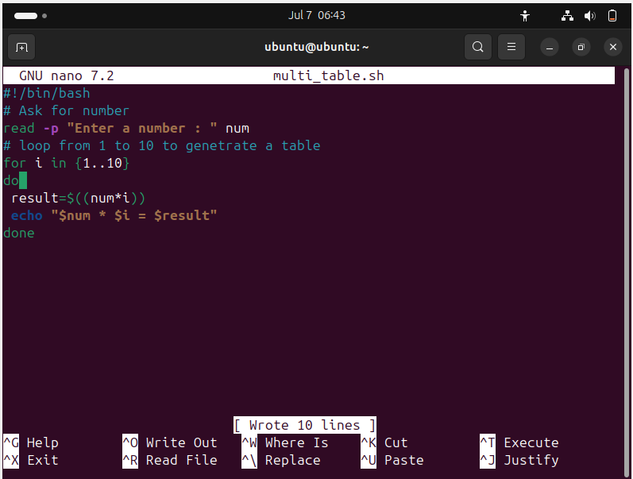


### Program 3 : To compare two numbers


.png)

## 📦 File Compression

File compression is the process of **reducing the size of a file or group of files**. This is done to save storage space or make files easier and faster to transfer over the internet.

**🧠 Why Compress Files?**

    ‚úÖ Saves disk space

    ‚úÖ Speeds up file transfer

    ‚úÖ Reduces bandwidth usage

    ‚úÖ Helps in organizing multiple files together (archiving)

### 📦 File Compression using `gzip`

`gzip` (GNU zip) is a popular **lossless file compression** utility used mainly in **Linux/Unix** systems. It uses the **DEFLATE** algorithm to reduce file size without losing data.

### üîç Purpose of `gzip`

- Reduce file size to save disk space
- Speed up file transfer (especially over networks)
- Commonly used with `tar` for folder compression (`.tar.gz`)

---

### üîß Basic Syntax & Usage

#### üëâ Compress a file

**gzip filename**

 * Compresses filename to filename.gz

 * Output: filename.gz

 * By default, replaces the original file

### üëâ Decompress a file

**gunzip filename.gz**

 * Restores the original `filename`

---

### ⚙️ Common `gzip` Options

| Option | Description                              |
| ------ | ---------------------------------------- |
| `-d`   | Decompress (same as `gunzip`)            |
| `-k`   | Keep the original file after compression |
| `-r`   | Compress files recursively (folders)     |
| `-v`   | Verbose – show the compression process   |
| `-l`   | Display compression statistics/info      |

### üî∏ Example:

**gzip -kv myfile.txt**

* Compresses `myfile.txt` to `myfile.txt.gz`
* Keeps the original file
* Displays compression details

#### 📁 Compressing Folders using 'tar' + 'gzip'

Since gzip works on **individual files**, use 'tar' to archive folders first:

#### üëâ Compress a directory:

'tar -czvf archive.tar.gz foldername/'
   
  * c: Create archive

  * z: Compress using gzip

  * v: Verbose

  * f: Output file name

### üëâ Extract .tar.gz archive:

'tar -xzvf archive.tar.gz'

### ‚úÖ Advantages of `gzip`

* Fast and efficient
* Widely available on Linux systems
* Ideal for logs, backups, and file distribution

---

### üìö Bonus Tip (Check Compression Info)

**gzip -l filename.gz**

* Shows original size, compressed size, and compression ratio.

---
## üêß Wildcards ( globbing characters) in Linux

**Wildcards** are special characters used in Linux shell (like Bash) to represent **multiple files or patterns**. They make it easier to **search, match, or operate on files/directories** without typing full names.

### üîë Why Use Wildcards?

| ‚úÖ Benefit                  |     üîç Description                           |
|-----------------------------|-----------------------------------------------|
| **Save time**               | Operate on multiple files with one command    |
| **Flexible file selection** | Match files by patterns (e.g., extensions)    |
| **Automation**              | Useful in scripting and batch operations      |

---
## üêß Wildcards in Linux 

| Wildcard | Meaning                                      | Example Command                        | Matches / Description                               |
|----------|----------------------------------------------|----------------------------------------|-----------------------------------------------------|
| `*`      | Matches **zero or more** characters          | `ls *.txt`                             | Lists all files ending with `.txt`                  |
| `?`      | Matches **exactly one** character            | `rm file?.sh`                          | Deletes files like `file1.sh`, `fileA.sh`          |
| `[ ]`    | Matches **one character** inside brackets    | `cp file[1-3].txt backup/`             | Copies `file1.txt`, `file2.txt`, `file3.txt`       |
| `[^ ]`   | Matches **one character not** in brackets    | `ls file[^0-9].txt`                    | Lists files like `filea.txt`, `file_.txt`          |
| `{}`     | Matches **comma-separated patterns**         | `ls file.{txt,jpg}`                    | Matches `file.txt`, `file.jpg`                     |
| Combined | Use multiple wildcards together              | `ls log_[0-9]*.log`                    | Matches `log_1.log`, `log_22.log`, `log123.log`    |

---

### üö´ Caution

Always **double-check** with `echo` or `ls` before using `rm` with wildcards:

  * 'echo *.txt'  # safe check before deleting
  
  * 'rm *.txt'  # ‚Üê Use only if you're sure

---

### üìö Bonus Tip: Escaping wildcards

If you want to **treat wildcards as normal characters**, use **backslash (`\`)** or quotes:

'echo "*.txt"'      # Prints *.txt
' echo \*.txt'       # Same result

---

## 🛡️ Escaping Characters in Linux (Shell) [ASSIGNMENT]

In Linux shell (like **bash**), **special characters** (such as `*`, `$`, `"`, `'`, `\`) have **special meanings**. To use them as **normal text**, we need to **escape** them.

## üîë Why Escape Characters?

| Purpose                            | Example                          |
|------------------------------------|----------------------------------|
| Prevent shell from interpreting them | Show `*` as literal asterisk     |
| Include spaces or special chars in file names | Handle `My File.txt` correctly |
| Use variables literally (not expand `$`) | Display `$HOME` as text         |

----

## ⚙️ Common Escape Methods

| Method       | Description                                 | Example                     | Output / Use Case                  |
|--------------|---------------------------------------------|-----------------------------|------------------------------------|
| `\` (backslash) | Escapes the next character                  | `echo \$HOME`               | Prints `$HOME` as text             |
| `' '` (single quotes) | Prevents **all** expansion (strong quoting) | `echo '$USER'`             | Prints `$USER` as-is               |
| `" "` (double quotes) | Allows variable expansion but blocks most others | `echo "Hello $USER"`     | Expands `$USER`, treats space as literal |
| `\\`         | Escapes a backslash                          | `echo "\\"`                 | Prints `\`                         |
| `\n`, `\t`   | Escapes for newline and tab in `echo -e`     | `echo -e "Line1\nLine2"`    | Prints on two lines                |

---


## üß™ Examples

### üëâ Prevent wildcard expansion:

* echo \*.txt

📤 Output: `*.txt`

### üëâ Show a dollar sign without expanding the variable:

* echo \$PATH

📤 Output: `$PATH`

### üëâ Use quotes to handle spaces:

* touch "My File.txt"

* ls My\ File.txt

---

## üìù Quoting in Linux [ASSIGNMENT] 

In Linux, **quoting** is used to protect **special characters**, **spaces**, and **variables** from being changed or expanded by the shell.

### üìå Why Use Quoting?

| Reason                  | Example                          |
|-------------------------|----------------------------------|
| To protect spaces       | `My File.txt` ‚Üí `"My File.txt"` |
| To stop variable expansion | `$HOME` ‚Üí `'$HOME'`           |
| To safely use symbols   | `$`, `*`, `&`, etc.              |

---

## üîí Types of Quotes

| Quote Type      | Use                     | Example                | Output                     |
|------------------|--------------------------|-------------------------|----------------------------|
| `'single quotes'` | Everything inside stays **exactly the same** | `echo '$HOME'`     | `$HOME` (not expanded)     |
| `"double quotes"` | Expands **variables**, but protects spaces | `echo "My home is $HOME"` | My home is /home/user      |
| `\ backslash`     | Escapes **one special character**     | `echo \$HOME`         | `$HOME` (not expanded)     |

---

## üìö Examples

### üëâ Handling spaces:

* touch "My File.txt"
* ls My\ File.txt


### üëâ Protecting variables:

* echo '$USER'
Output: $USER

* echo "$USER"
Output: your_username

---

> ‚úÖ Tip: Always use quotes when your file names have spaces or special characters.

### üêö What is Shell Scripting?

**Shell scripting** is writing a **series of Linux/Unix commands** in a **text file** (called a script) so they can be **executed together automatically** by the shell.

🧠 In Simple Words:

 A **shell script** is like a **recipe** — instead of typing each step (command) manually, you write them all in a file and run the file.

 ----

 ## Training Day :- 04

 ### Hardware


## 🧠 1. What is Computer Hardware?

Hardware refers to the **physical components** of a computer — things you can **see and touch** like CPU, motherboard, RAM, hard disk, ports, etc.

----

## 🧠 2. Motherboard – Central Hub of the System

The **motherboard** is the main printed circuit board that connects all parts of a computer.

### Basic Structure of a Motherboard

The motherboard is a flatboard made of printed circuits. It has many small parts on it. These parts include slots, sockets, and connectors. Each section of the motherboard has a specific role. **For example**:

  - The **CPU socket** holds the central processing unit (CPU).
  - RAM slots are used for memory modules.
  - Other connectors help attach storage devices and graphics cards.


### Function of Motherboard

The primary function of a motherboard is to provide a central platform where different components like the processor (CPU), memory modules (RAM), storage drives (HDD/SSD), and expansion cards can be integrated and work together seamlessly. It manages the data, instructions, and power flow between these connected devices.

In simpler terms, you can think of a motherboard as the command centre that allows the different parts of a computer to talk to each other and function as a complete system. It houses vital components like the CPU socket (where the processor is installed), memory slots (for RAM modules), and various ports/interfaces to connect peripherals. The motherboard also distributes power from the power supply unit (PSU) to all the connected components.

### üî∑ Key Components

| Component              | Description                                   |
| ---------------------- | --------------------------------------------- |
| **CPU Socket**         | Holds the processor (brain of computer)       |
| **Memory Slots (RAM)** | Slots for RAM chips (DDR4/DDR5)               |
| **Expansion Slots**    | Add-ons like GPU, sound card, LAN adapter     |
| **Chipset**            | Controls communication between CPU, RAM, I/O  |
| ‚û§ Northbridge          | Connects CPU ‚Üî RAM, Graphics                  |
| ‚û§ Southbridge          | Connects CPU ‚Üî I/O (USB, HDD, audio, etc.)    |
| **BIOS Chip**          | Stores firmware to start the computer         |
| **Power Connectors**   | Supplies power to motherboard from PSU        |
| **Cooling System**     | Includes fan/heat sink to prevent overheating |

> 🧠 If motherboard is faulty → **Replace ✔** (Not repair ❌)

---

### ‚ö° 3. Power Supply (SMPS)

* Converts **AC ‚Üî DC** (Switch Mode Power Supply)
* Provides power to all components
* Works with CMOS Battery to:

  * Keep BIOS settings
  * Maintain system clock even when PC is off

---

### ⚙️ 4. Booting Process (Power ON to OS)

1. Power goes to ROM
2. **Bootstrap loader** is activated
3. OS is copied from **Hard Disk ‚Üí RAM**
4. CPU starts processing via **registers** and **cache**

> ‚úÖ This startup process is called **Booting**

---

### üîå What Happens When You Power On Your PC (Hardware Level)

1. **Power supply starts**  
   - Sends power to all components.

2. **CPU wakes up**  
   - Looks for instructions from BIOS/UEFI.

3. **BIOS/UEFI runs**  
   - Performs POST (Power-On Self-Test) to check hardware.

4. **Boot device is found**  
   - Searches for a bootable device like SSD/HDD.

5. **Bootloader is loaded**  
   - Loads a small program into RAM.

6. **Operating system starts loading**  
   - The OS kernel takes control and the system starts.


### üìö 5. Memory Hierarchy

| Memory Type      | Speed     | Size     | Use                          |
| ---------------- | --------- | -------- | ---------------------------- |
| **Registers**    | Fastest   | Smallest | CPU instruction handling     |
| **Cache Memory** | Very Fast | Small    | Frequently used data for CPU |
| **RAM**          | Fast      | Medium   | Temporary working memory     |
| **Hard Disk**    | Slow      | Large    | Permanent storage            |

  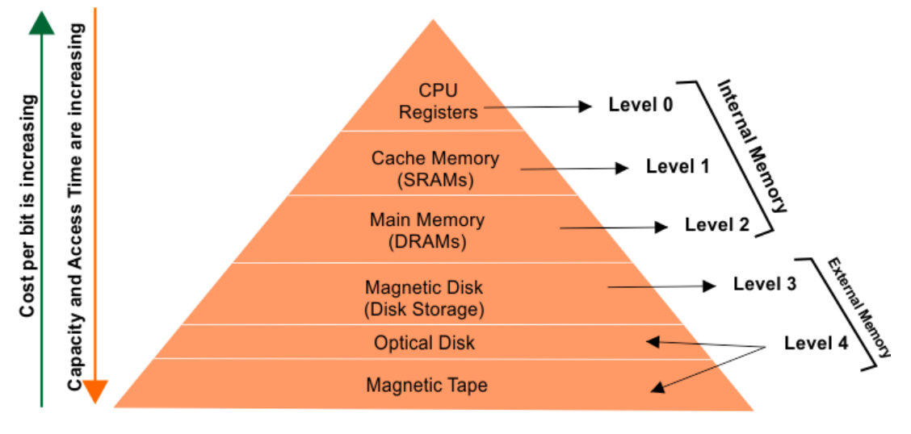

---

### ‚ö° 6. Cache Memory

* Between CPU and RAM
* Holds **frequently accessed data**
* Reduces speed mismatch
* Saves CPU time by **fetching data faster than RAM**

> ‚úÖ Cache memory is **faster** than RAM
> ‚úÖ Most required data is kept in cache

### 🧠 Why Do We Need Cache Memory? 

1.  Cache memory reduces the speed gap between the fast CPU and slower main memory (RAM).  
2.  It stores frequently accessed data and instructions for quicker access.  
3.  It minimizes the time the CPU spends waiting for data, improving efficiency.  
4.  It increases overall system performance by reducing memory access delays.  
5.  It decreases the load on main memory by handling repeated data access.  
6.  It speeds up the execution of loops and functions by keeping them readily available.


---

### üíæ 7. RAM Types

| Type     | Full Form   | Feature                            |
| -------- | ----------- | ---------------------------------- |
| **SRAM** | Static RAM  | No refresh, fast, costly           |
| **DRAM** | Dynamic RAM | Needs refresh, slower, widely used |

---

### üíø 8. Storage Devices

| Device           | Use                                 |
| ---------------- | ----------------------------------- |
| **Hard Disk**    | Main permanent storage              |
| **SSD**          | Faster version of HDD (Solid State) |
| **DVD Drive**    | Optical disk reading                |
| **Blu-ray Disc** | New version of DVD (double layer)   |
| **Floppy Disk**  | Very old data storage               |
| **Pen Drive**    | Portable data transfer              |

---

### üåê 9. Input/Output Ports & Interfaces

| Port/Device     | Purpose                                   |
| --------------- | ----------------------------------------- |
| **HDMI Port**   | High-quality video/audio output           |
| **VGA Port**    | Old analog display (needs converter)      |
| **LAN Adapter** | Connects to local network                 |
| **NIC**         | Enables networking/internet               |
| **USB Ports**   | Connects pen drives, keyboard, mouse etc. |
| **Data Cables** | Usually copper wires used for transfer    |

---

### üîß 10. BIOS, Firmware, and Drivers

| Term          | Explanation                                    |
| ------------- | ---------------------------------------------- |
| **BIOS/UEFI** | Firmware stored in ROM; runs before OS starts  |
| **Drivers**   | Utility software that enables hardware working |

---

### üîå 11. Extra Hardware Concepts

| Concept       | Description                                             |
| ------------- | ------------------------------------------------------- |
| **Modem**     | Converts analog ‚Üî digital signals                       |
| **UPS**       | Backup power source (uses battery)                      |
| **SMPS**      | Converts voltage (AC ‚Üî DC)                              |
| **Bootstrap** | Startup instructions in ROM to load OS                  |
| **Registers** | Tiny memory in CPU; faster than RAM, used for execution |

---

### 🧠 12. Chipset & Bridges (Detailed)

| Bridge          | Function                                           |
| --------------- | -------------------------------------------------- |
| **Northbridge** | Connects CPU to RAM, GPU, cache                    |
| **Southbridge** | Connects CPU to I/O devices like USB, HDD, network |

🧩 These two bridges together form the **motherboard chipset** – managing data flow inside the system.

----

**IMPORTANT NOTE**
* Study difference between RAM & ROM
* Study difference between RAM & Cache memory
* Study difference between RAM & Registers
* Study difference between RAM & Hard disk
* Study difference between RAM & ROM

------

## Training Day :- 05

----

### üíæ Hard Disk Drive (HDD)

#### üîπ What is HDD?

A **Hard Disk Drive (HDD)** is a traditional data storage device that uses **magnetic storage** to store and retrieve digital data. It has spinning disks (called platters) and a read/write head that moves to access data.

- **Used for:** Operating systems, software, documents, videos, etc.
- **Advantages:** Large storage capacity, cheaper than SSD.
- **Disadvantages:** Slower than SSD, contains moving parts (can fail over time).

---

### üî∏ Types of Hard Disk Drives

#### 1. **PATA (Parallel ATA) HDD**
- Also called **IDE**.
- Older interface, slow data transfer.
- Wide ribbon cables with 40 or 80 wires.

#### 2. **SATA (Serial ATA) HDD**
- Common in modern desktops and laptops.
- Faster than PATA.
- Uses thinner cables and supports hot swapping.

#### 3. **SCSI (Small Computer System Interface) HDD**
- Used in servers and high-performance systems.
- Faster and more reliable.
- Supports multiple devices on a single bus.

#### 4. **External HDD**
- Portable storage connected via USB or other ports.
- Can be PATA or SATA internally.
- Used for backups and data transfer.

---

### ‚úÖ Summary Table

| Type       | Speed      | Used In              | Interface     |
|------------|------------|----------------------|---------------|
| PATA       | Slow       | Older PCs            | Parallel ATA  |
| SATA       | Medium     | Most modern systems  | Serial ATA    |
| SCSI       | Fast       | Servers, Workstations| SCSI          |
| External   | Varies     | Portable use         | USB/SATA      |

-----------------

# üíæ Capacity and Partition of Hard Disk

## üîπ Hard Disk Capacity

- Refers to the **total amount of data** a hard disk can store.
- Measured in **GB (Gigabytes)** or **TB (Terabytes)**.
- Example: 500GB, 1TB, 2TB hard drives.
- Actual usable space is slightly less due to:
  - File system formatting
  - System files (like MBR or GPT data)

## üî∏ Hard Disk Partition

- A **partition** is a section of a hard disk treated as a separate drive.
- Helps in organizing data and separating OS, programs, personal files, etc.
- Each partition is assigned a **drive letter** (e.g., C:, D:, E:, F:).

### üîë Types of Partitions:

1. **Primary Partition**
   - Can host the OS (bootable).
   - Maximum of 4 primary partitions (MBR system).

2. **Extended Partition**
   - Used to create more than 4 partitions.
   - Cannot store data directly.

3. **Logical Partition**
   - Created inside an extended partition.
   - Used to store data, not bootable directly.

---

## ‚úÖ Example 

A 1TB Hard Disk partitioned as:

| Drive Letter | Size     | Type        | Use                      |
|--------------|----------|-------------|---------------------------|
| C:           | 300 GB   | Primary     | Windows OS               |
| D:           | 250 GB   | Logical     | Games & Apps             |
| E:           | 200 GB   | Logical     | Personal Files           |
| F:           | 250 GB   | Logical     | Backup / Projects        |

> üìå **Note**: The F: partition is fully valid and often used for backups, media, or projects.
>  C: ‚Üí Primary partition (Bootable)
   D:, E:, F: ‚Üí Logical partitions inside an extended partition

-----

### 🛠️ Common PC Boot Issues and Solutions (PC Hardware Troubleshooting)

#### üîπ 1. PC Not Powering On

**Cause:**
- Faulty power cable or power supply unit (PSU)
- Loose connections

**Solution:**
- Check the power cable and wall socket
- Ensure PSU switch is ON
- Reseat all power cables inside the cabinet

#### üîπ 2. No Display / Black Screen

**Cause:**
- Loose or faulty monitor cable
- Faulty GPU or RAM
- BIOS settings issue

**Solution:**
- Check monitor and cable connection
- Reseat or replace RAM and graphics card
- Reset BIOS using CMOS battery

#### üîπ 3. Beeping Sounds at Startup

**Cause:**
- POST error indicating hardware issue
- RAM or motherboard failure

**Solution:**
- Refer to motherboard manual for beep code meaning
- Try changing or reseating RAM
- Replace faulty components if needed

#### üîπ 4. Boot Device Not Found / "No Bootable Device"
**Cause:**
- Hard drive not detected
- Incorrect boot order in BIOS

**Solution:**
- Check SATA/Power cables to HDD/SSD
- Enter BIOS and set correct boot priority
- Reinstall OS if necessary

#### üîπ 5. PC Keeps Restarting Automatically
**Cause:**
- Overheating CPU or PSU
- Loose RAM or power connection
- Faulty hardware driver

**Solution:**
- Clean CPU fan and check cooling
- Reseat RAM and power cables
- Boot into safe mode and update drivers

#### üîπ 6. BIOS Not Loading / Frozen Logo Screen

**Cause:**
- Corrupted BIOS or damaged motherboard
- Faulty USB device connected

**Solution:**
- Disconnect all USB devices and restart
- Try BIOS recovery/reset using CMOS jumper or battery

#### 🔹 7. Error Messages Like “Missing Operating System”

**Cause:**
- Corrupted bootloader or OS
- Drive partition issues

**Solution:**
- Use bootable USB to repair OS
- Use command line tools like `bootrec /fixmbr`

### ‚úÖ Tips for Basic Troubleshooting:

- Always check cables and connections first.
- Use **BIOS/UEFI** to detect hardware.
- Remove all external devices before booting.
- Keep thermal paste and cooling systems clean.
- Use a **POST card** or diagnostic LED if available.

-----

### 🐢 Why is My PC Running Slow? — Issues and Reasons

#### 1. Too Many Apps Running
- When many programs are open at the same time, your PC gets tired and slows down.

#### 2. Low Memory (RAM)
- Your PC doesn't have enough memory to do all tasks quickly.

#### 3. Fragmented or Full Hard Drive
- When your storage is almost full, it takes longer to find and open files.

#### 4. Too Many Background Programs
- Some apps keep running even when you're not using them.

#### 5. Virus or Malware
- Viruses can secretly use your PC and make it slow.

#### 6. Old or Slow Hardware
- Old PCs or hard drives naturally work slower over time.

#### 7. Not Restarted for Long Time
- If your PC stays on for many days, it can slow down.

#### 8. PC is Overheating
- If your PC gets too hot, it lowers speed to cool down.

#### 9. Too Much Junk/Temporary Files
- Unwanted files pile up and slow the system.

#### 10. Too Many Tabs Open in Browser
- Opening many browser tabs uses more memory.

#### 11. Windows or Software Not Updated
- Old versions can have bugs and slow performance.

#### 12. Too Many Visual Effects
- Fancy animations and effects make old PCs slow.

### 🧠 Additional Simple & Smart Tips

#### Keep Desktop Clean
- Having too many files on the desktop slows down boot time and refresh speed.

#### Remove Unnecessary Icons from Taskbar
- Too many taskbar icons use memory in the background.

#### Avoid Too Many Bookmarks in Browser
- Excessive bookmarks can slow down the browser, especially during sync.

---

### ‚úÖ Easy Fixes:

- Close unused apps and browser tabs.
- Restart the PC regularly.
- Delete unwanted files and desktop clutter.
- Uninstall apps you don’t need.
- Scan for viruses and malware.
- Keep your software and Windows updated.

  -------------

### 🛠️ Diagnosing Hardware Failures: RAM, HDD, GPU, PSU

#### 🔹 1. 🧠 RAM (Random Access Memory)

##### üîç Symptoms:
- Frequent crashes or restarts
- Blue Screen of Death (BSOD)
- Programs freeze or fail to load
- Beeping sounds on startup

##### 🛠️ How to Diagnose:
- Use **Windows Memory Diagnostic** or **MemTest86**
- Try using one RAM stick at a time
- Reseat the RAM properly in the slot
- Replace faulty RAM if errors are detected

---

#### üîπ 2. üíΩ HDD (Hard Disk Drive)

##### üîç Symptoms:
- Slow boot and file access
- Clicking or grinding noise
- Files getting corrupted or disappearing
- “No bootable device” error

##### 🛠️ How to Diagnose:
- Use **CHKDSK** in Command Prompt
- Check SMART status using tools like **CrystalDiskInfo**
- Listen for unusual noises
- Boot from another drive to test

---

#### 🔹 3. 🎮 GPU (Graphics Card)

##### üîç Symptoms:
- No display or screen artifacts (weird colors/shapes)
- Game crashes or lag
- PC restarts under load
- Fan not spinning or overheating

##### 🛠️ How to Diagnose:
- Try using **integrated graphics** instead of GPU
- Use stress test tools like **FurMark**
- Check physical connection and power cables
- Replace GPU to test if issue goes away

---

#### üîπ 4. ‚ö° PSU (Power Supply Unit)

##### üîç Symptoms:
- PC doesn’t power on at all
- Random shutdowns or restarts
- Burning smell or electrical sound
- No fan movement in PSU

##### 🛠️ How to Diagnose:
- Use a **PSU tester** or multimeter
- Try another working PSU (if available)
- Disconnect non-essential components and test
- Check if fan in PSU spins when powered

### ‚úÖ General Tips:

- **Check connections** before replacing parts.
- **Remove dust** regularly to avoid overheating.
- **Look for LED/beep codes** on motherboard for quick hints.
- Always use **diagnostic tools** for confirmation.

----

**IMPORTANT NOTE**

Press **F1 key** to reach **help** in **window**

----

### üîß System Scanning & Defragmentation Process

---

#### ‚úÖ System Scanning
*Checks for malware, viruses, and system errors.*

1. **Open Security Tool**  
   Use antivirus software or built-in Windows Security.

2. **Select Scan Type**  
   Choose between:
   - Quick Scan
   - Full Scan
   - Custom Scan

3. **Start Scan**  
   The tool checks files, memory, and critical system areas.

4. **View Results**  
   Displays threats or issues found during the scan.

5. **Take Action**  
   Remove, quarantine, or fix detected threats.

---

#### üß© Disk Defragmentation
*Organizes scattered data to improve performance (for HDDs only).*

1. **Open Defragment Tool**  
   Search for `Defragment and Optimize Drives` in the Start menu.

2. **Select Drive**  
   Choose the drive you want to defragment (e.g., `C:\`).

3. **Analyze Disk**  
   Checks how fragmented the drive is.

4. **Click Optimize**  
   Rearranges files to store them contiguously.

5. **Completion**  
   Your system becomes faster and more efficient.

> ⚠️ **Note:** Defragmentation is useful for **HDDs**, not required for **SSDs**.

---

# ⚙️ Optimization & Related Concepts

---

### ‚úÖ What is Optimization?

**Optimization** in a computer system means improving performance by making processes faster, smoother, and more efficient.  
Examples include:
- Removing unnecessary files
- Organizing data (defragmentation)
- Adjusting settings for better speed or battery life

---

### ‚è∞ What is Scheduled Optimization?

**Scheduled Optimization** means setting your system to automatically run optimization tasks (like disk defragmentation) at regular intervals.

#### Example:
- Windows automatically defragments your hard disk every week (if scheduled).
- Keeps system performance smooth without user action.

> üìù You can check or change this in:  
**Control Panel > Administrative Tools > Optimize Drives**

---

### 📦 What is Delivery Optimization?

**Delivery Optimization** is a feature in Windows that helps in faster and efficient downloading of updates or apps by:
- Downloading updates from **Microsoft servers + other nearby PCs** (peer-to-peer sharing)
- Reducing internet data usage, especially in networks with many devices

#### Example:
If your PC and your friend's PC are on the same Wi-Fi, one download can help both.

> 🔒 It works securely and only shares official updates—not your personal data.

---

### 🛠️ Peripheral Troubleshooting: Keyboard, Mouse, Printer

---

#### ⌨️ Keyboard Issues & Fixes

##### üîπ Common Problems:
- Keys not responding
- Typing wrong characters
- Keyboard not detected

##### ‚úÖ Solutions:
1. **Check Connection** – Re-plug USB or check Bluetooth.
2. **Restart PC** – Temporary glitches can be fixed.
3. **Try Another Port** – Use a different USB port.
4. **Check Keyboard Layout** – Correct input language in settings.
5. **Update/Reinstall Driver** – Use Device Manager to update.
6. **Test on Another PC** – To confirm if keyboard is faulty.

---

#### 🖱️ Mouse Issues & Fixes

##### üîπ Common Problems:
- Cursor not moving
- Double-click not working
- Mouse freezing or skipping

##### ‚úÖ Solutions:
1. **Reconnect Mouse** – Try different USB port or replace batteries (wireless).
2. **Clean Mouse Sensor** – Dust can block laser or sensor.
3. **Check Surface** – Use on proper mouse pad.
4. **Update Mouse Driver** – From Device Manager.
5. **Try on Another PC** – To check if mouse is working.

---

#### 🖨️ Printer Issues & Fixes

##### üîπ Common Problems:
- Printer not detected
- Paper jams
- Ink/Toner issues
- Prints are blank or low quality

##### ‚úÖ Solutions:
1. **Check Connections** – USB/Wi-Fi properly connected.
2. **Restart Printer & PC** – Reset communication.
3. **Clear Paper Jam** – Open tray and remove jammed paper.
4. **Check Ink/Toner Levels** – Refill or replace if low.
5. **Set as Default Printer** – In control panel or settings.
6. **Reinstall Printer Drivers** – From manufacturer’s website.
7. **Run Troubleshooter** – Use built-in Windows Printer Troubleshooter.

---

> üí° **Tip:** Always keep drivers updated and check for loose connections first before doing advanced steps.

----

### ⚙️ BIOS / UEFI Settings & POST Errors [ASSIGNMENT]


#### 🧠 What is BIOS / UEFI?

| Feature | BIOS | UEFI |
|--------|------|------|
| Full Form | Basic Input Output System | Unified Extensible Firmware Interface |
| Interface | Text-based | Graphical (mouse support) |
| Boot Mode | Legacy Boot | Secure Boot |
| Storage Support | Up to 2 TB (MBR) | Over 2 TB (GPT) |
| Speed | Slower | Faster |
| Modern Use | Older PCs | Modern systems |

> BIOS/UEFI is firmware that starts when your PC powers on, initializes hardware, and loads the operating system.

---

#### üîß Common BIOS/UEFI Settings

1. **Boot Order** – Select the order of devices to boot from (e.g., USB > HDD > Network).
2. **Secure Boot** – Prevents unauthorized OS loading.
3. **Enable/Disable Devices** – Like USB ports, audio, virtualization.
4. **System Time & Date** – Set accurate time.
5. **Overclocking Options** – For CPU/RAM tuning (in UEFI).
6. **Password Protection** – BIOS access or disk lock.

---

#### 💻 What is POST?

**POST** (Power-On Self-Test) is a diagnostic process run by BIOS/UEFI to check if hardware is working properly before the OS loads.

---

#### ‚ùå Common POST Errors & Beep Codes

| Error | Cause | Solution |
|-------|-------|----------|
| **No Display / Beep** | RAM/Display issue | Reseat or replace RAM/Graphics |
| **1 Long Beep, 2 Short** | Display adapter failure | Check/replace graphics card |
| **Continuous Beeping** | Power or keyboard issue | Check power supply or keyboard |
| **CMOS Battery Low** | Dead CMOS battery | Replace CMOS battery |
| **Keyboard Not Found** | Unplugged or faulty keyboard | Reconnect or replace |
| **Disk Boot Failure** | OS not found | Check boot order or OS installation |

> üîî Beep codes vary by BIOS manufacturer (e.g., AMI, Award, Phoenix).

---

#### üìù Accessing BIOS/UEFI

- Press keys during startup: **Del**, **F2**, **Esc**, or **F10** (depends on system).
- Modern UEFI can also be accessed via **Windows Settings > Recovery > Advanced Startup > UEFI Firmware Settings**.

---

### üí• Blue Screen of Death (BSOD) & System Crash Analysis

---

#### üß® What is BSOD?

**BSOD (Blue Screen of Death)** is a critical system error screen in Windows that appears when the operating system can no longer run safely due to a serious problem.

It forces the system to shut down or restart to prevent damage.

---

#### ‚ùì Why Does BSOD Happen?

| Cause | Explanation |
|-------|-------------|
| üîß **Driver Issues** | Outdated, corrupted, or incompatible drivers |
| üíΩ **Hardware Failure** | Faulty RAM, hard disk, GPU, or overheating |
| üêû **Software Bugs** | Errors in applications or Windows updates |
| üìõ **Corrupt System Files** | Missing or damaged OS files |
| ⚠️ **Overclocking** | Unstable CPU/RAM settings |
| üîê **Malware** | Viruses affecting system stability |
| ‚õî **Low Disk Space** | On system partition (C:\) |
| 🔄 **Power Failures** | Sudden shutdowns corrupt data or memory |

> üìã **STOP Code** is shown during BSOD to help identify the exact error.

---

### 🛠️ System Crash Analysis (After BSOD)

#### Step 1: **Note the STOP Code**
- Example: `PAGE_FAULT_IN_NONPAGED_AREA` or `IRQL_NOT_LESS_OR_EQUAL`

#### Step 2: **Use Windows Reliability Monitor**
- Search **"Reliability Monitor"** in Start
- Shows timeline of errors and crashes

#### Step 3: **Check Event Viewer**
- Go to `Control Panel > Administrative Tools > Event Viewer`
- View **Critical Events** under **System Logs**

#### Step 4: **Analyze Dump File**
- Location: `C:\Windows\Minidump\`
- Use tools like:
  - **BlueScreenView**
  - **WinDbg (Windows Debugger)**

#### Step 5: **Run Diagnostics**
- **Memory Test**: `mdsched.exe`
- **Disk Check**: `chkdsk /f`
- **SFC Scan**: `sfc /scannow`

---

### ‚úÖ How to Prevent BSOD

- Keep drivers and Windows updated
- Regularly scan for malware
- Avoid overheating or overclocking
- Use quality power supply
- Maintain disk health and free space
- Create regular restore points

---

> ⚠️ **Important Tip:** If BSOD happens repeatedly, it’s a sign of a deeper hardware or system-level issue and should be addressed immediately.

---

### BSOD & System Crash Analysis – Flowchart Summary

---

* #### BLUE SCREEN OF DEATH (BSOD)

System Crash Detected  
‚Üì  
Blue Screen Appears (BSOD)  
‚Üì  
STOP Code is Displayed (e.g., IRQL_NOT_LESS_OR_EQUAL)  
‚Üì  
System Automatically Restarts or Halts  

---

#### WHY BSOD OCCURS

- Driver Issues  
‚Üì  
- Hardware Failures (RAM, HDD, Overheating)  
‚Üì  
- Software Bugs or Failed Windows Updates  
‚Üì  
- Corrupted System Files or Registry  
‚Üì  
- Malware Infections  
‚Üì  
- Low Disk Space or Sudden Power Failure


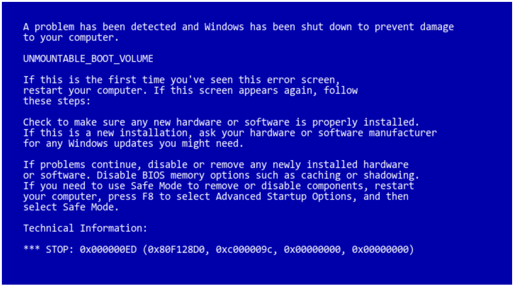

#### HOW TO PREVENT BSOD

- Keep Windows & Drivers Updated  
‚Üì  
- Regular Malware Scanning  
‚Üì  
- Avoid Overheating and Overclocking  
‚Üì  
- Maintain Sufficient Disk Space  
‚Üì  
- Create System Restore Points  
‚Üì  
- Use Reliable Power Supply  

---

* #### SYSTEM CRASH ANALYSIS

**Step 1:** Note the STOP Code on the BSOD  
‚Üì  
**Step 2:** Check Reliability Monitor  
‚Üì  
**Step 3:** Open Event Viewer ‚Üí View System Logs  
‚Üì  
**Step 4:** Analyze Dump Files  
- Location: `C:\Windows\Minidump\`  
- Tools: BlueScreenView, WinDbg  
‚Üì  
**Step 5:** Run Diagnostics  
- Memory Test ‚Üí `mdsched.exe`  
- Disk Check ‚Üí `chkdsk /f`  
- System File Check ‚Üí `sfc /scannow`

----

* **Tip:** If BSOD happens repeatedly, it usually indicates a hardware or OS-level issue that needs immediate attention.

-----


---

## Training Day :- 06

### 🛡️ System Recovery and Security

#### 🧯 1. Safe Mode

 A special mode in Windows that loads only essential files and drivers.
 Used to diagnose and fix issues like system crashes, virus infections, or driver problems.

  ##### üîπ Purpose:

* Fix system errors
* Remove malware
* Troubleshoot software/driver issues


üîπ **When to Use**:

    PC not starting normally

    Suspected malware infection

    Uninstalling faulty drivers or software


##### üî∏ Types of Safe Mode:


| **Type**                             | **Description**                                                              | **When to Use**                                                                             |
| ------------------------------------ | ---------------------------------------------------------------------------- | ------------------------------------------------------------------------------------------- |
| **1. Safe Mode**                     | Loads **basic drivers and services only** (no internet).                     | For general troubleshooting, removing viruses, uninstalling apps.                           |
| **2. Safe Mode with Networking**     | Same as Safe Mode **but includes network drivers** to allow internet access. | If you need to download drivers, updates, or antivirus tools.                               |
| **3. Safe Mode with Command Prompt** | Loads a **command-line interface only** (no desktop).                        | For **advanced troubleshooting** using commands (SFC, DISM, etc.). Useful if GUI is broken. |


##### ⚙️ How to Access Safe Mode:

1. Go to **Settings ‚Üí Recovery ‚Üí Advanced Startup ‚Üí Restart Now**
2. Choose **Troubleshoot ‚Üí Advanced Options ‚Üí Startup Settings ‚Üí Restart**
3. Then press:

   * **F4** ‚Üí Safe Mode
   * **F5** ‚Üí Safe Mode with Networking
   * **F6** ‚Üí Safe Mode with Command Prompt

---

#### üß∞ 2. Recovery Tools

> Tools to **repair, restore, or reset** your system in case of problems.

##### üîπ Purpose:

* Fix system errors or boot issues
* Revert to previous state
* Reinstall or reset Windows

##### üîπ Common Recovery Tools:

| Tool                             | Use                                      |
| -------------------------------- | ---------------------------------------- |
| **System Restore**               | Roll back to an earlier working state     |
| **Startup Repair**               | Fixes booting problems                   |
| **Reset This PC**                | Reinstalls Windows (with/without files)  |
| **Installation Media (USB/DVD)** | Reinstalls or repairs Windows externally |
| **Advanced Options (WinRE)**     | Access Safe Mode, Command Prompt, etc.   |

---

#### 🛠️ 3. OS Repair

> Fixes system corruption **without reinstalling Windows**.

##### üíΩ 3. OS Repair Methods

- **Using Installation Media:**  
  Boot from USB or DVD to repair or reinstall Windows.

- **Startup Repair Tool:**  
  Automatically detects and fixes startup problems.

- **SFC (System File Checker):**  
  Command: `sfc /scannow`  
  Scans and repairs corrupted system files.

- **DISM Tool:**  
  Command: `DISM /Online /Cleanup-Image /RestoreHealth`  
  Repairs the Windows image and resolves deep system issues.


##### ✅ Backup After OS Repair – Key Points

* ‚úÖ **Ensure the system is stable** after repair (check for normal functioning).
* 📁 **Locate and organize** all important files:

  * Documents
  * Desktop files
  * Downloads
  * Photos, videos, project folders
    
 üíΩ **Choose a backup method:**

* **External Storage** (USB, HDD, SSD)
* **Cloud Backup** (Google Drive, OneDrive, Dropbox)
* **File History** (Windows built-in backup tool)
* **System Image Backup**
* **Third-party backup software** (EaseUS, Macrium Reflect, Acronis)
* 📤 **Manually copy** files or use backup tools for automation.
* 🏷️ **Label backup folder or drive** clearly (e.g., "Backup\_July2025").
* üîê **Store backups safely** (offline + online preferred).
* üîç **Verify backup files** by opening a few to ensure they work.
* 🔁 **Set up automatic/scheduled backup** (for regular future safety).

  ##### 🧠 Why Backup After OS Repair?

    You already had system trouble — it could happen again.

    Avoid data loss in future crashes or malware attacks.

    Makes next recovery easier and faster.

---
#### üîå Plugins 

* A **plugin** is a small software that **adds extra features** to a larger program.
* It **extends functionality** without changing the main software.
* Common in browsers, audio software, websites, and IDEs.

#### üìå Examples:

* **Browser plugin** ‚Üí AdBlock (blocks ads)
* **WordPress plugin** ‚Üí Contact Form (adds form)
* **VS Code plugin** ‚Üí Python extension (adds language support)
* **Audio plugin** ‚Üí Reverb (adds sound effect)

#### ‚úÖ Key Points:

* Easy to **install/uninstall**
* Used for **customization**
* Should be from **trusted sources**
* May cause issues if **incompatible or outdated**

> 🔁 Plugins = Add-on features for apps

---

#### 🦠 4. Virus & Malware Symptoms

> Signs that indicate **malware infection** on your PC.

##### üîπ Common Symptoms:

  | Symptom            | Description                                               |
|---------------------|-----------------------------------------------------------|
| Slow performance    | Programs take longer to open or freeze frequently.        |
| Frequent crashes    | System restarts or shuts down unexpectedly.               |
| Pop-ups and ads     | Unexpected ads or pop-ups even when no browser is open.   |
| Unknown apps or toolbar installed   | Unfamiliar apps appear on the system.                     |
| High CPU usage      | Task Manager shows high usage without any known reason.   |

**Other symptoms are :**

- Antivirus software is disabled
- Files are missing or encrypted
- Browser redirects automatically

#### üßπ 5. Basic Malware Removal Steps

> Steps to **remove malware or virus** safely.

##### ‚úÖ Step-by-Step:

1. **Disconnect Internet**
2. **Boot into Safe Mode**
3. **Run antivirus/anti-malware scan**
4. 
   ‚û§ Use Windows Defender or Malwarebytes
5. **Uninstall unknown programs**
6. **Delete temp files**
7. 
   ‚û§ Use `Disk Cleanup` or `%temp%`
8. **Check browser extensions/settings**
9. **Update Windows & drivers**
10. **Change passwords**

##### 🛡️ Basic Tips to Protect Your System from Malware

* **Keep your system and software updated**
* **Use trusted antivirus or anti-malware software**
* **Avoid clicking on unknown links or email attachments**
* **Download software only from trusted websites**
* **Do not use pirated or cracked software**
* **Backup your important data regularly**

---

##### üíæ Where Should You Keep Your Windows Storage?

* ‚úÖ **Install Windows in C: drive** (default system partition)
* ‚úÖ **Store personal files in D: or E: drive** (keeps data safe)
* ‚ùå **Avoid filling C: drive with large files or games**
* ‚úÖ **Keep C: drive clean for better performance**
* ‚úÖ **Use external drives for backup or extra storage**

---

#### üíæ 6. Various Ways of Backup of Important Files

> Backups help **prevent data loss** due to virus, crash, or mistakes.

##### üîπ Backup Methods:

| Method                 | Description                                       | Pros            | Cons                   |
| ---------------------- | ------------------------------------------------- | --------------- | ---------------------- |
| **External Storage**   | Copy to USB, HDD, SSD                             | Easy, offline   | Can be lost or damaged |
| **Cloud Backup**       | Upload to online servers (Google Drive, OneDrive) | Access anywhere | Needs internet         |
| **Internal Backup**    | Save in different drive/partition                 | Fast & local    | Risk if drive fails    |
| **System Image**       | Full snapshot of OS + data                        | Full recovery   | Takes more space       |
| **Scheduled Backup**   | Automatic, regular backups                        | Hands-free      | Needs setup            |
| **3rd-Party Software** | Advanced tools (Acronis, EaseUS)                  | Extra features  | Some are paid          |


##### ⚠️ Things to Avoid Regarding Backup

*  **Not backing up at all**
*  **Storing backups only on the same drive as original files**
*  **Using unreliable or cheap storage devices**
*  **Forgetting to back up regularly**
*  **Not verifying if the backup actually works**
*  **Keeping backup devices connected all the time (risk of virus infection)**
*  **Not encrypting sensitive backup data**

---

#### 🔁 Summary Table

| Section              | Purpose                | Tools/Commands                 |
| -------------------- | ---------------------- | ------------------------------ |
| **Safe Mode**        | Diagnose system safely | F4, F5, F6                     |
| **Recovery Tools**   | Restore or reset PC    | System Restore, Startup Repair |
| **OS Repair**        | Fix without reinstall  | `sfc`, `dism`                  |
| **Malware Symptoms** | Detect infection       | Observe system behavior        |
| **Removal Steps**    | Clean virus/malware    | Antivirus, Safe Mode           |
| **Backup**           | Prevent data loss      | Cloud, External, Image         |

---

### üîå Networking Basics: RJ45, CAT Cable & Crimping Tool

#### üß∑ RJ45 Connector

- **RJ45** stands for **Registered Jack 45**
- It is an **8-pin connector** used to connect **Ethernet cables** to networking devices
- Commonly used in **LAN (Local Area Network)** setups
- Plugs into:
  - Routers  
  - Switches  
  - Network Interface Cards (NICs)

##### üîπ Key Features:
- 8 metal pins inside (for 8 wires)
- Works with CAT5/CAT6 cables
- Looks like a wider telephone jack

---

#### üßµ CAT Cable (Ethernet Cable)
**CAT (Category) wire** refers to a type of twisted pair cable used mainly for **networking and data transmission**.
Used in broadband connection and telephone connection.

- **CAT** = **Category** (e.g., CAT5, CAT6)
- Carries data over network connections
- Contains **8 color-coded wires (4 twisted pairs)**

##### üîπ Common Types of CAT Cables:

| Category | Speed      | Max Distance |
|----------|------------|--------------|
| CAT5     | 100 Mbps   | 100 meters   |
| CAT5e    | 1 Gbps     | 100 meters   |
| CAT6     | 1–10 Gbps  | 55–100 meters|
| CAT6a    | 10 Gbps    | 100 meters   |

> **CAT5e** and **CAT6** are most commonly used in homes and offices today.

---

#### üîß Crimping Tool

- Used to **attach RJ45 connectors** to CAT cables
- It **presses the pins** inside the connector into the wires

##### üîπ Functions:
- Strips outer cable jacket
- Arranges and trims wires
- Crimps connector securely onto cable

##### ‚úÖ Crimping Steps:
1. Strip ~1 inch of cable jacket  
2. Untwist & arrange wires in correct order (e.g., T568B)  
3. Cut wires evenly  
4. Insert wires into RJ45 connector  
5. Use crimping tool to secure the connection

---

#### üìå Summary Table

| Item            | Purpose                          | Key Info                |
|-----------------|----------------------------------|--------------------------|
| **RJ45**        | Connects Ethernet to device      | 8-pin connector          |
| **CAT Cable**   | Transmits data in LAN            | 4 twisted wire pairs     |
| **Crimping Tool**| Attaches RJ45 to CAT cable       | Strips, cuts, crimps     |

---

> ‚úÖ These components are **essential for basic networking**, LAN setup, and cable repair.

-----

# üåê RJ45 Wiring Color Codes

RJ45 connectors are used to terminate Ethernet cables (Cat5e, Cat6, etc.) for wired networking. The color order of the wires must follow a standard to ensure proper communication.

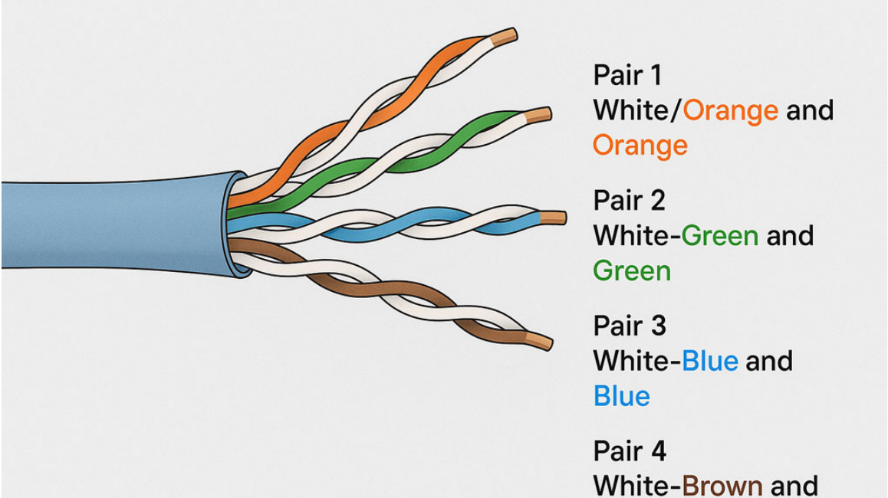

### üìò Wiring Standards

 standard color codes used for wiring RJ45 connectors:

#### üüß T568B Wiring Standard (Most Common)

| Pin | Wire Color     |
|-----|----------------|
| 1   | White/Orange   |
| 2   | Orange         |
| 3   | White/Green    |
| 4   | Blue           |
| 5   | White/Blue     |
| 6   | Green          |
| 7   | White/Brown    |
| 8   | Brown          |

#### 🔄 Wire Arrangement (Left to Right)

When holding the **RJ45 connector**:
- **Clip facing down**
- **Pins facing you**

#### Pin Number View:

1   2   3   4   5   6   7   8

#### T568B Colors:

WO  O   WG  B   WB  G   WBn Bn

*WG = White/Green, WO = White/Orange, WB = White/Blue, WBn = White/Brown, Bn = Brown*

---

#### 📦 Straight vs Cross Cable

| Cable Type   | Use Case                             | Ends Used            |
|--------------|--------------------------------------|----------------------|
| Straight     | PC to Switch, Router to Switch       | T568B – T568B        |
| Crossover    | PC to PC, Switch to Switch (older)   | T568A – T568B        |

> üìù Today, most devices support **Auto MDI-X**, so **straight cables** are commonly used.

---

#### ‚úÖ Summary

- Use **T568B** standard for most home/office Ethernet cables.
- Ensure both ends use the same standard for straight cables.
- Use crimping tools and follow proper color code for reliable connections.

---

### üîå Types of Cables in Networking

-----

#### ‚úÖ 1. Twisted Pair Cable

- Most commonly used in homes, offices, and LANs.
- Wires are **twisted in pairs** to reduce interference.

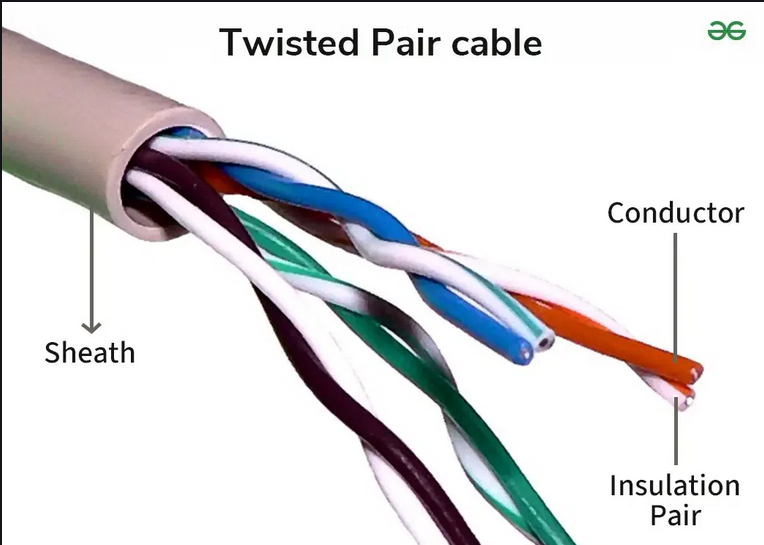

##### Types:
| Type         | Description                          | Speed Example        |
|--------------|--------------------------------------|----------------------|
| UTP (Unshielded Twisted Pair) | No outer shielding, cheaper, used in LAN | Cat5, Cat6 cables     |
| STP (Shielded Twisted Pair)   | Has shielding for extra protection       | Used in industries    |

> üß™ Example: Ethernet cable (RJ45)

---

#### ‚úÖ 2. Coaxial Cable

- Has a **single copper wire in the center**.
- Covered by insulation and metal shield.
- Used in **TV cables, CCTV**, and older networks.

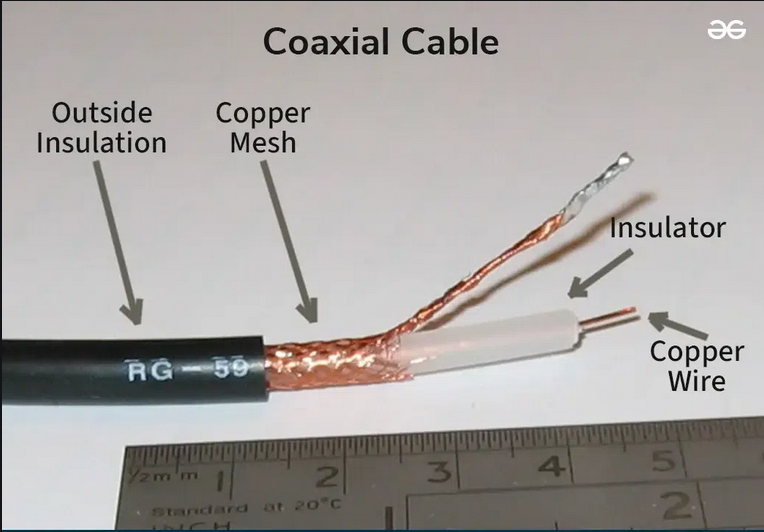

##### Features:
- Better shielding than twisted pair.
- Not used much today in new networks.

> üß™ Example: Cable TV wire

---

#### ‚úÖ 3. Fiber Optic Cable

- Made of **glass or plastic fibers**.
- Uses **light signals** to transfer data.
- Very **fast**, used for **long distances and high-speed internet**.

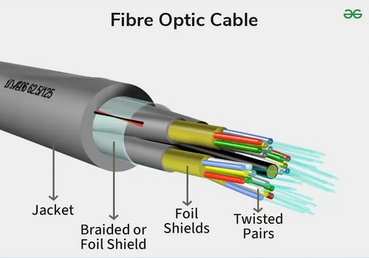

##### Features:
- No electrical interference
- Expensive but very high-speed

> üß™ Example: Used by ISPs for broadband or backbone connections

---

#### 🔁 Quick Comparison Table

| Cable Type       | Speed         | Distance     | Cost      | Usage                      |
|------------------|---------------|--------------|-----------|----------------------------|
| Twisted Pair     | Medium (up to 1 Gbps) | Short (100 m) | Low       | Home/office LAN (Cat5/Cat6) |
| Coaxial Cable     | Low/Medium    | Medium        | Medium    | TV, CCTV, old networks      |
| Fiber Optic       | Very High     | Very Long     | High      | Internet backbone, ISPs     |

---

> ‚úÖ Tip:  
> - Use **Twisted Pair (Cat5/Cat6)** for home/office LAN.  
> - Use **Fiber Optic** for fast internet and long distances.

---

## Training Day :- 07

### Welcome to networking basics 

----

#### 🖥️ What is a Host in Networking?

A **host** is any device that connects to a **network** and can **send or receive data**.

##### üí° Simple Definition:
> A **host** is a device on a network that has an **IP address** and can **communicate with other devices**.

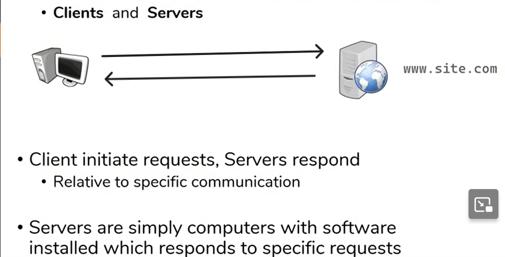

##### ‚úÖ Examples of Hosts:
- Computers (laptops/desktops)
- Smartphones
- Servers
- Printers
- Smart TVs
- Any device with an **IP address**

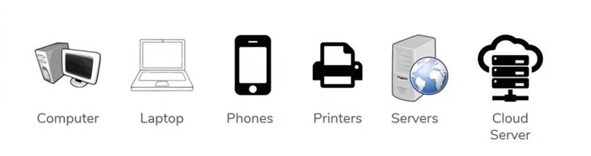

---

**IoT (Internet of Things)** is a network of **connected physical devices** that can collect, send, and receive data over the **internet** without human involvement.

 Also any **Internet of Things (IoT)** devices
- TV
- Thermometers
- Speakers
- Lights
- Smart Watches
- Refrigerator

---

##### 🧠 Key Points:
- Every host must have a **unique IP address**
- Hosts can be:
  - **Clients** (e.g., your PC)
  - **Servers** (e.g., Google’s web server)
- Hosts can **send**, **receive**, or **request** information

---
##### 🧠 In IP addressing:
- The **network part** of the IP address identifies the **network**.
- The **host part** identifies the **specific device** in that network.

##### üìå Example:

**IP Address:** `192.168.1.10`  
**Subnet Mask:** `255.255.255.0`

- **Network part:** `192.168.1`
- **Host part:** `10`

➡️ So, `10` is the **host ID**, which means it's the 10th device on the `192.168.1` network.

---

#### üßæ Summary Table

| Feature         | Description                          |
|------------------|--------------------------------------|
| **What is a host?**  | A device connected to a network      |
| **Requires IP?**     | Yes, must have a unique IP address   |
| **Examples**         | PC, smartphone, printer, server      |
| **Function**         | Sends/receives data over the network |

---

#### üåê **What is a Network?**

A **network** is a group of **two or more connected devices** (like computers, phones, printers) that can **share data, files, and resources** with each other.

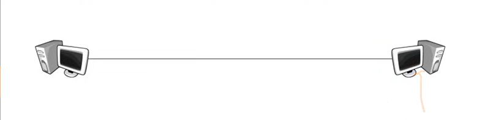

##### 🧠 Think of it like:

> A network is like a **highway** that connects devices so they can **talk and share** things easily.


##### üìå Why Networks are Useful:

* Share files and data
* Share printers, scanners, and internet
* Communicate via emails, chats, calls

##### 📦 Examples of Networks:

* **Home Network:** Connecting your phone, laptop, and smart TV to Wi-Fi
* **School/Office Network:** Many computers connected to a central server
* **Internet:** The largest network in the world!

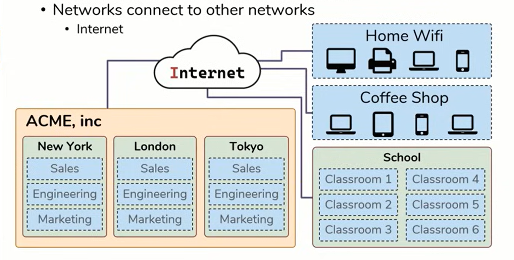

---

##### 🖥️ Types of Networks:

| Type | Full Form                 | Area Covered              |
| ---- | ------------------------- | ------------------------- |
| LAN  | Local Area Network        | Small area (home, office) |
| MAN  | Metropolitan Area Network | City-wide area            |
| WAN  | Wide Area Network         | Large area (countries)    |

---

#### üåê What is an IP Address?

- **IP Address** is like a home address for a device on a network.
- It is used to identify each device (host) uniquely.

##### ‚ú® Properties:
1. **Unique** – Every device gets a different IP.
2. **Universal** – Works everywhere across the internet.

##### üîó Types of IP Address

| Type        | Where it is used         | Example        |
|-------------|---------------------------|----------------|
| Public IP   | Used on the Internet      | `8.8.8.8`      |
| Private IP  | Used in Local Networks    | `192.168.1.1`  |

##### 🧮 IP Address Format

- IP Address is made of **binary numbers**, but shown in **decimal**.
- Example: `192.168.1.1` in binary is `11000000.10101000.00000001.00000001`

---

#### üåê IPv4 vs IPv6

---

##### ‚úÖ What is IPv4?

**IPv4 (Internet Protocol version 4)** is the 4th version of the Internet Protocol and is the most widely used.

##### üìå Features of IPv4:
- 32-bit address
- Written in decimal format (e.g., `192.168.1.1`)
- Provides about 4.3 billion unique addresses
- Still used in most networks today

  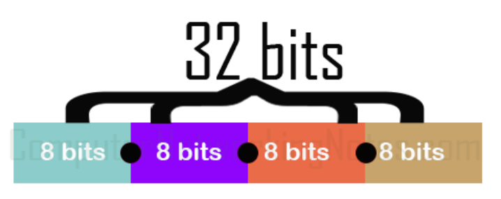

**Example:**  
`192.168.0.1`

---

##### ‚úÖ What is IPv6?

**IPv6 (Internet Protocol version 6)** is the latest version of the Internet Protocol, developed due to the exhaustion of IPv4 addresses.

##### üìå Features of IPv6:
- 128-bit address
- Written in hexadecimal format (e.g., `2001:0db8:85a3:0000:0000:8a2e:0370:7334`)
- Provides trillions of unique addresses
- Supports modern internet-connected devices

**Example:**  
`2001:0db8:85a3:0000:0000:8a2e:0370:7334`

##### 🔁 Difference between IPv4 and IPv6

| Feature                  | IPv4                          | IPv6                                   |
|--------------------------|-------------------------------|----------------------------------------|
| **Full Form**            | Internet Protocol version 4   | Internet Protocol version 6            |
| **Address Size**         | 32-bit                        | 128-bit                                |
| **Address Format**       | Decimal                       | Hexadecimal                            |
| **Example Address**      | `192.168.1.1`                 | `2001:db8::1`                          |
| **Number of Addresses**  | ~4.3 billion                  | Trillions (almost infinite)            |
| **Header Size**          | 20 bytes                      | 40 bytes                               |
| **Configuration**        | Manual or via DHCP            | Auto-configuration supported           |
| **Security**             | Optional (via IPSec)          | Mandatory (IPSec built-in)             |
| **Broadcasting**         | Supported                     | Not supported (uses multicasting)      |
| **Speed & Efficiency**   | Less efficient                | More efficient and faster              |
| **NAT (Address Sharing)**| Common                        | Not required                           |

---

#### ‚úÖ Summary:
- **IPv4** is old, still in use, but limited in number of addresses.
- **IPv6** is the future, offering vast address space, improved performance, and security.

---

#### üìò Notations in Networking

In networking, **notations** are the way **IP addresses** and **subnet masks** are written and represented so that computers and people can understand and process them easily.
In networking, IP addresses can be represented in different notations:

1. **Binary Notation** 🧠 (Used by computers)
2. **Dotted Decimal Notation** üìç (Used by humans)
3. **CIDR Notation** üßæ (Used for subnetting)

---

##### üîπ 1. **Binary Notation**

###### ‚úÖ What is it?

* Every **IP address** is actually stored and processed in **binary form** (0s and 1s) by computers.
* Each of the 4 parts (called **octets**) in an IPv4 address is represented as an **8-bit binary number**.

###### 🔁 Conversion Trick: Decimal ➝ Binary
Use **division by 2** and write the remainders **in reverse**.

###### üìå Example:

Let’s take the IP address:

**`192.168.1.1`**

In **binary notation**, this is:

192    = 11000000  
168    = 10101000  
1      = 00000001  
1      = 00000001

So the full binary IP address is:

**`11000000.10101000.00000001.00000001`**

---

##### üîπ 2. **Dotted Decimal Notation**

###### ‚úÖ What is it?

* This is the **most common format** used by humans.
* An IPv4 address is written as **four decimal numbers separated by dots**, where each number is the **decimal version of 8 binary bits** (1 byte).

## 🔁 Conversion Trick: Binary ➝ Decimal
Use **place values**:  

Multiply each binary digit by powers of 2 (from right to left), then **add all**.

###### üìå Example:

Binary:
`11000000.10101000.00000001.00000001`

Convert each part to decimal:


11000000 ‚Üí 192  
10101000 ‚Üí 168  
00000001 ‚Üí 1  
00000001 ‚Üí 1

So the **dotted decimal notation** is:

**`192.168.1.1`**

---

##### üîπ 3. **CIDR Notation (Bonus)**

> CIDR stands for **Classless Inter-Domain Routing**
> It is another way to show an IP address **with subnet mask**.
> CIDR combines **IP address + subnet mask** in a compact way.

###### 🧠 CIDR Conversion Trick:

| CIDR Notation | Subnet Mask          |
|---------------|----------------------|
| /8            | 255.0.0.0            |
| /16           | 255.255.0.0          |
| /24           | 255.255.255.0        |
| /32           | 255.255.255.255      |

---

###### üìå Format: 

IP_address/subnet_bits

**Example:**
`192.168.1.1/24`
üëâ Means: First 24 bits are **network**, and remaining 8 are **host**.

---

#### ‚úÖ Summary Table

| Notation Type       | Format Example                        | Description                             |
| ------------------- | ------------------------------------- | --------------------------------------- |
| **Binary Notation** | `11000000.10101000.00000001.00000001` | IP in binary, understood by computers   |
| **Dotted Decimal**  | `192.168.1.1`                         | IP in human-readable form               |
| **CIDR Notation**   | `192.168.1.1/24`                      | IP + subnet info for routing/networking |

---


#### üßæ IP Classes (Classful Addressing)

##### ‚úÖ What is Classful Addressing?

**Classful Addressing** is a system used in early internet networking to divide the IPv4 address space into **5 predefined classes**: A, B, C, D, and E.

Each IP address was split into two parts:
- **Prefix (Network ID):** Identifies the **network**.
- **Suffix (Host ID):** Identifies the **device/node** within that network.

This structure was used to decide how many **networks** and **hosts per network** could exist.

---

###### üß© Structure of IP Address

An **IPv4 address** is 32 bits long, written in 4 octets (like: `192.168.1.1`).

**Example** : 192.168.0.1 ‚Üí 11000000.10101000.00000000.00000001

Each address = **Network ID (prefix)** + **Host ID (suffix)**

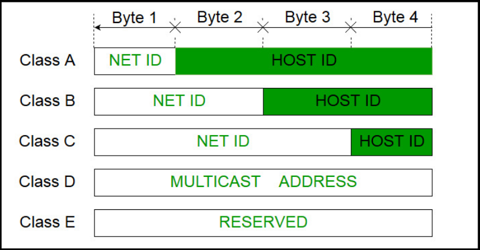

IPv4 addresses are divided into 5 **Classes** based on their first number.

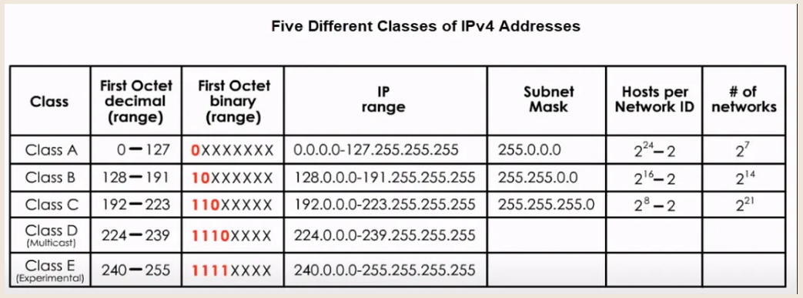


###### 🅰️ Class A

- **Range:** 1.0.0.0 to 126.255.255.255  
- **Starting Bit Pattern:** `0`
- **Default Subnet Mask:** `255.0.0.0 (/8)`
- **Network.Host.Host.Host**
- **Number of Networks:** 128
- **Hosts per Network:** ~16 million
- **Used for:** Very large organizations (e.g., ISPs)

**Example:** `10.0.0.1`

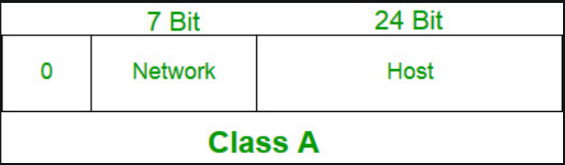

###### 🅱️ Class B

- **Range:** 128.0.0.0 to 191.255.255.255  
- **Starting Bit Pattern:** `10`
- **Default Subnet Mask:** `255.255.0.0 (/16)`
- **Network.Network.Host.Host**
- **Number of Networks:** ~16,384
- **Hosts per Network:** ~65,000
- **Used for:** Medium-sized organizations (e.g., universities)

**Example:** `172.16.5.4`


###### üÖ≤ Class C

- **Range:** 192.0.0.0 to 223.255.255.255  
- **Starting Bit Pattern:** `110`
- **Default Subnet Mask:** `255.255.255.0 (/24)`
- **Network.Network.Network.Host**
- **Number of Networks:** ~2 million
- **Hosts per Network:** 254
- **Used for:** Small networks (e.g., homes, small businesses)

**Example:** `192.168.1.10`

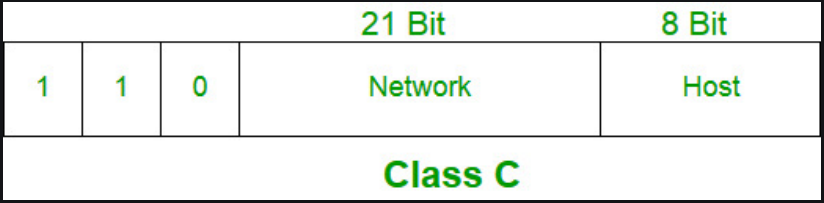

###### üÖ≥ Class D (Multicast)

- **Range:** 224.0.0.0 to 239.255.255.255  
- **Starting Bit Pattern:** `1110`
- **Used for:** **Multicasting** (one-to-many communication)
- **Not for host assignment**

**Example:** `224.0.0.9` (used in routing protocols like RIP)


###### üÖ¥ Class E (Reserved)

- **Range:** 240.0.0.0 to 255.255.255.255  
- **Starting Bit Pattern:** `1111`
- **Used for:** **Research and development**
- **Not assigned to hosts**

**Example:** `250.1.1.1`


---

#### üìä Summary Table

| Class | Hosts/Network |  Use Case             |
|-------|----------------|----------------------|
| A     | ~16 million    | Large orgs/ISPs      |
| B     | ~65,000        | Universities/Corps   |
| C     | 254            | Small offices/homes  |
| D     | Not applicable |     Multicasting     |
| E     | Not applicable | Research/Reserved    |

---

##### 🧠 Easy Trick to Remember Classes:


A ‚Üí "All" (Large)

B ‚Üí "Big" (Medium)

C ‚Üí "Common" (Small)

D ‚Üí "Deliver" (Multicast)

E ‚Üí "Experiment" (Reserved)

---

##### üö´ Limitations of Classful Addressing

- **Wastes IP addresses** (e.g., Class A gives millions even if not needed)
- Not flexible for modern networks
- Doesn't support efficient **subnetting** or **CIDR**

✅ That’s why it was replaced by **Classless Addressing (CIDR)** in modern networking.

---

##### üß™ Example Questions:

1. **What class does the IP `172.16.0.1` belong to?**  
   ‚Üí Class B

2. **How many hosts can a Class C network support?**  
   ‚Üí 254

3. **What is the default subnet mask of Class A?**  
   ‚Üí `255.0.0.0`

---

##### üîç How to Remember:
- **Class A**: 0–127 → Big organizations (e.g. Indian Railways)
- **Class B**: 128–191 → Medium companies
- **Class C**: 192–223 → Home/Office LAN
- **Class D**: 224–239 → Group messages (multicast)
- **Class E**: 240–255 → Future use

---

#### üåç Reserved IP Addresses

| IP Address      | Purpose                     |
|------------------|------------------------------|
| `0.0.0.0`        | Default / Unknown network    |
| `127.0.0.1`      | Loopback (test your PC)      |
| `255.255.255.255`| Broadcast to all devices     |

---

#### 🧠 Network vs Host ID

- IP Address is divided into 2 parts:
  - **Network ID**: Identifies the network.
  - **Host ID**: Identifies the device (host) in that network.

##### Example:
- Class B IP: `172.16.5.10`
- **Network ID** = `172.16`
- **Host ID** = `5.10`

---
#### üì° Difference Between Unicast, Broadcast, and Multicast Addresses

| Type       | Definition                                                                             |          Bandwidth Use        |          Example Use Case       |
|------------|----------------------------------------------------------------------------------------|-------------------------------|---------------------------------|
| **Unicast** (one to one)  | Sends data from **one sender to one specific receiver**.                |          Efficient            | One PC sending a file to another PC|
| **Broadcast**(one to all) | Sends data from **one sender to all devices** on the network.           |  High (for large networks)    | ARP Request, DHCP Discovery   |
| **Multicast**(one to many) | Sends data from **one sender to multiple selected receivers** (group). | More efficient than broadcast | Streaming video to multiple users  |

---

##### üì• Address Information

| Type        | IP Address Range                             | MAC Address Example       |
|-------------|-----------------------------------------------|---------------------------|
| **Unicast**   | Unique IP (e.g., `192.168.1.10`)              | `00:1A:2B:3C:4D:5E`        |
| **Broadcast** | IPv4: `255.255.255.255` (local broadcast)     | `FF:FF:FF:FF:FF:FF`        |
| **Multicast** | IPv4: `224.0.0.0` to `239.255.255.255`        | `01:00:5E:xx:xx:xx`        |

-----

#### üåê DNS and MAC Address

#####  ‚úÖ DNS (Domain Name System)

- **Definition**: DNS converts domain names (like `www.google.com`) into IP addresses (like `142.250.182.14`).
- **Purpose**: Helps users access websites using names instead of IP numbers.
- **How it works**:
  1. You enter a website name.
  2. DNS finds the IP address of that website.
  3. Browser connects to the correct server using that IP.

- **Example**:

[www.google.com](http://www.google.com) ‚Üí 142.250.182.14

---

##### ‚úÖ MAC Address (Media Access Control)

- **Definition**: A MAC address is a **unique identifier** assigned to a device's **network interface card (NIC)**.
- **Used in**: Local area networks (LAN) for device identification.
- **Format**: 6 pairs of hexadecimal digits (48-bit).
- Example: `00:1A:2B:3C:4D:5E`

- **Key Points**:
- Permanent (burned into hardware)
- Used for communication inside a network
- Helps routers and switches direct data correctly

---

#### 🔄 IP vs MAC (Quick Difference)

| Feature        | IP Address           | MAC Address           |
|----------------|----------------------|------------------------|
| Type           | Logical (can change) | Physical (permanent)  |
| Usage          | Internet-wide        | Local network (LAN)   |
| Format         | 192.168.0.1          | 00:1A:2B:3C:4D:5E      |
| Assigned by    | ISP or network       | Manufacturer           |

---

#### üö™ Default Gateway

##### ‚úÖ What is a Default Gateway?

- A **Default Gateway** is a device (usually a **router**) that connects your local network to **external networks**, such as the internet.
- It acts as an **exit point** for devices to send data **outside their network**.

---

###### üìå Why is it important?

- Without a default gateway, devices can **only communicate within the same local network**.
- It allows communication with **other networks or the internet**.

###### 🧠 Example:

- Suppose your PC has IP: `192.168.1.10`
- Your router (default gateway) has IP: `192.168.1.1`

> When your PC wants to access `www.google.com`, it sends the request to `192.168.1.1` (default gateway), which forwards it to the internet.

---

#### 🗂️ Default Gateway vs IP Address

| Feature         | IP Address                 | Default Gateway             |
|-----------------|----------------------------|------------------------------|
| Identity        | Unique to the device       | Common for all in network   |
| Purpose         | Used to identify the device| Used to route external traffic|
| Example         | `192.168.1.10`             | `192.168.1.1`                |

---

> ‚úÖ **Tip**: The Default Gateway is usually the **IP address of your router**.

-----

#### 🛠️ Subnetting (Very Important)

##### üìå What is it?

It helps you to utilize your network bandwidth more intelligently.

The practice of dividing a network into two or more networks is called subnetting.

> Subnetting means breaking a big network into smaller parts.
 
##### ‚úÖ Why we need it?

- To use IP addresses more efficiently.
- To increase security and control.

##### üìò Subnet Mask

| Class | Subnet Mask        |
|-------|---------------------|
| A     | `255.0.0.0`         |
| B     | `255.255.0.0`       |
| C     | `255.255.255.0`     |

##### 🎯 Example:

> IP Address: `205.150.65.0/26`

- `/26` ‚Üí Means 26 bits are for network, 6 bits for host.

##### Calculations:
- **Subnet Mask**: `255.255.255.192`
- **No. of Subnets**: `2^2 = 4`
- **No. of Hosts/Subnet**: `2^6 - 2 = 62`
- **Network IP**: `205.150.65.0`
- **Broadcast IP**: `205.150.65.63`

---

#### üìä Bandwidth and Latency

- **Bandwidth**: Speed of data transfer (measured in bps) or 
It is the rate at which data is actually transmitted over the network .

- **Latency**: Time delay during data transfer from source to destination .

---

#### üåê Network IP and Broadcast IP 

---

##### ‚úÖ Network IP (Network Address)

- It is the **first IP address** in a network.
- It is used to **identify the whole network**.
- It does **not belong to any device**.
- **Example**: `192.168.1.0` ‚Üí means the 192.168.1 network.

---

##### ‚úÖ Broadcast IP (Broadcast Address)

- It is the **last IP address** in a network.
- It is used to **send a message to all devices** in the network.
- It does **not belong to any one device**.
- **Example**: `192.168.1.255` ‚Üí message goes to all devices in 192.168.1.x

---

#### 🎯 Summary

| Term           | Meaning                          | Example          |
|----------------|----------------------------------|------------------|
| Network IP     | First IP, shows the network      | `192.168.1.0`    |
| Broadcast IP   | Last IP, talks to all devices    | `192.168.1.255`  |

> ‚úÖ **Network IP = name of the network**  
> ‚úÖ **Broadcast IP = send to everyone in that network**

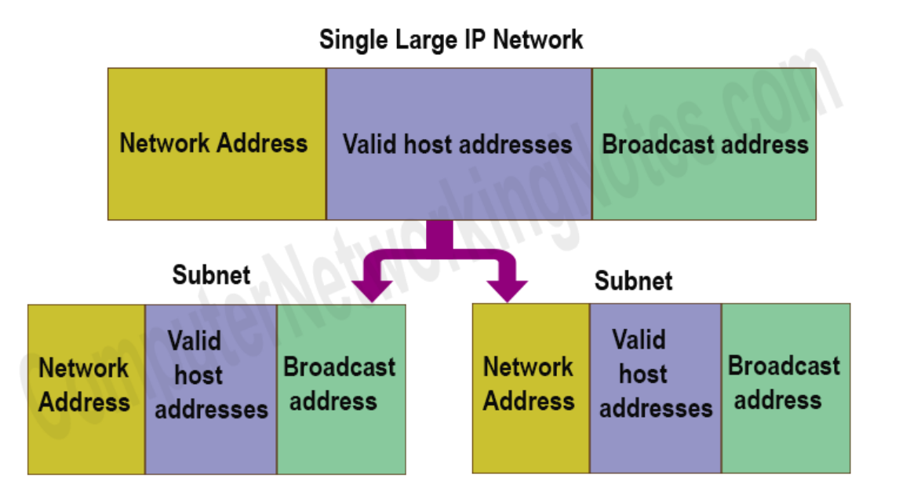

-------------


#### ‚úÖ Final Summary (Easy Revision)

| Concept        | Meaning                                       |
|----------------|-----------------------------------------------|
| IP Address     | Identity of device on a network               |
| Public IP      | Visible on internet                          |
| Private IP     | Used within a LAN                            |
| Subnetting     | Divide a network into smaller ones            |
| Broadcast IP   | Last IP in a subnet, sends to all             |
| DNS            | Converts name to IP                           |
| MAC Address    | Physical device ID                            |
| IPv4           | 32-bit IP                                     |
| IPv6           | 128-bit IP (newer version)                    |
| Host           | Any device on a network                       |

---

> üéì Tip: Always remember **Network + Host = IP Address**  
> ✨ For any subnet: **2^host_bits – 2 = Number of Hosts**

---

## Training day :- 08

----

### 🧠 What is DHCP?

##### ✅ DHCP – Dynamic Host Configuration Protocol

##### üìå Definition:
**DHCP** is a network protocol that **automatically gives IP addresses** to devices (like your phone, computer, etc.) when they connect to a network.

##### üîß Why is DHCP used?

- To **avoid manual IP configuration**.
- To **save time** and **reduce mistakes**.
- Makes it **easy to manage** IPs in big networks

##### 🧠 How it works (Simple Steps):

1. You connect your device to Wi-Fi.
2. Your device asks for an IP address.
3. The **DHCP server** picks a free IP and gives it to your device.
4. You are now connected to the network and internet!

##### üìé Example:

- You connect your laptop to Wi-Fi.
- DHCP gives it IP: `192.168.1.5`
- Next time, it may give a different IP like `192.168.1.8`

##### üßæ Key Terms:

| Term         | Meaning                              |
|--------------|---------------------------------------|
| DHCP Server  | The device (router or server) that gives IP addresses |
| DHCP Client  | The device (your phone, PC, etc.) that gets an IP     |

##### 🔄 Without DHCP vs With DHCP

| Action           | Manual IP (No DHCP) | DHCP (Automatic)      |
|------------------|---------------------|------------------------|
| Set IP Address   | You do it manually  | Given automatically   |
| Easy to Use?     | ‚ùå No                | ‚úÖ Yes                |
| Error chances    | High                | Low                   |

> ✅ **In Simple Words**: DHCP is like an **auto-assign system** that gives an IP address to each device, so you don’t have to do it yourself.

-------


### 🛠️ Networking Commands: `ping`, `traceroute`, `ifconfig`

#### ‚úÖ 1. `ping` Command

##### üìå What is it?
`ping` checks if another computer or website is reachable and shows how long the data takes to travel there and back.

##### 🧠 Technical Meaning:
It sends small data packets (ICMP echo requests) to a target IP or domain, and waits for a reply.

##### üß™ Example Command:

ping google.com

> **On windows**

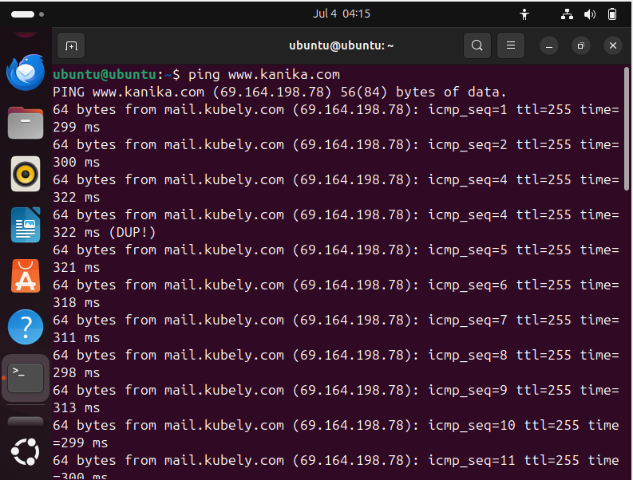

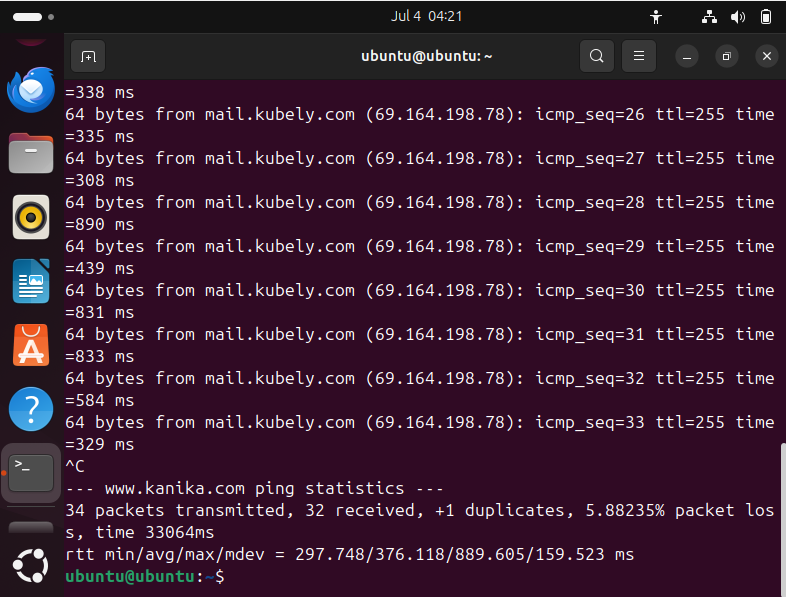

> **On Linux**

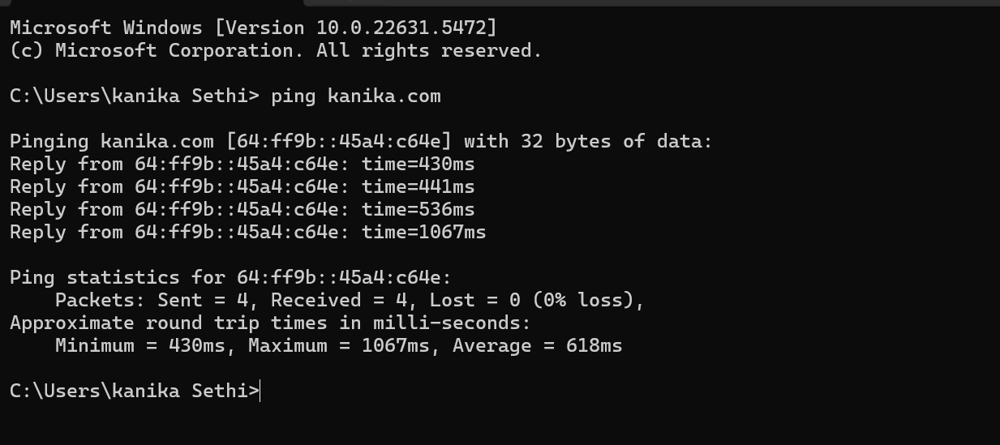


##### üìå Real-Life Example:

> You're not able to open Google on your browser. You run `ping google.com` to check if your computer can reach Google’s servers. If it replies, the problem is not with your internet.

##### ‚úÖ Use:

* To test internet or network connection
* To see if a server is **up or down**

---

## üìå What is "64 bytes" in ping?

- When we use the `ping` command, it sends a **data packet** to the target.
- That packet is usually **64 bytes in size**.
- It means: **64 bytes of data were sent and received successfully**.

### üß™ Example:

ping google.com

Output:

64 bytes from 142.250.182.14: time = 25 ms

> This shows your computer sent a **64-byte packet** to Google, and it replied in **25 ms**.

---

## üìå What is Loopback?

* **Loopback** means sending data **to your own computer**.
* It is used to **test your network setup locally**.
* The loopback IP address is : 127.0.0.1
* Also called **localhost**.

### üß™ Example:

ping 127.0.0.1

> This checks if your PC’s network system is working properly (no need for internet).


## 🎯 Summary

| Term        | Meaning                   |
| ----------- | ------------------------- |
| 64 bytes    | Size of ping packet       |
| Loopback    | Testing your own computer |
| Loopback IP | `127.0.0.1` (localhost)   |

---

#### ‚úÖ 2. `traceroute` / `tracert` Command

##### üìå What is it?

It shows the path (all the routers or hops) that your data travels through to reach a website.

##### 🧠 Technical Meaning:

Sends packets with increasing TTL (Time To Live) and shows each router between your device and the final server.

##### üß™ Example Command:

traceroute google.com      # On Linux/macOS

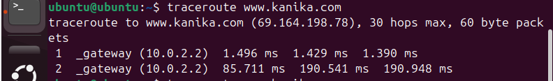

tracert google.com         # On Windows

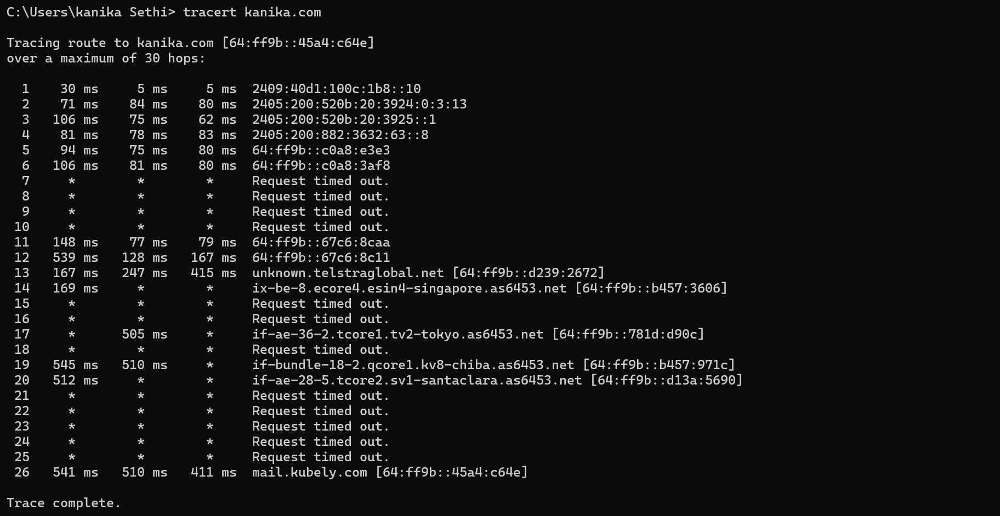


##### üìå Real-Life Example:

> A website is working for your friend but not for you. You run `tracert` to see where your request is getting delayed or blocked — maybe a router between you and the site is down.

> Think of traceroute like **tracking a courier package**.

 Each stop (hop) it passes through is like a delivery center.
 
 Traceroute shows **each stop**, and **how long** it took to reach there.
 
##### üîç Use Cases of traceroute

* Diagnose where a connection is slow or failing
* Identify routing problems in networks
* See how many hops it takes to reach a website
* Understand how data travels on the internet

#### ✳️ Asterisks (`*`) in Traceroute – Meaning & Interpretation

##### üìå Meaning:
- Asterisks appear when the router **does not respond** within the time limit.
- It shows a **timeout** for that attempt.


##### üìñ Interpretation:

| Output            | Interpretation                                  |
|------------------|--------------------------------------------------|
| `*  *  *`         | No response from the router at that hop         |
| `12 ms  *  14 ms` | Responded to 1st and 3rd attempt only            |
| Multiple `* * *` rows | Could mean a **firewall** or **unreachable hop** |
| All hops = `*`    | Likely a **major network issue** or **blocked path** |

> ✅ **Note**: Some routers are **configured to ignore traceroute** — so occasional asterisks are normal.
> ‚úÖ **Tip**: 
Use ping to check if a site is reachable.
Use traceroute to see how it's being reached and where delays happen.

---

#### ‚úÖ 3. `ifconfig` Command (`ipconfig` in Windows)

| Command     | Platform | Purpose                                      |
|-------------|----------|----------------------------------------------|
| `ipconfig`  | Windows  | Displays and manages IP configuration        |
| `ifconfig`  | Linux    | Displays and configures network interfaces   |


##### üîç What is it?

| Command     | Description                                                                 |
|-------------|-----------------------------------------------------------------------------|
| `ipconfig`  | A Windows command-line tool that displays current TCP/IP network settings. |
| `ifconfig`  | A Linux/Unix command-line tool for viewing and changing network interface parameters. |

##### 🧠 Real-life Analogy

| Command     | Analogy                                                                  |
|-------------|--------------------------------------------------------------------------|
| `ipconfig`  | Like checking your **phone’s network settings**: IP, Wi-Fi, gateway info |
| `ifconfig`  | Like accessing your **router’s admin page** to check connection settings |


##### üìå Important Fields Displayed

| Field              | Meaning                                                       |
|--------------------|---------------------------------------------------------------|
| **IP Address**      | Unique address assigned to your device                        |
| **Subnet Mask**     | Defines network and host portions of IP address               |
| **Default Gateway** | Router IP used to access external networks                    |
| **MAC Address**     | Physical address of your network adapter                      |
| **DNS Servers**     | Servers used for domain name resolution                       |
| **Interface Name**  | Name of the network adapter (e.g., `eth0`, `wlan0`, `Ethernet`) |
| **Status**          | Shows if the interface is connected or disconnected           |


##### üí° Examples

###### ‚úÖ `ipconfig` (Windows)

ipconfig

###### ‚úÖ `ifconfig` (Linux)

ifconfig

##### ‚úÖ Use:

* To find your IP address
* To troubleshoot local network issues

---

##### üìù Tip

* On **modern Linux systems**, `ifconfig` is deprecated. Use the `ip` command instead:

  ip addr show
  
---

#### üìã Summary Table

| Command      | Purpose                              | OS        | Real-Life Use Example                    |
| ------------ | ------------------------------------ | --------- | ---------------------------------------- |
| `ping`       | Check if device/website is reachable | All       | Check if internet is working             |
| `traceroute` | See all steps data takes to a site   | Linux/mac | Find where connection is slow or blocked |
| `tracert`    | Same as above (Windows version)      | Windows   | Same use as traceroute                   |
| `ifconfig`   | Show/change local network config     | Linux/mac | Check IP/MAC if no internet on your PC   |
| `ipconfig`   | Same as ifconfig (for Windows)       | Windows   | Check if router gave your PC a proper IP |

---

> 🧠 **Tip:** These 3 commands help you quickly test, fix, or understand your network connection — even before calling a technician!

---

### üåê Ethernet 

#### ‚úÖ What is Ethernet?

- Ethernet is a **wired communication technology** used in **Local Area Networks (LANs)** to connect devices like PCs, switches, and routers.
- It allows devices to **send and receive data using physical cables** (usually Cat5e or Cat6).
- It follows the **IEEE 802.3 standard**.

##### 🧠 Real-Life Analogy

> Think of Ethernet like **city roads**:

- Cars = Data packets  
- Roads = Ethernet cables  
- Houses = Computers  
- Traffic lights = Switches/Routers  

Ethernet allows computers to **send and receive data** safely and efficiently — just like cars traveling on proper roads.

##### 👀 What Does Ethernet Look Like?

##### üîå Cable:
- Looks like a thick telephone wire.
- Usually has **RJ45 connectors** on both ends.
- Labeled as **Cat5e, Cat6, Cat6a**, etc.

##### üî≤ Port:
- Found on desktops, laptops, routers.
- A square port labeled as “LAN” or with this symbol: `<>`

---

##### ⚙️ How Ethernet Works :

1. Devices are connected to a **switch or router** using Ethernet cables.
2. Each device has a **unique MAC address**.
3. When data is sent, the switch/router checks the **destination MAC** and forwards it to the correct device.
4. Communication happens at very **high speed**, with **low errors**.

##### üß™ Where is Ethernet Used?

- Homes: Wired internet
- Offices: LAN networks
- Gaming: Stable, fast connection
- CCTV: For camera and DVR connection
- Servers & data centers: High-speed networking

##### üöÄ Advantages of Ethernet

- üîπ Faster than Wi-Fi
- üîπ More secure and stable
- üîπ Low latency (great for gaming/video calls)
- üîπ Less interference than wireless
- üîπ Easy to set up for small networks

##### üîç How to Check Ethernet on Your System

###### 🖥️ On **Windows**:
- **Method 1**:
  
  1. Press `Windows + R` ‚Üí type `ncpa.cpl` ‚Üí Enter
  2. Look for **"Ethernet"** connection
  3. Right-click ‚Üí Status ‚Üí See IP & speed

- **Method 2**: ipconfig

###### üêß On **Linux**:

ifconfig      # older systems

ip a          # newer systems

Look for : eth0, ens33, enp3s0

If it shows `inet` with an IP (like `192.168.1.10`), Ethernet is active.

#### 📘 Real-Life Analogy Table – Networking Terms

| Term      | Purpose                                      | Real-Life Analogy                              |
|-----------|----------------------------------------------|-------------------------------------------------|
| inet      | Shows the **IP address** of your device      | Your **home address** on the network         |
| netmask   | Defines the **size of your local network**   | **Walls of your house** (who's inside with you) |
| broadcast | Sends data to **all devices in the network** | **Loudspeaker** message for the whole street |
| lo0       | Loopback interface – connects to **yourself**| **Talking to yourself** in a mirror           |

---

#### üìù Quick Summary

| Topic             | Info                                  |
| ----------------- | ------------------------------------- |
| What is Ethernet  | Wired LAN technology using cables     |
| Analogy           | Roads for sending data                |
| Connector Type    | RJ45                                  |
| Common Cables     | Cat5e, Cat6, Cat6a                    |
| Common Speeds     | 100 Mbps – 10 Gbps                    |
| Used In           | Homes, offices, gaming, CCTV, servers |
| Check (Windows)   | `ncpa.cpl`, `ipconfig`                |
| Check (Linux)     | `ifconfig`, `ip a`                    |
| Protocol Standard | IEEE 802.3                            |

> ‚úÖ **Tip**: Ethernet is best when you need **high speed, no disconnection, and better security** compared to Wi-Fi.

----

#### 🔄 Ethernet vs Wi-Fi – Comparison Table

| Feature       | üß∑ Ethernet                         | üì∂ Wi-Fi                              |
|---------------|-------------------------------------|----------------------------------------|
|  **Signal**  | Direct connection via cable (no signal loss) | Uses radio waves (can face interference) |
|  **Speed**   | Faster – up to 10 Gbps or more      | Slower – depends on router & range     |
|  **Stability** | Very stable (no drops or lag)       | Less stable (affected by walls, devices) |
|  **Mobility** | Limited – fixed to cable            | High – move freely within Wi-Fi range   |

---
#### üåê Comparison: Ethernet vs Wi-Fi vs LAN vs WAN vs Internet

| Term       | What It Is                            | Scope             | Wired/Wireless      | Example                              |
|------------|----------------------------------------|-------------------|----------------------|---------------------------------------|
| **Ethernet** | A wired networking technology         | Small (single room/building) | Wired           | PC connected to router via cable      |
| **Wi-Fi**    | Wireless networking technology        | Small to medium   | Wireless             | Phone connected to home Wi-Fi         |
| **LAN**      | Local Area Network – connects devices in one location | Limited to building/campus | Both (Ethernet & Wi-Fi) | Office network, home network          |
| **WAN**      | Wide Area Network – connects LANs over long distances | City to worldwide   | Both (Fiber, wireless, etc.) | Bank branches network, telecom network |
| **Internet** | Global network of networks            | Worldwide         | Both                 | Browsing Google, watching YouTube     |

------

## Training day :- 09

### üåê Introduction to HTML

#### ‚úÖ What is HTML?

**HTML (HyperText Markup Language)** is the standard language used to create web pages.  
It defines the **structure and layout** of content using **tags**.

- Not a programming language, but a **markup language**.
- HTML files have a `.html` extension.

---

#### ‚úÖ What Does HTML Do?

- Creates the **structure** of a web page.
- Organizes content using elements like headings, paragraphs, images, and links.
- Acts as the **skeleton** of a web page.
- It works along with CSS (for styling) and JavaScript (for functionality).

---

#### ‚úÖ How Does a Browser Render HTML?

1. Browser loads the `.html` file.
2. It reads the HTML **line-by-line** from top to bottom.
3. Builds a **DOM (Document Object Model)** in memory.
4. Converts HTML tags into **visual elements** on the screen.
5. Processes linked CSS for styling and JavaScript for functionality.

**Example:**  
When the browser sees `<h1>Hello</h1>`, it renders **Hello** as a big heading.


#### ‚úÖ Basic Structure of an HTML Document

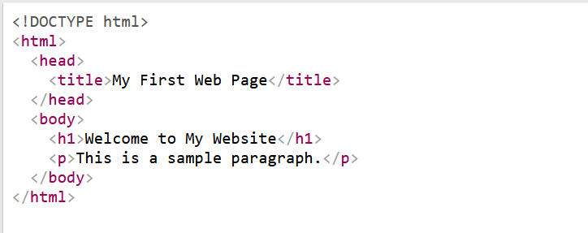


#### ‚úÖ Explanation of Each Part

| Part              | Description                                  |
| ----------------- | -------------------------------------------- |
| `<!DOCTYPE html>` | Declares the HTML version (HTML5).           |
| `<html>`          | Root of the document. All content goes here. |
| `<head>`          | Meta information (title, links, charset).    |
| `<title>`         | Title shown in the browser tab.              |
| `<body>`          | Contains visible content on the web page.    |
| `<h1>`            | Largest heading, used for main titles.       |
| `<p>`             | Paragraph element.                           |

#### ‚úÖ Structure of HTML (Tree View)

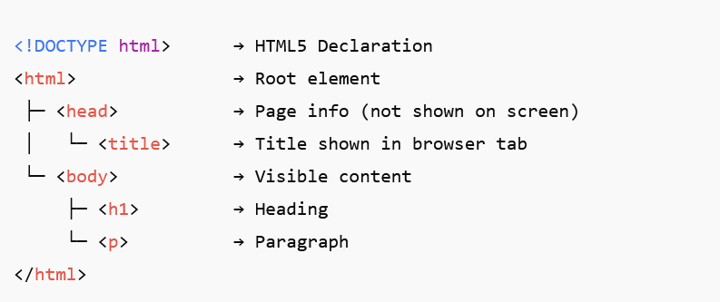

#### ‚úÖ Summary Points

* HTML defines **what** content appears on a webpage.
* A **browser renders** HTML into visible structure.
* Tags are used in **pairs**: `<tag>` ... `</tag>`.
* Structure includes: `<!DOCTYPE>`, `<html>`, `<head>`, and `<body>`.

---

## Training day:- 10

### üåê Introduction to HTML & Web Basics

#### ‚úÖ What is HTML?

**HTML (HyperText Markup Language)** is the standard language used to create web pages. It structures content using **tags** that the browser can interpret.

---

#### üîñ Common HTML Tags

##### 1. Headings (`<h1>` to `<h6>`)
- Used to define titles and subheadings.
- `<h1>` is the largest, `<h6>` is the smallest.

```html
<h1>Main Title</h1>
<h2>Subheading</h2>
````

##### 2. Paragraph (`<p>`)

* Represents a block of text.

```html
<p>This is a paragraph of text.</p>
```


##### 3. Lists

##### 🔸 Unordered List (`<ul>`) – Bullet Points

```html
<ul>
  <li>Apple</li>
  <li>Banana</li>
</ul>
```

##### 🔸 Ordered List (`<ol>`) – Numbered

```html
<ol>
  <li>First Step</li>
  <li>Second Step</li>
</ol>
```

##### 4. Links (`<a>`)

* Used to create clickable hyperlinks.
* `href` attribute defines the URL.

```html
<a href="https://www.google.com">Visit Google</a>
```

##### 5. Images (``)

* Used to display images on a web page.
* `src` specifies the image path, `alt` gives alternative text.

```html

```

##### Using above HTML tags 

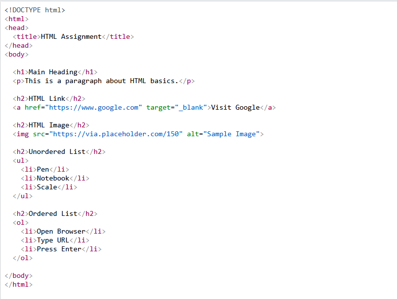


---

## ‚úÖ Quick Notes:

* All tags are enclosed in **angle brackets**: `< >`.
* Some tags need **opening and closing** (e.g., `<p></p>`), while some are **self-closing** (e.g., ``).
* HTML is not case-sensitive but is recommended to be written in **lowercase**.

---

## Training day :- 11

### üìò 1. Forms and Input Types in HTML

#### üîπ What is a Form?
An **HTML form** is used to collect user input and send it to a server for processing. It is defined using the `<form>` tag.

```html
<form action="/submit" method="post">
  <!-- input elements go here -->
</form>
````

* `action`: The server URL where form data will be sent.
* `method`: Defines how form data is sent – `GET` or `POST`.

---

### üîπ HTML Form Methods: `GET` vs `POST`

| Feature       | `GET` Method                         | `POST` Method                     |
| ------------- | ------------------------------------ | --------------------------------- |
| Data Location | Appended in URL (visible)            | Sent in request body (invisible)  |
| Use Case      | Safe data like search, filters       | Sensitive data like passwords     |
| Length Limit  | Limited to URL length (\~2048 chars) | No size limit (depends on server) |
| Security      | Less secure                          | More secure                       |
| Example URL   | `/submit?name=John&email=test@x.com` | Data is hidden from URL           |

‚úÖ Use `GET` for search/filter forms and `POST` for login or data submission forms.

---

### üîπ Common Input Types

| Input Type | Description                   | Example                   |
| ---------- | ----------------------------- | ------------------------- |
| `text`     | Single-line text input        | `<input type="text">`     |
| `password` | Password input (hidden chars) | `<input type="password">` |
| `email`    | Validates email format        | `<input type="email">`    |
| `number`   | Numeric values only           | `<input type="number">`   |
| `radio`    | One option from a group       | `<input type="radio">`    |
| `checkbox` | Multiple options              | `<input type="checkbox">` |
| `date`     | Date picker                   | `<input type="date">`     |
| `file`     | File upload                   | `<input type="file">`     |
| `submit`   | Submits the form              | `<input type="submit">`   |
| `reset`    | Resets all form fields        | `<input type="reset">`    |

---

### üîπ Example HTML Form

```html
<form action="/submit" method="post">
  Name: <input type="text" name="name"><br>
  Email: <input type="email" name="email"><br>
  Password: <input type="password" name="password"><br>

  Gender:
  <input type="radio" name="gender" value="male"> Male
  <input type="radio" name="gender" value="female"> Female<br>

  Hobbies:
  <input type="checkbox" name="hobby" value="Reading"> Reading
  <input type="checkbox" name="hobby" value="Travel"> Travel<br>

  Upload File: <input type="file"><br>

  <input type="submit" value="Submit">
</form>
```

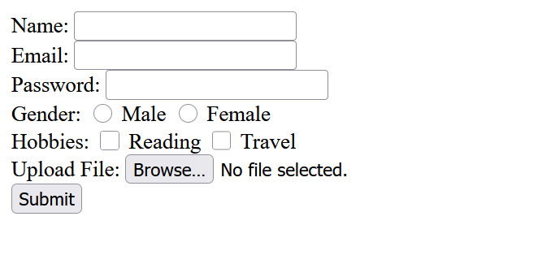

---

## üìò 2. Semantic HTML

### üîπ What is Semantic HTML?

Semantic HTML refers to the use of HTML5 tags that clearly describe the purpose and meaning of the content. It helps in **accessibility**, **SEO**, and **code readability**.

---

### üîπ Common Semantic Tags

| Tag         | Purpose                                             |
| ----------- | --------------------------------------------------- |
| `<header>`  | Top section of page (logo, nav, title, etc.)        |
| `<footer>`  | Bottom section of page (copyright, links)           |
| `<nav>`     | Navigation links to other pages                     |
| `<section>` | A thematic grouping of content                      |
| `<article>` | Self-contained content (e.g., blog post, news item) |

---

### üîπ Semantic HTML Example

```html
<body>
  <header>
    <h1>Eco Lifestyle Guide</h1>
    <nav>
      <a href="home.html">Home</a>
      <a href="tips.html">Tips</a>
    </nav>
  </header>

  <section>
    <article>
      <h2>Green Living Tips</h2>
      <p>Use reusable bags and bottles to reduce plastic waste.</p>
    </article>
  </section>

  <footer>
    <p>© 2025 Eco Web. All rights reserved.</p>
  </footer>
</body>
```


---

#### üìù Summary

* **Forms** are used for collecting input.
* Use various `input` types like `text`, `email`, `checkbox`, etc. depending on the need.
* **Semantic HTML** helps browsers and developers understand the structure and meaning of a webpage using tags like `<header>`, `<nav>`, `<section>`, `<article>`, and `<footer>`.

---

## Training Day :- 12

## üìò 3. CSS Styling: Inline, Internal & External

### üîπ What is CSS?

CSS (Cascading Style Sheets) is used to style HTML elements. It controls layout, color, fonts, spacing, and more.

There are **three ways to apply CSS**:

### ‚úÖ Inline CSS

* Applied directly to an HTML element using the `style` attribute.
* Best for quick, one-time styling.

```html
<p style="color: green; font-size: 18px;">This is styled text.</p>
```

### ‚úÖ Internal CSS

* Defined inside a `<style>` tag within the `<head>` of an HTML file.
* Useful for styling a single web page.

```html
<head>
  <style>
    body {
      background-color: #f0fff0;
      font-family: Arial;
    }
    h1 {
      color: darkgreen;
    }
  </style>
</head>
```

### ‚úÖ External CSS

* Written in a separate `.css` file.
* Linked to the HTML file using the `<link>` tag.
* Recommended for styling multiple pages consistently.

**HTML File:**

```html
<head>
  <link rel="stylesheet" href="styles.css">
</head>
```

**styles.css File:**

```css
body {
  background-color: #e6ffe6;
  font-family: Verdana;
}
h1 {
  color: seagreen;
  text-align: center;
}
```

---

### üîπ Comparison Table

| Feature     | Inline CSS             | Internal CSS                 | External CSS               |
| ----------- | ---------------------- | ---------------------------- | -------------------------- |
| Location    | Inside HTML element    | Inside `<style>` in `<head>` | In separate `.css` file    |
| Scope       | One element only       | Whole single HTML page       | Multiple HTML files        |
| Reusability | ❌ No                   | ⚠️ Limited                   | ✅ High                     |
| Use Case    | Quick fixes or testing | Small websites or one-pagers | Full websites / many pages |

---

## Training Day :- 13

### üìò Module 4: Introduction to Git and Version Control

---

## üî∂ What is Git and Why Use Version Control?

### üîπ What is Git?
**Git** is a **distributed version control system (VCS)** used to track changes in source code and collaborate on software projects. It helps developers work together efficiently, even on large and complex projects.

### üîπ What is Version Control?
**Version control** is a system that records changes to a file or set of files over time, so you can recall specific versions later.

### ‚úÖ Benefits of Using Git & Version Control:
- Keep history of all changes.
- Collaborate with teams efficiently.
- Rollback to previous versions if something breaks.
- Work on multiple features simultaneously (branches).
- Avoid overwriting each other's work.

---
## üîπ Why is Git Open Source?

Git is open-source because it is licensed under the **GNU General Public License (GPL)**. This allows anyone to **freely use, modify, and share** it. Being open-source encourages global collaboration, fast development, and secure improvements by the community.

---

## üîπ Why Must Future Coders Learn Git?

Future coders must learn Git because it is a **crucial skill in software development**. It helps track code changes, supports **team collaboration**, ensures safe coding practices, and is widely used in the **tech industry**. Most coding jobs require Git knowledge.


## üî∂ Git Architecture: Repository, Working Tree, Index

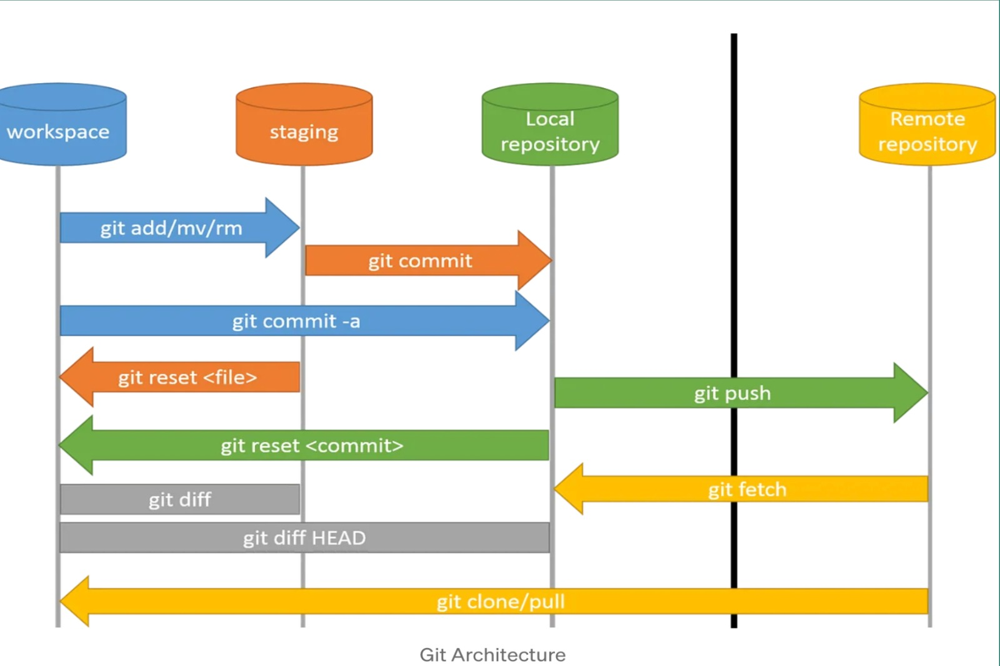

Git uses a **three-layer architecture**:

| Component              | Description |
|------------------------|-------------|
| **Repository (repo)**  | A `.git` directory that stores the entire history and configuration of the project. |
| **Working Tree**       | The current checked-out version of the project files (what you see and edit). |
| **Index (Staging Area)** | A space where changes are prepared before making a permanent commit. |

### 🔁 Git Workflow Diagram:

Working Tree ‚Üí Index (Staging Area) ‚Üí Repository

---

### 📘 Git with Command Line –


#### üß∞ Step 1: Install Git

1. Go to the official Git website: [https://git-scm.com/](https://git-scm.com/)
2. Download Git based on your OS (Windows/Mac/Linux)
3. Install using the default options

üì∏ **Git download page or installation setup**

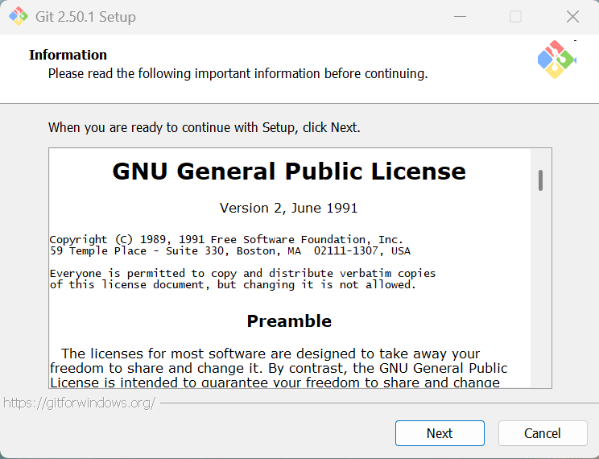

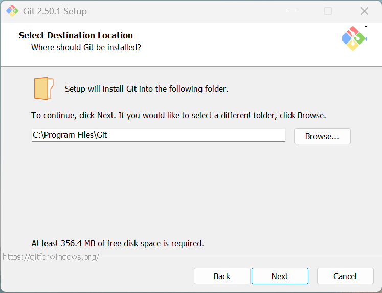

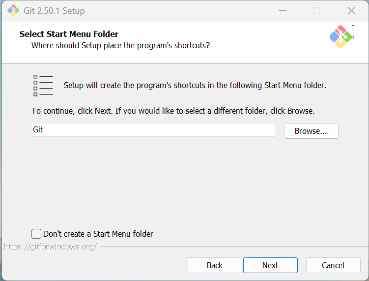

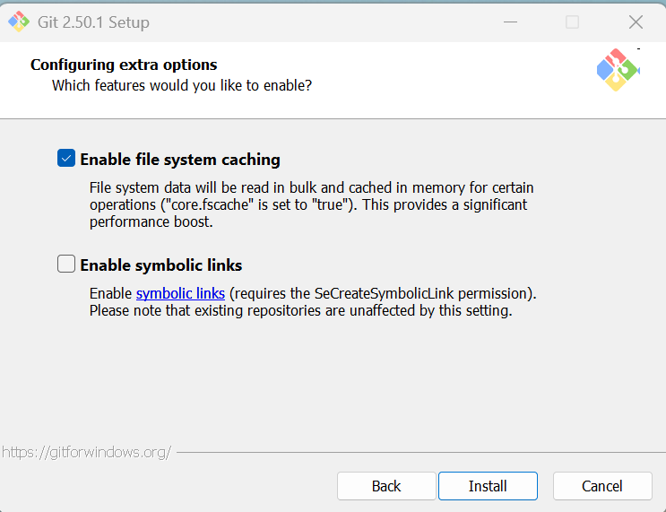

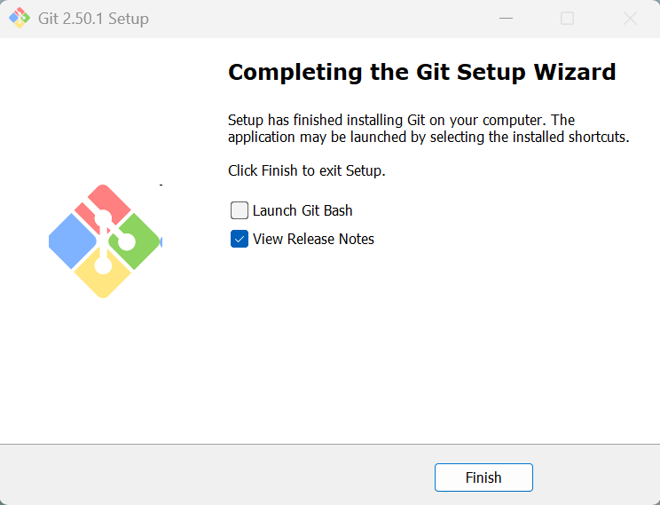

#### üåê Step 2: Create a GitHub Repository

1. Log in to [https://github.com](https://github.com)
2. Click on **New Repository**
3. Give your repo a name like `Practice`
4. Keep it **public**
5. Don't select **Initialize with README** if you are cloning from local
6. Click **Create repository**

üì∏ **Create repository page on GitHub**

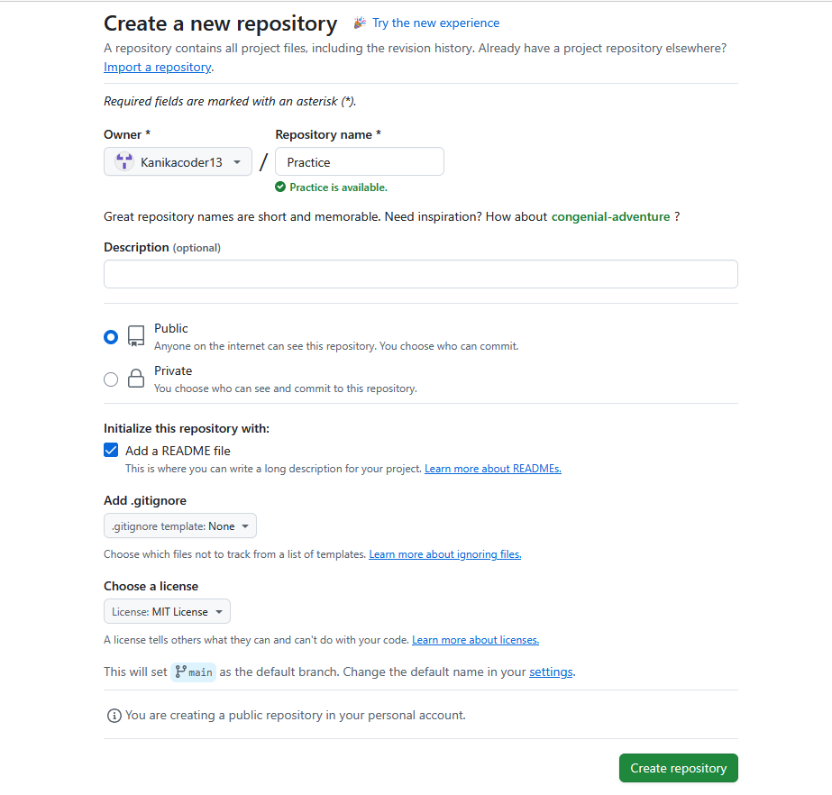

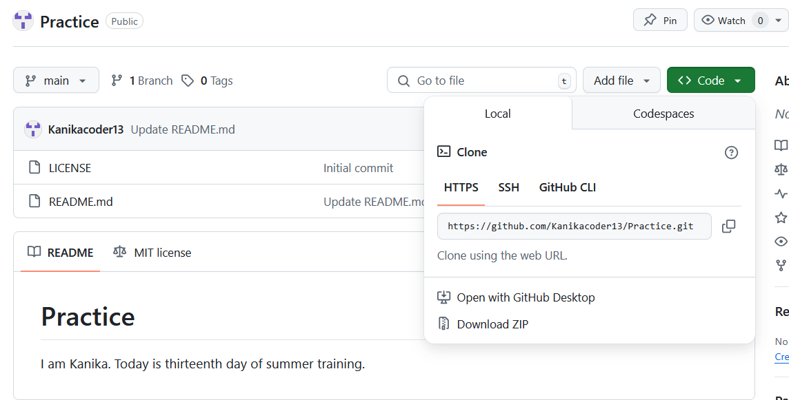


#### 🔁 Step 3: Clone Repository to Your System

Open **Git Bash** and use the command:

```bash
git clone https://github.com/kanikacoder13/Practice.git
```

## 📁 Step 4: Go into the Project Folder

Use:

```bash
cd Practice
```

## 📄 Step 5: Create a New File

Use this command:

```bash
touch index.html
```

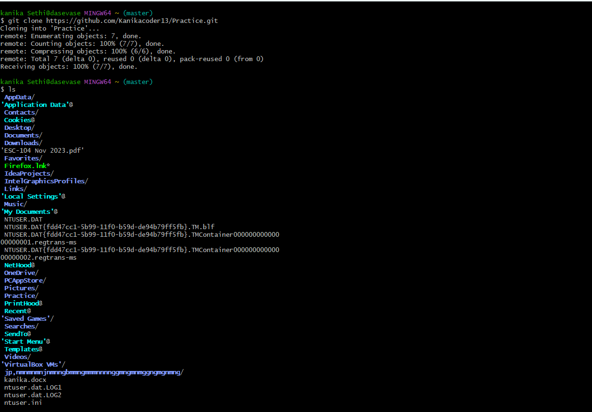


## üìù Step 6: Edit the File

Edit using `nano` or VS Code or Notepad:

```bash
nano index.html
```

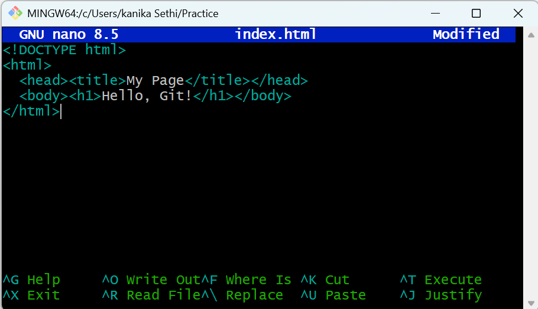


## üìå Step 7: Stage the File

Stage your file using:

```bash
git add index.html
```

## 💬 Step 8: Commit Your Changes

Commit with a message:

```bash
git commit -m "Added index.html file"
```
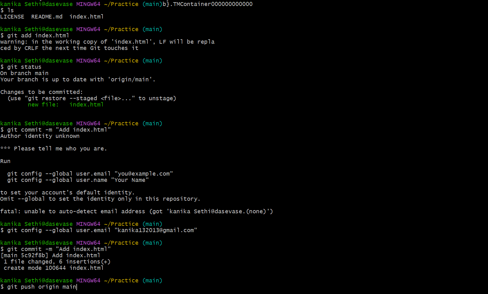

## üåç Step 9: Push to GitHub

Now push to the GitHub repository:

```bash
git push origin main
```
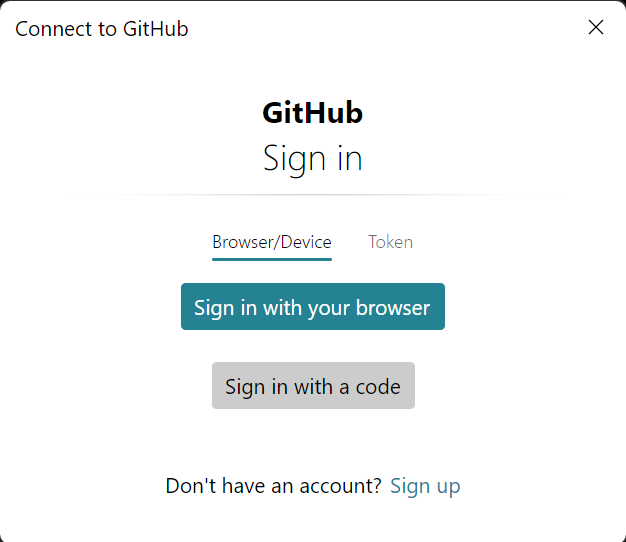


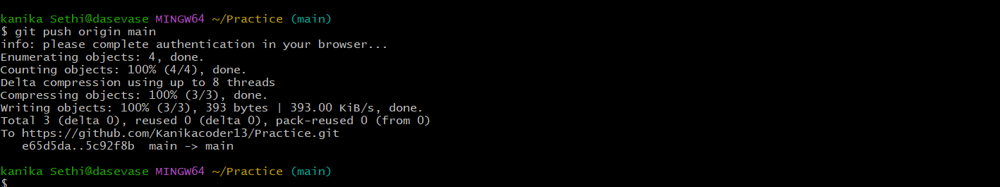

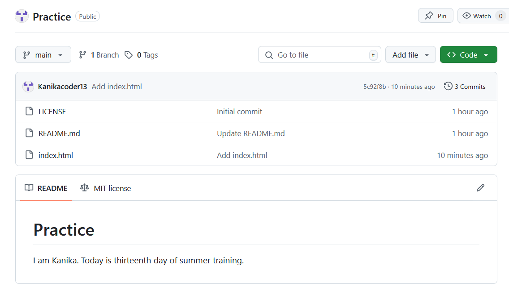

-----

## üî∂ Core Git Operations (with Explanation)

### 1️⃣ `git init`

* Initializes a new Git repository.
* Creates a `.git` folder to track the project.

```bash
git init
```

### 2️⃣ `git add`

* Adds files to the staging area (also called index).
* Prepares them to be committed.

```bash
git add filename      # Add a specific file
git add .             # Add all modified files
```

### 3️⃣ `git commit`

* Commits the staged changes to the Git repository.
* Every commit must have a message.

```bash
git commit -m "Your commit message"
```

### 4️⃣ `git status`

* Shows the status of files in the working directory and staging area.

```bash
git status
```

### 5️⃣ `git log`

* Shows the commit history in reverse chronological order.

```bash
git log
```

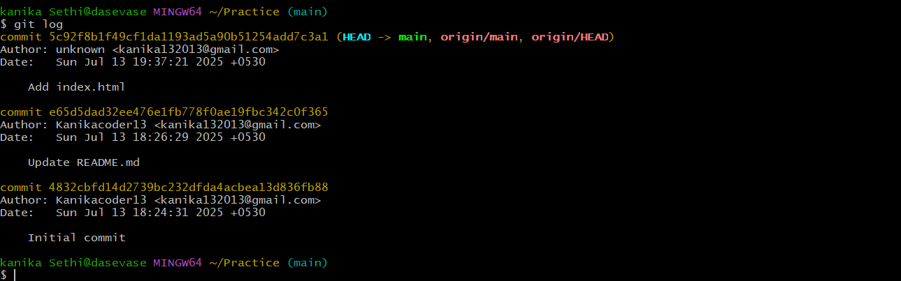

---

### üîê GitHub Access & Personal Access Tokens

#### üîπ Why Use a Personal Access Token?

GitHub removed password authentication for Git. Use tokens for secure authentication instead.

#### üîπ How to Generate a Personal Access Token:

1. Go to **GitHub ‚Üí Settings**
2. Open **Developer Settings**
3. Go to **Personal Access Tokens**
4. Click **Generate new token**
5. Set:

   * **Name of Token**
   * **Expiration Date**
   * **Permissions (Read/Write)**
6. Click **Generate**
7. **Copy the token** and keep it safe (you won’t see it again).

#### ‚ùå Never Share:

* API Keys
* Personal Tokens
* IP addresses
* Sensitive personal information

---

### ✅ Do’s and Don’ts of GitHub

#### ‚úÖ Do's

* Use `.gitignore` to skip unwanted files.
* Write clear, meaningful commit messages.
* Use branches to work on features separately.
* Push regularly to save progress online.

#### ❌ Don’ts

* Don’t share your **personal access tokens**.
* Don’t commit confidential data (API keys, passwords).
* Don’t edit code directly on the `main` branch without testing.

---

### üìù Summary of Git Commands

| Command                | Purpose                                  |
| ---------------------- | ---------------------------------------- |
| `git init`             | Create a new Git repository              |
| `git clone`            | Copy a remote repository to local system |
| `git add`              | Stage changes for commit                 |
| `git commit -m ""`     | Commit changes with a message            |
| `git status`           | View file status in working directory    |
| `git log`              | View commit history                      |
| `touch index.html`     | Create a new file                        |
| `nano index.html`      | Open and edit file in terminal           |
| `cd folder-name`       | Enter a folder                           |
| `ls`                   | List files in folder                     |
| `git push origin main` | Push commits to GitHub                   |

---

