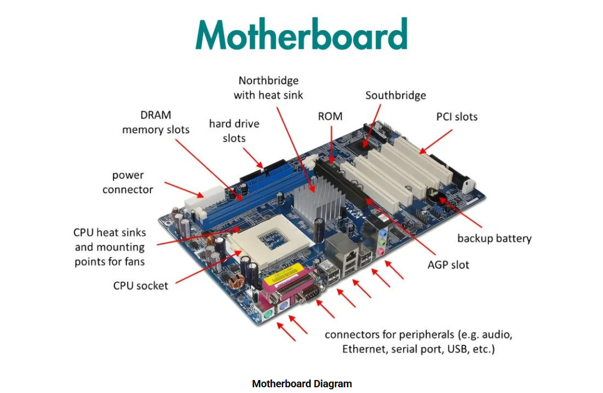

# Daily Report
## Training day :- 01
I am **Kanika**. Today was my first day of summer training in the **Computer Science Department(Parent branch)** . I was very excited about this training . Firstly there was an **orientation program** conducted for us in the **auditorium** . Here , I interacted with **Dr. Priyanka** who is professor in **Computer Scienec department** . She gave all the necessary information that was required and also welcomed all the students who are going to be part of the parent branch . She told us about socities , attendance creteria and many other things . Then , I interacted with **Head of Department, Dr. Kiran Jyoti** along with all the students . She also introduced a new scheme for **2024 year onwards students**. After this valuable interaction , all the students shifted to their respective labs . In the lab , our teacher explained the syllabus of this training that all the students will study in further days . Then she said that first day we will discuss about **Linux**.
Firstly i learned about **Linux** & **its importance** then why most of the **companies** & **coders** use **Linux** over **Windows** ? Following are the reasons behind it :- 
- Linux is **more secure** due to its permission-based system and fewer malware targets than windows.
- Linux is **open source** , so it can be easily available.
- Linux is **free** , while windows required paid license.
- Linux has large community.

---
  
  ### Difference between linux and window
  | Feature | Linux | Window |
  |---------|-------|--------|
  |   Type	|Open-source OS	|Proprietary OS|
  |  Cost	  | Free to use	  |Paid (license required)|
  |Security	| More secure,less virus-prone	|More vulnerable to malware|
  |Customization |	Highly customizable	| Limited customization|
  |Command Line	|Command line used often (Terminal)|Mostly GUI-based| 
  |Performance	|Lightweight, works well on older systems	|Requires more system resources|
  |User Interface |Depends on distro (e.g., Ubuntu, Fedora)|Standard and
  consistent UI|
  |Support for Software|Limited for some commercial software|Widely supported software (e.g., MS Office)|
  |Best for |	Developers, programmers, servers|General users, gamers, businesses|

  ---
  ### Uses of linux :-
  - Servers
  - Programming
  - Cybersecurity
  - Education
  - Cloud Computing
  - Networking
---
Here are **career opportunities with Linux** in short points:

1. **Linux System Administrator** – Manage Linux servers and systems.
2. **DevOps Engineer** – Automate deployment and infrastructure.
3. **Cloud Engineer** – Work with AWS, Azure, GCP using Linux servers.
4. **Cybersecurity Analyst** – Use Linux for ethical hacking and security.
5. **Software Developer** – Develop apps and tools on Linux platforms.
6. **Linux Support Engineer** – Troubleshoot Linux systems and provide tech support.
7. **Embedded Systems Engineer** – Build Linux-based systems for IoT, robotics.
8. **Data Scientist** – Use Linux for big data processing and analysis.
9. **Open Source Contributor** – Contribute to Linux and open-source projects.
10. **IT Trainer** – Teach Linux skills and prepare others for certifications.
----
  ### Installation of linux
  - Step 1: Download and Install VirtualBox
  - Step 2: Download Microsoft Visual C++ Redistributable
  - Step 3: Download Ubuntu ISO
  - Step 4: Create a Virtual Machine and Install Ubuntu

  ### Resources

1.  [Download Oracle Virtual Box](https://www.virtualbox.org)

2.  [Download Latest Visual C++ Redistributable](https://learn.microsoft.com/en-US/cpp/windows/latest-supported-vc-redist)

3.  [Download Ubuntu](https://tinyurl.com/csegndec)

  
---

### Study of Product-based company and Service-based comapany

- **Product-based Company**:- A company that builds and sells its **own products** like software,apps, or devices. **E.g.**:- Google , Microsoft.

- **Service-based Company**:- A comapny that provides **services to other companies** like software development,support or consulting. **E.g.**:- TCS , Infosys.

---
## Booting and its types 
I have also learned about booting and types-

### 🖥️ What is Booting?

**Booting** is the process of starting a computer.
When you switch on your computer, the system loads the operating system (like Windows or Linux) from the hard drive into the RAM (memory), so you can use the computer.

### 🔁 Booting Process :

1. **Power On** – You turn on the computer.
2. **POST (Power-On Self-Test)** – System checks hardware (RAM, keyboard, etc.).
3. **BIOS/UEFI Loads** – Basic system firmware starts.
4. **Boot Loader Activated** – BIOS/UEFI finds and runs the boot loader.
5. **OS Loading** – Boot loader loads the operating system into RAM.
6. **System Ready** – Operating system starts, and the computer is ready to use.

---

### 🧾 Types of Booting:

🔄 1. **Cold Booting (Hard Booting):**

➡️ **Meaning**: Starting the computer when it is completely turned off.

➡️ **Example**: You press the **power button** to turn on your computer after it was shut down – that's **cold booting**.

🔁 2. **Warm Booting (Soft Booting)**:

➡️ **Meaning**: Restarting the computer without turning off the power.

➡️ **Example**: You press **Ctrl + Alt + Del** or click **Restart** on Windows – that's **warm booting**.

🔧 3. **Dual Booting**:

➡️ **Meaning**: Having **two operating systems** installed and choosing one to run.

➡️ **Example**: Your laptop has Windows and Linux installed. At startup, you choose which one to use.

☁️ 4. **Network Booting (PXE Booting)**:

➡️ **Meaning**: Booting a computer from a **network server** instead of **local storage**.

➡️ **Example**: In a computer lab, systems boot from the college server using a LAN cable.

---

## Training Day :- 02
---
Day **two** of the **summer training program** picked up right where we left off , diving deeper into the concepts introduced yesterday. It brought with a fresh set of challenges and exciting new information . The instructor continued to provide insightful explanations making complex concepts easy to grasp . It was a productive day thaT further fueled my enthusiasm for the rest of the training .

---
## Structure of Linux shell


----

### Study of Kernel
The kernel is the core part of an operating system.

It manages the communication between hardware and software.

Also, it manages the following resources of the linux system :-

- Memory management
- File manangement
- Device management
- Process management
- I/O management etc

-----------------------------------

### Study of Shell

The shell is a program that acts as an interface between the user and the operating system.

It takes user commands and tells the operating system to perform tasks.

It lets you type commands to tell the computer what to do , like opening files , mananging programs.
 
 ### Types of Shell

Shells are mainly divided into two categories:

 **1. Command-Line Interface (CLI) Shells**

User interacts by typing commands

Fast and powerful for developers and system admins

Examples (Types of CLI Shells):

|Shell Name	|          Description                 |
|-----------|--------------------------------------|
|     sh	  |Bourne Shell (original Unix shell)    |
|    bash   |	Bourne Again Shell (most popular)    |
|   csh     |	      C Shell (C-like syntax)        |
|    ksh    |	   Korn Shell (advanced features)    |
|    zsh    |Z Shell (user-friendly & customizable)|
|-----------|--------------------------------------|

### 🐚 What is **Bash**?

**Bash** stands for **Bourne Again SHell**.
It is a **command-line shell** used in **Linux** and **Unix-based systems** to **interact with the operating system**.

---

### 🔹 **Simple Definition:**

> **Bash** is a program that lets you **type commands** to control your computer without using the mouse.

---

### ✅ **Key Features:**

* Used to **run commands** like creating files, copying, moving, or deleting.
* Supports **scripting**, so you can **automate tasks** with `.sh` files.
* Built-in on **Linux**, **macOS**, and available for **Windows** (via WSL or Git Bash).

---

### 🧠 **Example Bash Commands:**

```bash
ls       # list files
cd       # change directory
mkdir    # make a new folder
rm       # remove files/folders
echo     # print text
```

---

### 📜 **Example of a Bash Script:**

```bash
#!/bin/bash
echo "Hello, Kanika!"
mkdir my_folder
cd my_folder
touch file.txt
```

---

### 🔁 **Why Bash is Important:**

* Core part of **Linux system administration**.
* Helps in **automation** (via shell scripting).
* Essential for **DevOps**, **ethical hacking**, **software development**, and more.

---

Let me know if you want a **Bash cheat sheet** or beginner guide PDF!

**2. Graphical User Interface (GUI) Shells**

User interacts using windows, icons, and buttons

Easy for beginners

**Example** : GNOME, KDE (on Linux)

----

## 📁 Linux File System Structure 

A file system structure is the way an operating system organizes and manages data (files and folders) on a storage device like a hard disk or SSD.

It defines:

   * How files are stored

   * How folders (directories) are arranged

   * How the system keeps track of file locations and permissions

The Linux file system is organized **like a tree**, starting from the **root** directory `/`.  
All files and folders are inside this root, even if they are on different drives.


The file system structure is like a **digital cabinet** that helps the OS and users **to keep data organized and easy to access**

### 🌳 Main Folders in Linux File System

| Directory | Meaning |
|-----------|---------|
| `/`       | **Root** – Starting point of the file system |
| `/bin`    | Essential **binaries** (like `ls`, `cp`, etc.) |
| `/boot`   | Files needed to **boot** the system |
| `/etc`    | System **configuration** files |
| `/home`   | Personal folders for **users** (like `/home/kanika`) |
| `/lib`    | Shared **libraries** for programs |
| `/media`  | Used to mount **USB drives, CDs** etc. |
| `/opt`    | **Optional software** packages |
| `/root`   | **Home directory** of the root user |
| `/sbin`   | System **admin commands** |
| `/tmp`    | Temporary files (auto-deleted) |
| `/usr`    | User-related programs and data |
| `/var`    | Variable data (like **logs**, mails) |

---

#### 📌 Key Points

- The top-level directory is `/` (called **root**).
- Everything is organized under `/` like branches of a tree.
- Linux does **not** use drive letters like Windows (C:, D:) — everything is part of the same tree.

  -----
## 💽 What is Slash Full Disk in Linux?

In Linux, when someone says **"slash full disk"** or **"/ is full"**, it means the **root directory (`/`)** has **no free space left**.

---

### ✅ What is `/` (Slash) in Linux?

- `/` is called the **root directory**.
- It is the **starting point** of the entire Linux file system.
- All other folders like `/home`, `/etc`, `/bin`, etc., exist inside `/`.

---

### 🚨 What Does "Slash Full Disk" Mean?

- The **main partition** of Linux (where it’s installed) is **completely full**.
- No space is available to save files, install software, or update the system.

---

### ⚠️ Why Is It a Problem?

- System becomes **slow** or may **crash**.
- You can’t install or update software.
- Some apps and services may stop working.

---

### 🛠️ How to Check If `/` Is Full?
           df -h /
          
📌 Quick Summary
|  Term  | Meaning |
|--------|---------|
| / (Slash)|	Root directory (main Linux filesystem)|
|Slash Full Disk|	The root disk is full – no free space left|
## 🖥️ Basic Shell Commands in Linux (With Syntax)

| Command | Description | Syntax | Example |
|--------|-------------|--------|---------|
| `ls` | Lists files and folders | `ls [options]` | `ls -l` |
| `cd` | Changes directory | `cd [directory]` | `cd /home/user` |
| `mkdir` | Creates a new folder | `mkdir [folder_name]` | `mkdir myfolder` |
| `rmdir` | Removes an empty folder | `rmdir [folder_name]` | `rmdir myfolder` |
| `touch` | Creates a new empty file | `touch [file_name]` | `touch file.txt` |
| `rm` | Removes files or folders | `rm [file/folder]` | `rm file.txt` |
| `cp` | Copies files/folders | `cp [source] [destination]` | `cp file.txt /home/user/` |
| `mv` | Moves or renames files/folders | `mv [source] [destination]` | `mv file.txt newname.txt` |
| `cat` | Displays contents of a file | `cat [file_name]` | `cat file.txt` |
| `whatis` | Gives a one-line description of a command | `whatis [command]` | `whatis ls` |
| `whereis` | Shows location of binary, source, and man page | `whereis [command]` | `whereis gcc` |
| `clear` | Clears the terminal screen | `clear` | `clear` |
| `man` | Shows manual/help for a command | `man [command]` | `man ls` |
| `exit` | Closes the terminal session | `exit` | `exit` |
| `pwd` | Shows current directory path | `pwd` | `pwd` |

**Point to remember** : 
    
    **cd ..** (moves up one directory that means it will take out of that box and into the box it was placed inside)
  
**Example**:
  
  If you are currently in: /home/user/documents/reports/
  Typing cd .. will take you to: /home/user/documents/

---


**nano** command :

   - A text editor in linux
   - Beginner-friendly
   - Simple and clear

*Important shortcut keys*:

 - Ctrl + O → Save the file (O for Output)
 - Ctrl + X → Exit
 - Ctrl + K → Cut a line
 - Ctrl + U → Paste

**vi editor**:

    It is also a text editor
    The older, more powerful one
    Comes pre-installed in all Linux systems
    Harder for beginners


📌 Use these commands in the terminal to manage files, navigate folders, and control your Linux system.

**To use terminal command , Press Ctrl + Alt + T**

## 🖥️ VMware vs VirtualBox – Simple Difference

Both **VMware** and **VirtualBox** are **virtualization software**.  
They let you **run another operating system** (like Linux) **inside your current OS** (like Windows), without removing or changing anything.

---

### ✅ What Do They Mean?

| Software     | Meaning                                                                 |
|--------------|-------------------------------------------------------------------------|
| **VMware**   | A professional virtualization tool used for creating and managing VMs. |
| **VirtualBox** | A free, open-source virtualization tool made by Oracle.                |

---

### 🔁 Main Difference :

| Feature             | **VirtualBox**                          | **VMware**                              |
|---------------------|-----------------------------------------|-----------------------------------------|
| Cost                | ✅ Free (Open Source)                   | ⚠️ Some versions are paid (e.g., Workstation Pro) |
| User Friendly       | ✅ Beginner-friendly                    | ✅ Professional features, less beginner-focused |
| Performance         | ⚠️ Good but slightly lower             | 🚀 Generally faster and smoother         |
| OS Support          | ✅ Windows, Linux, macOS                | ✅ Windows, Linux (macOS limited)         |
| Ideal For           | Students, learners, open-source fans   | Professional users, enterprise setups   |

---

### 💡 Summary:

> Both let you create **virtual machines (VMs)**.  
> Use **VirtualBox** for learning and free use.  
> Use **VMware** if you want more speed and pro features.

## 📦 What is an ISO File?

An **ISO file** (also called an **ISO image**) is a **complete copy or digital version of a CD, DVD, or other disk**, stored in a **single file**.  
It contains **all the data, files, and folders** needed to create a full copy of the original disk.

---

### ✅ In Linux, What Is It Used For?

- ISO files are used to **distribute operating systems** like **Ubuntu**, **Fedora**, **Kali**, etc.
- You download the ISO file and then **write it to a USB drive** to install Linux on your system.

---
### 📌 Key Points:

| Feature        | Description                                               |
|----------------|-----------------------------------------------------------|
| File Extension | `.iso`                                                    |
| Contains       | Full copy of an OS or disk (bootable installer)           |
| Common Use     | To install Linux, Windows, or other operating systems     |

----

## 🖥️ What is Bare Metal Installation in Linux?

**Bare Metal Installation** means installing Linux **directly on a computer's hardware** — not inside any other operating system or virtual machine.

You are installing Linux on a **fresh or empty computer**, just like installing Windows on a new laptop.

---

### ✅ Why is it called "Bare Metal"?

Because the installation is done **on the actual physical machine** — the "bare metal" — without any layers like:

- No Windows
- No VirtualBox
- No VMware

---

**🛠️ Simple Example: Installing Ubuntu on Bare Metal**

#### 📌 Where Bare Metal is Used:

- In **servers** (no need for Windows)
- For **learning real Linux**
- In **offices or companies** that use Linux systems
- When you want **full performance** (no lag from virtual machines)

---

#### 🔁 Difference (Simple Table)

| Feature           | Bare Metal Linux     | Virtual Machine Linux     |
|------------------|----------------------|----------------------------|
| Runs directly on hardware | ✅ Yes           | ❌ No (runs inside another OS) |
| Needs Windows?   | ❌ No                 | ✅ Yes (as host OS)         |
| Speed            | 🚀 Fast               | 🐢 Slower (shared resources) |
| Good for         | Real use, servers     | Practice, testing          |

---

### 💡 Tip:

> If you want to use Linux like a real system (not inside Windows), go for **bare metal installation**. It's faster and gives you full control over the machine.

---

# Training Day :- 03

---
### 💾 What is a **Partitioning Scheme**?

> A **partitioning scheme** is a method used to **organize a hard drive** into parts, so operating systems can manage and access data properly.

---

### 🔹 **Why Partitioning is Needed?**

* To **install multiple OS** (e.g., Linux + Windows).
* To **separate system files and personal files**.
* For **better data management and backup**.
* To **improve performance** and **security**.

---

### 🧱 **Common Partitioning Schemes:**

| Scheme                           | Description                                   | Max Partitions | OS Support            |
| -------------------------------- | --------------------------------------------- | -------------- | --------------------- |
| **MBR** (Master Boot Record)     | Older scheme, supports BIOS booting           | 4 primary      | Windows, Linux        |
| **GPT** (GUID Partition Table)   | Modern, supports UEFI booting and large disks | 128 primary    | Windows, Linux, macOS |
| **LVM** (Logical Volume Manager) | Used in Linux, flexible for resizing          | Dynamic        | Linux only            |

---

### 📌 **Example:**

When you install Linux:

* You create a partition for **root (`/`)**
* One for **home (`/home`)**
* One for **swap**

That setup is based on a **Linux partitioning scheme**.

---

## 🔐 Linux File Permission Commands – `chmod`, `chmod 444`, `chmod 644`, `chown`

Linux uses file permissions to control **who can read, write, or execute files and directories**. The `chmod` command allows us to modify these permissions. Every file and directory has **permissions** assigned to three types of users — **owner(u)**, **group(g)**, and **others(o)**. These permissions determine whether a user can **read**, **write**, or **execute** the file.

---

### ✅ **1. `chmod` (Change File Permissions)**
To **change file or directory permissions** in Linux for the owner, group, and others.

#### 🔸 **Syntax**:

```bash
chmod [permissions] [file_name]
```
**For example:** chmod + x filename.sh

## 🔧 `chmod +x filename.sh`

### 📘 What Does It Do?
The command `chmod +x filename.sh` is used to **add execute permission** to a file (usually a script like `.sh`), so it can be **run as a program**.

---

### 🔍 Syntax Breakdown

| Component     | Description                                                  |
| ------------- | ------------------------------------------------------------ |
| `chmod`       | Stands for **Change Mode** – used to change file permissions |
| `+x`          | Adds **execute** permission                                  |
| `filename.sh` | The name of the shell script file                            |

---


### ✅ Purpose

This command makes a file **executable** by the **user, group, and others (by default)**.
You can then run the script directly using:

```bash
./filename.sh
```

Without execute permission, you'll see:

```
bash: ./filename.sh: Permission denied

```
### 💡 Pro Tip

To give execute permission **only to the file owner**, use:

```bash
chmod u+x filename.sh
```
This is a safer option when sharing code in teams or on public systems.

---


#### 🔢 **Octal Permission Codes**:

| Number | Symbol | Meaning              |
| ------ | ------ | -------------------- |
| 7      | rwx    | Read, Write, Execute |
| 6      | rw-    | Read, Write          |
| 5      | r-x    | Read, Execute        |
| 4      | r--    | Read only            |
| 0      | ---    | No permissions       |

---

### 🧪 **Examples**:

#### 🔹 `chmod 444 file.txt`
To make a file **read-only** for everyone (owner, group, and others). Prevents editing or deletion.


```bash
chmod 444 file.txt
```

⟶ `r-- r-- r--`


#### 🔹 `chmod 644 file.txt`

To allow the owner to **read and write**, and **group & others to only read**. Commonly used for text/config files.
🔸 Now only the owner can edit, while others can only read the file.

```bash
chmod 644 file.txt
```

⟶ `rw- r-- r--`


### ✅ **2. `chown` (Change File Owner)** [ASSIGNMENT]

`chown` changes the **owner** or **group** of a file or directory.

**Syntax**:
#### 🔸**change owner**:

```bash
chown [new_owner] [file_name]
```


#### 🔸 **Change Owner and Group**:

```bash
chown user:group file.txt
```

✅ **Examples**:

    chown kanika file.txt → Changes the owner to kanika

    chown root:admin file.txt → Changes owner to root and group to admin
---

### 📎 **Check Permissions**:
✅ *Tip*: Use ls -l to view current permissions:

 ```bash
 ls -l file.txt
 ```
---

> 🔁 **Quick Tip**:

> `chmod` = change permissions

> `chown` = change owner

**Point to remember**:

When working with system files, it's often necessary to use **sudo** to **execute chmod** with root privileges.

---
## 🔄 Redirection in Linux

In Linux, **redirection** is a powerful feature used to control **input and output** of commands. It allows you to **save output to files, read from files, or even combine and filter output streams**. This is widely used in scripting and system automation. Redirection operator is ">"

### 🔄 Types of Redirection in Linux

Redirection is used in Linux to control where input comes from and where output or error messages go. It helps in saving outputs to files, reading inputs from files, and managing errors effectively.

--

| **Operator** | **Meaning**                    | **Example**                        | **Result**                                             |
|--------------|--------------------------------|------------------------------------|--------------------------------------------------------|
| `>`          | Output redirection             | `ls > files.txt`                   | Saves output to `files.txt` (overwrites if it exists)  |
| `>>`         | Append output                  | `echo "Hello" >> notes.txt`        | Adds `"Hello"` to end of `notes.txt`                  |
| `<`          | Input redirection              | `wc -l < notes.txt`                | Reads input from `notes.txt` instead of keyboard       |

> 🧠 **Tip**: Use redirection to log outputs, handle errors gracefully, and automate input/output in shell scripts.

## 📢 `echo` Command in Linux

The `echo` command is used to **display text, strings, or variables** on the terminal. It’s one of the most commonly used commands in **shell scripting, logging, and debugging**.

---

### ✅ What Does `echo` Do?

- Prints **text or output** to the screen.
- Displays the value of **environment variables**.
- Writes output to **files using redirection**.
- Supports **escape characters** for formatting.

---

### 📌 Syntax:
```bash
echo [option] [string or variable]
````

---

### 🔹 Basic Examples

| **Command**          | **Description**            | **Output**           |
| -------------------- | -------------------------- | -------------------- |
| `echo Hello, Linux!` | Print a simple message     | `Hello, Linux!`      |
| `echo $USER`         | Show current username      | `kanika` *(example)* |
| `echo "Home: $HOME"` | Print environment variable | `Home: /home/kanika` |

---

### 🔍 Formatting Output with `-e` Flag

Use `-e` to interpret special escape characters like new lines or tabs.

| **Escape** | **Meaning** | **Example**                 | **Output**       |
| ---------- | ----------- | --------------------------- | ---------------- |
| `\n`       | New Line    | `echo -e "Line1\nLine2"`    | Line1 <br> Line2 |
| `\t`       | Tab space   | `echo -e "Name:\tKanika"`   | Name: Kanika     |
| `\\`       | Backslash   | `echo -e "Path: C:\\Users"` | Path: C:\Users   |

---

### 💡 Pro Tips

* Use `echo` in shell scripts to print progress or debug messages.
* Combine with `>` or `>>` for **logging** outputs to files.
* Works with **variables**, **escape sequences**, and **redirection**.

---

## 🚰 Pipe (`|`) in Linux

In Linux, the **pipe operator (`|`)** is used to **pass the output of one command as input to another**.  
It helps you build powerful command chains by combining simple commands to perform complex tasks.

---

### ✅ What Does a Pipe Do?

- Connects **stdout (output)** of one command to the **stdin (input)** of another.
- Helps create efficient **one-liners** without the need for intermediate files.
- Commonly used in **filtering**, **sorting**, **counting**, and **processing data**.

---

### 📌 Syntax:

```bash
command1 | command2
````

➡ The output of `command1` becomes the input of `command2`.

---
**Example**: sort – Sort file content

    cat file.txt | sort

✅ What it does:

  - Reads the content of file.txt
  - Sorts the lines alphabetically using sort

📤 Output:
Sorted version of the file content, line by line.

### 🧠 Pro Tips:

* Pipes work **left to right**: output of the left command goes to the right.

* You can **chain multiple pipes**

## Shell Programs

### Program 1 : To display name , age and city

.png)


### Program 2 : To print multiplication table


.png)


### Program 3 : To compare two numbers


.png)

## 📦 File Compression

File compression is the process of **reducing the size of a file or group of files**. This is done to save storage space or make files easier and faster to transfer over the internet.

**🧠 Why Compress Files?**

    ✅ Saves disk space

    ✅ Speeds up file transfer

    ✅ Reduces bandwidth usage

    ✅ Helps in organizing multiple files together (archiving)

### 📦 File Compression using `gzip`

`gzip` (GNU zip) is a popular **lossless file compression** utility used mainly in **Linux/Unix** systems. It uses the **DEFLATE** algorithm to reduce file size without losing data.

### 🔍 Purpose of `gzip`

- Reduce file size to save disk space
- Speed up file transfer (especially over networks)
- Commonly used with `tar` for folder compression (`.tar.gz`)

---

### 🔧 Basic Syntax & Usage

#### 👉 Compress a file

**gzip filename**

 * Compresses filename to filename.gz

 * Output: filename.gz

 * By default, replaces the original file

### 👉 Decompress a file

**gunzip filename.gz**

 * Restores the original `filename`

---

### ⚙️ Common `gzip` Options

| Option | Description                              |
| ------ | ---------------------------------------- |
| `-d`   | Decompress (same as `gunzip`)            |
| `-k`   | Keep the original file after compression |
| `-r`   | Compress files recursively (folders)     |
| `-v`   | Verbose – show the compression process   |
| `-l`   | Display compression statistics/info      |

### 🔸 Example:

**gzip -kv myfile.txt**

* Compresses `myfile.txt` to `myfile.txt.gz`
* Keeps the original file
* Displays compression details

#### 📁 Compressing Folders using 'tar' + 'gzip'

Since gzip works on **individual files**, use 'tar' to archive folders first:

#### 👉 Compress a directory:

'tar -czvf archive.tar.gz foldername/'
   
  * c: Create archive

  * z: Compress using gzip

  * v: Verbose

  * f: Output file name

### 👉 Extract .tar.gz archive:

'tar -xzvf archive.tar.gz'

### ✅ Advantages of `gzip`

* Fast and efficient
* Widely available on Linux systems
* Ideal for logs, backups, and file distribution

---

### 📚 Bonus Tip (Check Compression Info)

**gzip -l filename.gz**

* Shows original size, compressed size, and compression ratio.

---
## 🐧 Wildcards ( globbing characters) in Linux

**Wildcards** are special characters used in Linux shell (like Bash) to represent **multiple files or patterns**. They make it easier to **search, match, or operate on files/directories** without typing full names.

### 🔑 Why Use Wildcards?

| ✅ Benefit                  |     🔍 Description                           |
|-----------------------------|-----------------------------------------------|
| **Save time**               | Operate on multiple files with one command    |
| **Flexible file selection** | Match files by patterns (e.g., extensions)    |
| **Automation**              | Useful in scripting and batch operations      |

---
## 🐧 Wildcards in Linux 

| Wildcard | Meaning                                      | Example Command                        | Matches / Description                               |
|----------|----------------------------------------------|----------------------------------------|-----------------------------------------------------|
| `*`      | Matches **zero or more** characters          | `ls *.txt`                             | Lists all files ending with `.txt`                  |
| `?`      | Matches **exactly one** character            | `rm file?.sh`                          | Deletes files like `file1.sh`, `fileA.sh`          |
| `[ ]`    | Matches **one character** inside brackets    | `cp file[1-3].txt backup/`             | Copies `file1.txt`, `file2.txt`, `file3.txt`       |
| `[^ ]`   | Matches **one character not** in brackets    | `ls file[^0-9].txt`                    | Lists files like `filea.txt`, `file_.txt`          |
| `{}`     | Matches **comma-separated patterns**         | `ls file.{txt,jpg}`                    | Matches `file.txt`, `file.jpg`                     |
| Combined | Use multiple wildcards together              | `ls log_[0-9]*.log`                    | Matches `log_1.log`, `log_22.log`, `log123.log`    |

---

### 🚫 Caution

Always **double-check** with `echo` or `ls` before using `rm` with wildcards:

  * 'echo *.txt'  # safe check before deleting
  
  * 'rm *.txt'  # ← Use only if you're sure

---

### 📚 Bonus Tip: Escaping wildcards

If you want to **treat wildcards as normal characters**, use **backslash (`\`)** or quotes:

'echo "*.txt"'      # Prints *.txt
' echo \*.txt'       # Same result

---

## 🛡️ Escaping Characters in Linux (Shell) [ASSIGNMENT]

In Linux shell (like **bash**), **special characters** (such as `*`, `$`, `"`, `'`, `\`) have **special meanings**. To use them as **normal text**, we need to **escape** them.

## 🔑 Why Escape Characters?

| Purpose                            | Example                          |
|------------------------------------|----------------------------------|
| Prevent shell from interpreting them | Show `*` as literal asterisk     |
| Include spaces or special chars in file names | Handle `My File.txt` correctly |
| Use variables literally (not expand `$`) | Display `$HOME` as text         |

----

## ⚙️ Common Escape Methods

| Method       | Description                                 | Example                     | Output / Use Case                  |
|--------------|---------------------------------------------|-----------------------------|------------------------------------|
| `\` (backslash) | Escapes the next character                  | `echo \$HOME`               | Prints `$HOME` as text             |
| `' '` (single quotes) | Prevents **all** expansion (strong quoting) | `echo '$USER'`             | Prints `$USER` as-is               |
| `" "` (double quotes) | Allows variable expansion but blocks most others | `echo "Hello $USER"`     | Expands `$USER`, treats space as literal |
| `\\`         | Escapes a backslash                          | `echo "\\"`                 | Prints `\`                         |
| `\n`, `\t`   | Escapes for newline and tab in `echo -e`     | `echo -e "Line1\nLine2"`    | Prints on two lines                |

---


## 🧪 Examples

### 👉 Prevent wildcard expansion:

* echo \*.txt

📤 Output: `*.txt`

### 👉 Show a dollar sign without expanding the variable:

* echo \$PATH

📤 Output: `$PATH`

### 👉 Use quotes to handle spaces:

* touch "My File.txt"

* ls My\ File.txt

---

## 📝 Quoting in Linux [ASSIGNMENT] 

In Linux, **quoting** is used to protect **special characters**, **spaces**, and **variables** from being changed or expanded by the shell.

### 📌 Why Use Quoting?

| Reason                  | Example                          |
|-------------------------|----------------------------------|
| To protect spaces       | `My File.txt` → `"My File.txt"` |
| To stop variable expansion | `$HOME` → `'$HOME'`           |
| To safely use symbols   | `$`, `*`, `&`, etc.              |

---

## 🔒 Types of Quotes

| Quote Type      | Use                     | Example                | Output                     |
|------------------|--------------------------|-------------------------|----------------------------|
| `'single quotes'` | Everything inside stays **exactly the same** | `echo '$HOME'`     | `$HOME` (not expanded)     |
| `"double quotes"` | Expands **variables**, but protects spaces | `echo "My home is $HOME"` | My home is /home/user      |
| `\ backslash`     | Escapes **one special character**     | `echo \$HOME`         | `$HOME` (not expanded)     |

---

## 📚 Examples

### 👉 Handling spaces:

* touch "My File.txt"
* ls My\ File.txt


### 👉 Protecting variables:

* echo '$USER'
Output: $USER

* echo "$USER"
Output: your_username

---

> ✅ Tip: Always use quotes when your file names have spaces or special characters.

### 🐚 What is Shell Scripting?

**Shell scripting** is writing a **series of Linux/Unix commands** in a **text file** (called a script) so they can be **executed together automatically** by the shell.

🧠 In Simple Words:

 A **shell script** is like a **recipe** — instead of typing each step (command) manually, you write them all in a file and run the file.

 ----

 ## Training Day :- 04

 ### Hardware


## 🧠 1. What is Computer Hardware?

Hardware refers to the **physical components** of a computer — things you can **see and touch** like CPU, motherboard, RAM, hard disk, ports, etc.

----

## 🧠 2. Motherboard – Central Hub of the System

The **motherboard** is the main printed circuit board that connects all parts of a computer.

### Basic Structure of a Motherboard

The motherboard is a flatboard made of printed circuits. It has many small parts on it. These parts include slots, sockets, and connectors. Each section of the motherboard has a specific role. **For example**:

  - The **CPU socket** holds the central processing unit (CPU).
  - RAM slots are used for memory modules.
  - Other connectors help attach storage devices and graphics cards.



### Function of Motherboard

The primary function of a motherboard is to provide a central platform where different components like the processor (CPU), memory modules (RAM), storage drives (HDD/SSD), and expansion cards can be integrated and work together seamlessly. It manages the data, instructions, and power flow between these connected devices.

In simpler terms, you can think of a motherboard as the command centre that allows the different parts of a computer to talk to each other and function as a complete system. It houses vital components like the CPU socket (where the processor is installed), memory slots (for RAM modules), and various ports/interfaces to connect peripherals. The motherboard also distributes power from the power supply unit (PSU) to all the connected components.

### 🔷 Key Components

| Component              | Description                                   |
| ---------------------- | --------------------------------------------- |
| **CPU Socket**         | Holds the processor (brain of computer)       |
| **Memory Slots (RAM)** | Slots for RAM chips (DDR4/DDR5)               |
| **Expansion Slots**    | Add-ons like GPU, sound card, LAN adapter     |
| **Chipset**            | Controls communication between CPU, RAM, I/O  |
| ➤ Northbridge          | Connects CPU ↔ RAM, Graphics                  |
| ➤ Southbridge          | Connects CPU ↔ I/O (USB, HDD, audio, etc.)    |
| **BIOS Chip**          | Stores firmware to start the computer         |
| **Power Connectors**   | Supplies power to motherboard from PSU        |
| **Cooling System**     | Includes fan/heat sink to prevent overheating |

> 🧠 If motherboard is faulty → **Replace ✔** (Not repair ❌)

---

### ⚡ 3. Power Supply (SMPS)

* Converts **AC ↔ DC** (Switch Mode Power Supply)
* Provides power to all components
* Works with CMOS Battery to:

  * Keep BIOS settings
  * Maintain system clock even when PC is off

---

### ⚙️ 4. Booting Process (Power ON to OS)

1. Power goes to ROM
2. **Bootstrap loader** is activated
3. OS is copied from **Hard Disk → RAM**
4. CPU starts processing via **registers** and **cache**

> ✅ This startup process is called **Booting**

---

### 🔌 What Happens When You Power On Your PC (Hardware Level)

1. **Power supply starts**  
   - Sends power to all components.

2. **CPU wakes up**  
   - Looks for instructions from BIOS/UEFI.

3. **BIOS/UEFI runs**  
   - Performs POST (Power-On Self-Test) to check hardware.

4. **Boot device is found**  
   - Searches for a bootable device like SSD/HDD.

5. **Bootloader is loaded**  
   - Loads a small program into RAM.

6. **Operating system starts loading**  
   - The OS kernel takes control and the system starts.


### 📚 5. Memory Hierarchy

| Memory Type      | Speed     | Size     | Use                          |
| ---------------- | --------- | -------- | ---------------------------- |
| **Registers**    | Fastest   | Smallest | CPU instruction handling     |
| **Cache Memory** | Very Fast | Small    | Frequently used data for CPU |
| **RAM**          | Fast      | Medium   | Temporary working memory     |
| **Hard Disk**    | Slow      | Large    | Permanent storage            |

  

---

### ⚡ 6. Cache Memory

* Between CPU and RAM
* Holds **frequently accessed data**
* Reduces speed mismatch
* Saves CPU time by **fetching data faster than RAM**

> ✅ Cache memory is **faster** than RAM
> ✅ Most required data is kept in cache

### 🧠 Why Do We Need Cache Memory? 

1.  Cache memory reduces the speed gap between the fast CPU and slower main memory (RAM).  
2.  It stores frequently accessed data and instructions for quicker access.  
3.  It minimizes the time the CPU spends waiting for data, improving efficiency.  
4.  It increases overall system performance by reducing memory access delays.  
5.  It decreases the load on main memory by handling repeated data access.  
6.  It speeds up the execution of loops and functions by keeping them readily available.


---

### 💾 7. RAM Types

| Type     | Full Form   | Feature                            |
| -------- | ----------- | ---------------------------------- |
| **SRAM** | Static RAM  | No refresh, fast, costly           |
| **DRAM** | Dynamic RAM | Needs refresh, slower, widely used |

---

### 💿 8. Storage Devices

| Device           | Use                                 |
| ---------------- | ----------------------------------- |
| **Hard Disk**    | Main permanent storage              |
| **SSD**          | Faster version of HDD (Solid State) |
| **DVD Drive**    | Optical disk reading                |
| **Blu-ray Disc** | New version of DVD (double layer)   |
| **Floppy Disk**  | Very old data storage               |
| **Pen Drive**    | Portable data transfer              |

---

### 🌐 9. Input/Output Ports & Interfaces

| Port/Device     | Purpose                                   |
| --------------- | ----------------------------------------- |
| **HDMI Port**   | High-quality video/audio output           |
| **VGA Port**    | Old analog display (needs converter)      |
| **LAN Adapter** | Connects to local network                 |
| **NIC**         | Enables networking/internet               |
| **USB Ports**   | Connects pen drives, keyboard, mouse etc. |
| **Data Cables** | Usually copper wires used for transfer    |

---

### 🔧 10. BIOS, Firmware, and Drivers

| Term          | Explanation                                    |
| ------------- | ---------------------------------------------- |
| **BIOS/UEFI** | Firmware stored in ROM; runs before OS starts  |
| **Drivers**   | Utility software that enables hardware working |

---

### 🔌 11. Extra Hardware Concepts

| Concept       | Description                                             |
| ------------- | ------------------------------------------------------- |
| **Modem**     | Converts analog ↔ digital signals                       |
| **UPS**       | Backup power source (uses battery)                      |
| **SMPS**      | Converts voltage (AC ↔ DC)                              |
| **Bootstrap** | Startup instructions in ROM to load OS                  |
| **Registers** | Tiny memory in CPU; faster than RAM, used for execution |

---

### 🧠 12. Chipset & Bridges (Detailed)

| Bridge          | Function                                           |
| --------------- | -------------------------------------------------- |
| **Northbridge** | Connects CPU to RAM, GPU, cache                    |
| **Southbridge** | Connects CPU to I/O devices like USB, HDD, network |

🧩 These two bridges together form the **motherboard chipset** – managing data flow inside the system.

**IMPORTANT NOTE**
* Study difference between RAM & ROM
* Study difference between RAM & Cache memory
* Study difference between RAM & Registers
* Study difference between RAM & Hard disk
* Study difference between RAM & ROM

------

## Training Day :- 05

----

### 💾 Hard Disk Drive (HDD)

#### 🔹 What is HDD?

A **Hard Disk Drive (HDD)** is a traditional data storage device that uses **magnetic storage** to store and retrieve digital data. It has spinning disks (called platters) and a read/write head that moves to access data.

- **Used for:** Operating systems, software, documents, videos, etc.
- **Advantages:** Large storage capacity, cheaper than SSD.
- **Disadvantages:** Slower than SSD, contains moving parts (can fail over time).

---

### 🔸 Types of Hard Disk Drives

#### 1. **PATA (Parallel ATA) HDD**
- Also called **IDE**.
- Older interface, slow data transfer.
- Wide ribbon cables with 40 or 80 wires.

#### 2. **SATA (Serial ATA) HDD**
- Common in modern desktops and laptops.
- Faster than PATA.
- Uses thinner cables and supports hot swapping.

#### 3. **SCSI (Small Computer System Interface) HDD**
- Used in servers and high-performance systems.
- Faster and more reliable.
- Supports multiple devices on a single bus.

#### 4. **External HDD**
- Portable storage connected via USB or other ports.
- Can be PATA or SATA internally.
- Used for backups and data transfer.

---

### ✅ Summary Table

| Type       | Speed      | Used In              | Interface     |
|------------|------------|----------------------|---------------|
| PATA       | Slow       | Older PCs            | Parallel ATA  |
| SATA       | Medium     | Most modern systems  | Serial ATA    |
| SCSI       | Fast       | Servers, Workstations| SCSI          |
| External   | Varies     | Portable use         | USB/SATA      |

# 💾 Capacity and Partition of Hard Disk

## 🔹 Hard Disk Capacity

- Refers to the **total amount of data** a hard disk can store.
- Measured in **GB (Gigabytes)** or **TB (Terabytes)**.
- Example: 500GB, 1TB, 2TB hard drives.
- Actual usable space is slightly less due to:
  - File system formatting
  - System files (like MBR or GPT data)

---

## 🔸 Hard Disk Partition

- A **partition** is a section of a hard disk treated as a separate drive.
- Helps in organizing data and separating OS, programs, personal files, etc.
- Each partition is assigned a **drive letter** (e.g., C:, D:, E:, F:).

### 🔑 Types of Partitions:

1. **Primary Partition**
   - Can host the OS (bootable).
   - Maximum of 4 primary partitions (MBR system).

2. **Extended Partition**
   - Used to create more than 4 partitions.
   - Cannot store data directly.

3. **Logical Partition**
   - Created inside an extended partition.
   - Used to store data, not bootable directly.

---

## ✅ Example 

A 1TB Hard Disk partitioned as:

| Drive Letter | Size     | Type        | Use                      |
|--------------|----------|-------------|---------------------------|
| C:           | 300 GB   | Primary     | Windows OS               |
| D:           | 250 GB   | Logical     | Games & Apps             |
| E:           | 200 GB   | Logical     | Personal Files           |
| F:           | 250 GB   | Logical     | Backup / Projects        |

> 📌 **Note**: The F: partition is fully valid and often used for backups, media, or projects.
>  C: → Primary partition (Bootable)
   D:, E:, F: → Logical partitions inside an extended partition

-----

### 🛠️ Common PC Boot Issues and Solutions (PC Hardware Troubleshooting)

#### 🔹 1. PC Not Powering On

**Cause:**
- Faulty power cable or power supply unit (PSU)
- Loose connections

**Solution:**
- Check the power cable and wall socket
- Ensure PSU switch is ON
- Reseat all power cables inside the cabinet

#### 🔹 2. No Display / Black Screen

**Cause:**
- Loose or faulty monitor cable
- Faulty GPU or RAM
- BIOS settings issue

**Solution:**
- Check monitor and cable connection
- Reseat or replace RAM and graphics card
- Reset BIOS using CMOS battery

#### 🔹 3. Beeping Sounds at Startup

**Cause:**
- POST error indicating hardware issue
- RAM or motherboard failure

**Solution:**
- Refer to motherboard manual for beep code meaning
- Try changing or reseating RAM
- Replace faulty components if needed

#### 🔹 4. Boot Device Not Found / "No Bootable Device"
**Cause:**
- Hard drive not detected
- Incorrect boot order in BIOS

**Solution:**
- Check SATA/Power cables to HDD/SSD
- Enter BIOS and set correct boot priority
- Reinstall OS if necessary

#### 🔹 5. PC Keeps Restarting Automatically
**Cause:**
- Overheating CPU or PSU
- Loose RAM or power connection
- Faulty hardware driver

**Solution:**
- Clean CPU fan and check cooling
- Reseat RAM and power cables
- Boot into safe mode and update drivers

#### 🔹 6. BIOS Not Loading / Frozen Logo Screen

**Cause:**
- Corrupted BIOS or damaged motherboard
- Faulty USB device connected

**Solution:**
- Disconnect all USB devices and restart
- Try BIOS recovery/reset using CMOS jumper or battery

#### 🔹 7. Error Messages Like “Missing Operating System”

**Cause:**
- Corrupted bootloader or OS
- Drive partition issues

**Solution:**
- Use bootable USB to repair OS
- Use command line tools like `bootrec /fixmbr`

### ✅ Tips for Basic Troubleshooting:

- Always check cables and connections first.
- Use **BIOS/UEFI** to detect hardware.
- Remove all external devices before booting.
- Keep thermal paste and cooling systems clean.
- Use a **POST card** or diagnostic LED if available.

-----

### 🐢 Why is My PC Running Slow? — Issues and Reasons

#### 1. 💼 Too Many Apps Running

- When many programs are open at the same time, your PC gets tired and slows down.

#### 2. 🧠 Low Memory (RAM)

- Your PC doesn't have enough memory to do all tasks quickly.

#### 3. 💽 Fragmented or Full Hard Drive
- When your storage is almost full, it takes longer to find and open files.

#### 4. 🔍 Too Many Background Programs
- Some apps keep running even when you're not using them.

#### 5. 🦠 Virus or Malware
- Viruses can secretly use your PC and make it slow.

#### 6. 🕰️ Old or Slow Hardware
- Old PCs or hard drives naturally work slower over time.

#### 7. 🔄 Not Restarted for Long Time
- If your PC stays on for many days, it can slow down.

#### 8. 🌡️ PC is Overheating
- If your PC gets too hot, it lowers speed to cool down.

#### 9. 📦 Too Much Junk/Temporary Files
- Unwanted files pile up and slow the system.

#### 10. 🌐 Too Many Tabs Open in Browser
- Opening many browser tabs uses more memory.

#### 11. ⏳ Windows or Software Not Updated
- Old versions can have bugs and slow performance.

#### 12. 🎨 Too Many Visual Effects
- Fancy animations and effects make old PCs slow.

### 🧠 Additional Simple & Smart Tips

#### 🗂️ Keep Desktop Clean
- Having too many files on the desktop slows down boot time and refresh speed.

#### 📉 Remove Unnecessary Icons from Taskbar
- Too many taskbar icons use memory in the background.

#### ❌ Avoid Too Many Bookmarks in Browser
- Excessive bookmarks can slow down the browser, especially during sync.

---

### ✅ Easy Fixes:

- Close unused apps and browser tabs.
- Restart the PC regularly.
- Delete unwanted files and desktop clutter.
- Uninstall apps you don’t need.
- Scan for viruses and malware.
- Keep your software and Windows updated.

### 🛠️ Diagnosing Hardware Failures: RAM, HDD, GPU, PSU

#### 🔹 1. 🧠 RAM (Random Access Memory)

##### 🔍 Symptoms:
- Frequent crashes or restarts
- Blue Screen of Death (BSOD)
- Programs freeze or fail to load
- Beeping sounds on startup

##### 🛠️ How to Diagnose:
- Use **Windows Memory Diagnostic** or **MemTest86**
- Try using one RAM stick at a time
- Reseat the RAM properly in the slot
- Replace faulty RAM if errors are detected

---

#### 🔹 2. 💽 HDD (Hard Disk Drive)

##### 🔍 Symptoms:
- Slow boot and file access
- Clicking or grinding noise
- Files getting corrupted or disappearing
- “No bootable device” error

##### 🛠️ How to Diagnose:
- Use **CHKDSK** in Command Prompt
- Check SMART status using tools like **CrystalDiskInfo**
- Listen for unusual noises
- Boot from another drive to test

---

#### 🔹 3. 🎮 GPU (Graphics Card)

##### 🔍 Symptoms:
- No display or screen artifacts (weird colors/shapes)
- Game crashes or lag
- PC restarts under load
- Fan not spinning or overheating

##### 🛠️ How to Diagnose:
- Try using **integrated graphics** instead of GPU
- Use stress test tools like **FurMark**
- Check physical connection and power cables
- Replace GPU to test if issue goes away

---

#### 🔹 4. ⚡ PSU (Power Supply Unit)

##### 🔍 Symptoms:
- PC doesn’t power on at all
- Random shutdowns or restarts
- Burning smell or electrical sound
- No fan movement in PSU

##### 🛠️ How to Diagnose:
- Use a **PSU tester** or multimeter
- Try another working PSU (if available)
- Disconnect non-essential components and test
- Check if fan in PSU spins when powered

### ✅ General Tips:

- **Check connections** before replacing parts.
- **Remove dust** regularly to avoid overheating.
- **Look for LED/beep codes** on motherboard for quick hints.
- Always use **diagnostic tools** for confirmation.

----

**IMPORTANT NOTE**

Press **F1 key** to reach **help** in **window**

----

### 🔧 System Scanning & Defragmentation Process

---

#### ✅ System Scanning
*Checks for malware, viruses, and system errors.*

1. **Open Security Tool**  
   Use antivirus software or built-in Windows Security.

2. **Select Scan Type**  
   Choose between:
   - Quick Scan
   - Full Scan
   - Custom Scan

3. **Start Scan**  
   The tool checks files, memory, and critical system areas.

4. **View Results**  
   Displays threats or issues found during the scan.

5. **Take Action**  
   Remove, quarantine, or fix detected threats.

---

#### 🧩 Disk Defragmentation
*Organizes scattered data to improve performance (for HDDs only).*

1. **Open Defragment Tool**  
   Search for `Defragment and Optimize Drives` in the Start menu.

2. **Select Drive**  
   Choose the drive you want to defragment (e.g., `C:\`).

3. **Analyze Disk**  
   Checks how fragmented the drive is.

4. **Click Optimize**  
   Rearranges files to store them contiguously.

5. **Completion**  
   Your system becomes faster and more efficient.

> ⚠️ **Note:** Defragmentation is useful for **HDDs**, not required for **SSDs**.

---

# ⚙️ Optimization & Related Concepts

---

### ✅ What is Optimization?

**Optimization** in a computer system means improving performance by making processes faster, smoother, and more efficient.  
Examples include:
- Removing unnecessary files
- Organizing data (defragmentation)
- Adjusting settings for better speed or battery life

---

### ⏰ What is Scheduled Optimization?

**Scheduled Optimization** means setting your system to automatically run optimization tasks (like disk defragmentation) at regular intervals.

#### Example:
- Windows automatically defragments your hard disk every week (if scheduled).
- Keeps system performance smooth without user action.

> 📝 You can check or change this in:  
**Control Panel > Administrative Tools > Optimize Drives**

---

### 📦 What is Delivery Optimization?

**Delivery Optimization** is a feature in Windows that helps in faster and efficient downloading of updates or apps by:
- Downloading updates from **Microsoft servers + other nearby PCs** (peer-to-peer sharing)
- Reducing internet data usage, especially in networks with many devices

#### Example:
If your PC and your friend's PC are on the same Wi-Fi, one download can help both.

> 🔒 It works securely and only shares official updates—not your personal data.

---

### 🛠️ Peripheral Troubleshooting: Keyboard, Mouse, Printer

---

#### ⌨️ Keyboard Issues & Fixes

##### 🔹 Common Problems:
- Keys not responding
- Typing wrong characters
- Keyboard not detected

##### ✅ Solutions:
1. **Check Connection** – Re-plug USB or check Bluetooth.
2. **Restart PC** – Temporary glitches can be fixed.
3. **Try Another Port** – Use a different USB port.
4. **Check Keyboard Layout** – Correct input language in settings.
5. **Update/Reinstall Driver** – Use Device Manager to update.
6. **Test on Another PC** – To confirm if keyboard is faulty.

---

#### 🖱️ Mouse Issues & Fixes

##### 🔹 Common Problems:
- Cursor not moving
- Double-click not working
- Mouse freezing or skipping

##### ✅ Solutions:
1. **Reconnect Mouse** – Try different USB port or replace batteries (wireless).
2. **Clean Mouse Sensor** – Dust can block laser or sensor.
3. **Check Surface** – Use on proper mouse pad.
4. **Update Mouse Driver** – From Device Manager.
5. **Try on Another PC** – To check if mouse is working.

---

#### 🖨️ Printer Issues & Fixes

##### 🔹 Common Problems:
- Printer not detected
- Paper jams
- Ink/Toner issues
- Prints are blank or low quality

##### ✅ Solutions:
1. **Check Connections** – USB/Wi-Fi properly connected.
2. **Restart Printer & PC** – Reset communication.
3. **Clear Paper Jam** – Open tray and remove jammed paper.
4. **Check Ink/Toner Levels** – Refill or replace if low.
5. **Set as Default Printer** – In control panel or settings.
6. **Reinstall Printer Drivers** – From manufacturer’s website.
7. **Run Troubleshooter** – Use built-in Windows Printer Troubleshooter.

---

> 💡 **Tip:** Always keep drivers updated and check for loose connections first before doing advanced steps.

----

### ⚙️ BIOS / UEFI Settings & POST Errors [ASSIGNMENT]


#### 🧠 What is BIOS / UEFI?

| Feature | BIOS | UEFI |
|--------|------|------|
| Full Form | Basic Input Output System | Unified Extensible Firmware Interface |
| Interface | Text-based | Graphical (mouse support) |
| Boot Mode | Legacy Boot | Secure Boot |
| Storage Support | Up to 2 TB (MBR) | Over 2 TB (GPT) |
| Speed | Slower | Faster |
| Modern Use | Older PCs | Modern systems |

> BIOS/UEFI is firmware that starts when your PC powers on, initializes hardware, and loads the operating system.

---

#### 🔧 Common BIOS/UEFI Settings

1. **Boot Order** – Select the order of devices to boot from (e.g., USB > HDD > Network).
2. **Secure Boot** – Prevents unauthorized OS loading.
3. **Enable/Disable Devices** – Like USB ports, audio, virtualization.
4. **System Time & Date** – Set accurate time.
5. **Overclocking Options** – For CPU/RAM tuning (in UEFI).
6. **Password Protection** – BIOS access or disk lock.

---

#### 💻 What is POST?

**POST** (Power-On Self-Test) is a diagnostic process run by BIOS/UEFI to check if hardware is working properly before the OS loads.

---

#### ❌ Common POST Errors & Beep Codes

| Error | Cause | Solution |
|-------|-------|----------|
| **No Display / Beep** | RAM/Display issue | Reseat or replace RAM/Graphics |
| **1 Long Beep, 2 Short** | Display adapter failure | Check/replace graphics card |
| **Continuous Beeping** | Power or keyboard issue | Check power supply or keyboard |
| **CMOS Battery Low** | Dead CMOS battery | Replace CMOS battery |
| **Keyboard Not Found** | Unplugged or faulty keyboard | Reconnect or replace |
| **Disk Boot Failure** | OS not found | Check boot order or OS installation |

> 🔔 Beep codes vary by BIOS manufacturer (e.g., AMI, Award, Phoenix).

---

#### 📝 Accessing BIOS/UEFI

- Press keys during startup: **Del**, **F2**, **Esc**, or **F10** (depends on system).
- Modern UEFI can also be accessed via **Windows Settings > Recovery > Advanced Startup > UEFI Firmware Settings**.

---

### 💥 Blue Screen of Death (BSOD) & System Crash Analysis

---

#### 🧨 What is BSOD?

**BSOD (Blue Screen of Death)** is a critical system error screen in Windows that appears when the operating system can no longer run safely due to a serious problem.

It forces the system to shut down or restart to prevent damage.

---

#### ❓ Why Does BSOD Happen?

| Cause | Explanation |
|-------|-------------|
| 🔧 **Driver Issues** | Outdated, corrupted, or incompatible drivers |
| 💽 **Hardware Failure** | Faulty RAM, hard disk, GPU, or overheating |
| 🐞 **Software Bugs** | Errors in applications or Windows updates |
| 📛 **Corrupt System Files** | Missing or damaged OS files |
| ⚠️ **Overclocking** | Unstable CPU/RAM settings |
| 🔐 **Malware** | Viruses affecting system stability |
| ⛔ **Low Disk Space** | On system partition (C:\) |
| 🔄 **Power Failures** | Sudden shutdowns corrupt data or memory |

> 📋 **STOP Code** is shown during BSOD to help identify the exact error.

---

### 🛠️ System Crash Analysis (After BSOD)

#### Step 1: **Note the STOP Code**
- Example: `PAGE_FAULT_IN_NONPAGED_AREA` or `IRQL_NOT_LESS_OR_EQUAL`

#### Step 2: **Use Windows Reliability Monitor**
- Search **"Reliability Monitor"** in Start
- Shows timeline of errors and crashes

#### Step 3: **Check Event Viewer**
- Go to `Control Panel > Administrative Tools > Event Viewer`
- View **Critical Events** under **System Logs**

#### Step 4: **Analyze Dump File**
- Location: `C:\Windows\Minidump\`
- Use tools like:
  - **BlueScreenView**
  - **WinDbg (Windows Debugger)**

#### Step 5: **Run Diagnostics**
- **Memory Test**: `mdsched.exe`
- **Disk Check**: `chkdsk /f`
- **SFC Scan**: `sfc /scannow`

---

### ✅ How to Prevent BSOD

- Keep drivers and Windows updated
- Regularly scan for malware
- Avoid overheating or overclocking
- Use quality power supply
- Maintain disk health and free space
- Create regular restore points

---

> ⚠️ **Important Tip:** If BSOD happens repeatedly, it’s a sign of a deeper hardware or system-level issue and should be addressed immediately.

---

### BSOD & System Crash Analysis – Flowchart Summary

---

* #### BLUE SCREEN OF DEATH (BSOD)

System Crash Detected  
↓  
Blue Screen Appears (BSOD)  
↓  
STOP Code is Displayed (e.g., IRQL_NOT_LESS_OR_EQUAL)  
↓  
System Automatically Restarts or Halts  

---

#### WHY BSOD OCCURS

- Driver Issues  
↓  
- Hardware Failures (RAM, HDD, Overheating)  
↓  
- Software Bugs or Failed Windows Updates  
↓  
- Corrupted System Files or Registry  
↓  
- Malware Infections  
↓  
- Low Disk Space or Sudden Power Failure


#### HOW TO PREVENT BSOD

- Keep Windows & Drivers Updated  
↓  
- Regular Malware Scanning  
↓  
- Avoid Overheating and Overclocking  
↓  
- Maintain Sufficient Disk Space  
↓  
- Create System Restore Points  
↓  
- Use Reliable Power Supply  

---

* #### SYSTEM CRASH ANALYSIS

**Step 1:** Note the STOP Code on the BSOD  
↓  
**Step 2:** Check Reliability Monitor  
↓  
**Step 3:** Open Event Viewer → View System Logs  
↓  
**Step 4:** Analyze Dump Files  
- Location: `C:\Windows\Minidump\`  
- Tools: BlueScreenView, WinDbg  
↓  
**Step 5:** Run Diagnostics  
- Memory Test → `mdsched.exe`  
- Disk Check → `chkdsk /f`  
- System File Check → `sfc /scannow`

----

* **Tip:** If BSOD happens repeatedly, it usually indicates a hardware or OS-level issue that needs immediate attention.

-----


---

## Training Day :- 06

### 🛡️ System Recovery and Security

#### 🧯 1. Safe Mode

 A special mode in Windows that loads only essential files and drivers.
 Used to diagnose and fix issues like system crashes, virus infections, or driver problems.

  ##### 🔹 Purpose:

* Fix system errors
* Remove malware
* Troubleshoot software/driver issues


🔹 **When to Use**:

    PC not starting normally

    Suspected malware infection

    Uninstalling faulty drivers or software


##### 🔸 Types of Safe Mode:


| **Type**                             | **Description**                                                              | **When to Use**                                                                             |
| ------------------------------------ | ---------------------------------------------------------------------------- | ------------------------------------------------------------------------------------------- |
| **1. Safe Mode**                     | Loads **basic drivers and services only** (no internet).                     | For general troubleshooting, removing viruses, uninstalling apps.                           |
| **2. Safe Mode with Networking**     | Same as Safe Mode **but includes network drivers** to allow internet access. | If you need to download drivers, updates, or antivirus tools.                               |
| **3. Safe Mode with Command Prompt** | Loads a **command-line interface only** (no desktop).                        | For **advanced troubleshooting** using commands (SFC, DISM, etc.). Useful if GUI is broken. |


##### ⚙️ How to Access Safe Mode:

1. Go to **Settings → Recovery → Advanced Startup → Restart Now**
2. Choose **Troubleshoot → Advanced Options → Startup Settings → Restart**
3. Then press:

   * **F4** → Safe Mode
   * **F5** → Safe Mode with Networking
   * **F6** → Safe Mode with Command Prompt

---

#### 🧰 2. Recovery Tools

> Tools to **repair, restore, or reset** your system in case of problems.

##### 🔹 Purpose:

* Fix system errors or boot issues
* Revert to previous state
* Reinstall or reset Windows

##### 🔹 Common Recovery Tools:

| Tool                             | Use                                      |
| -------------------------------- | ---------------------------------------- |
| **System Restore**               | Roll back to an earlier working state     |
| **Startup Repair**               | Fixes booting problems                   |
| **Reset This PC**                | Reinstalls Windows (with/without files)  |
| **Installation Media (USB/DVD)** | Reinstalls or repairs Windows externally |
| **Advanced Options (WinRE)**     | Access Safe Mode, Command Prompt, etc.   |

---

#### 🛠️ 3. OS Repair

> Fixes system corruption **without reinstalling Windows**.

##### 💽 3. OS Repair Methods

- **Using Installation Media:**  
  Boot from USB or DVD to repair or reinstall Windows.

- **Startup Repair Tool:**  
  Automatically detects and fixes startup problems.

- **SFC (System File Checker):**  
  Command: `sfc /scannow`  
  Scans and repairs corrupted system files.

- **DISM Tool:**  
  Command: `DISM /Online /Cleanup-Image /RestoreHealth`  
  Repairs the Windows image and resolves deep system issues.


##### ✅ Backup After OS Repair – Key Points

* ✅ **Ensure the system is stable** after repair (check for normal functioning).
* 📁 **Locate and organize** all important files:

  * Documents
  * Desktop files
  * Downloads
  * Photos, videos, project folders
    
 💽 **Choose a backup method:**

  * **External Storage** (USB, HDD, SSD)
  * **Cloud Backup** (Google Drive, OneDrive, Dropbox)
  * **File History** (Windows built-in backup tool)
  * **System Image Backup**
  * **Third-party backup software** (EaseUS, Macrium Reflect, Acronis)
* 📤 **Manually copy** files or use backup tools for automation.
* 🏷️ **Label backup folder or drive** clearly (e.g., "Backup\_July2025").
* 🔐 **Store backups safely** (offline + online preferred).
* 🔍 **Verify backup files** by opening a few to ensure they work.
* 🔁 **Set up automatic/scheduled backup** (for regular future safety).

  ##### 🧠 Why Backup After OS Repair?

    You already had system trouble — it could happen again.

    Avoid data loss in future crashes or malware attacks.

    Makes next recovery easier and faster.

---
#### 🔌 Plugins 

* A **plugin** is a small software that **adds extra features** to a larger program.
* It **extends functionality** without changing the main software.
* Common in browsers, audio software, websites, and IDEs.

#### 📌 Examples:

* **Browser plugin** → AdBlock (blocks ads)
* **WordPress plugin** → Contact Form (adds form)
* **VS Code plugin** → Python extension (adds language support)
* **Audio plugin** → Reverb (adds sound effect)

#### ✅ Key Points:

* Easy to **install/uninstall**
* Used for **customization**
* Should be from **trusted sources**
* May cause issues if **incompatible or outdated**

> 🔁 Plugins = Add-on features for apps

---

#### 🦠 4. Virus & Malware Symptoms

> Signs that indicate **malware infection** on your PC.

##### 🔹 Common Symptoms:

  | Symptom            | Description                                               |
|---------------------|-----------------------------------------------------------|
| Slow performance    | Programs take longer to open or freeze frequently.        |
| Frequent crashes    | System restarts or shuts down unexpectedly.               |
| Pop-ups and ads     | Unexpected ads or pop-ups even when no browser is open.   |
| Unknown apps or toolbar installed   | Unfamiliar apps appear on the system.                     |
| High CPU usage      | Task Manager shows high usage without any known reason.   |

**Other symptoms are :**

- Antivirus software is disabled
- Files are missing or encrypted
- Browser redirects automatically

#### 🧹 5. Basic Malware Removal Steps

> Steps to **remove malware or virus** safely.

##### ✅ Step-by-Step:

1. **Disconnect Internet**
2. **Boot into Safe Mode**
3. **Run antivirus/anti-malware scan**
4. 
   ➤ Use Windows Defender or Malwarebytes
5. **Uninstall unknown programs**
6. **Delete temp files**
7. 
   ➤ Use `Disk Cleanup` or `%temp%`
8. **Check browser extensions/settings**
9. **Update Windows & drivers**
10. **Change passwords**

##### 🛡️ Basic Tips to Protect Your System from Malware

* **Keep your system and software updated**
* **Use trusted antivirus or anti-malware software**
* **Avoid clicking on unknown links or email attachments**
* **Download software only from trusted websites**
* **Do not use pirated or cracked software**
* **Backup your important data regularly**

---

##### 💾 Where Should You Keep Your Windows Storage?

* ✅ **Install Windows in C: drive** (default system partition)
* ✅ **Store personal files in D: or E: drive** (keeps data safe)
* ❌ **Avoid filling C: drive with large files or games**
* ✅ **Keep C: drive clean for better performance**
* ✅ **Use external drives for backup or extra storage**

---

#### 💾 6. Various Ways of Backup of Important Files

> Backups help **prevent data loss** due to virus, crash, or mistakes.

##### 🔹 Backup Methods:

| Method                 | Description                                       | Pros            | Cons                   |
| ---------------------- | ------------------------------------------------- | --------------- | ---------------------- |
| **External Storage**   | Copy to USB, HDD, SSD                             | Easy, offline   | Can be lost or damaged |
| **Cloud Backup**       | Upload to online servers (Google Drive, OneDrive) | Access anywhere | Needs internet         |
| **Internal Backup**    | Save in different drive/partition                 | Fast & local    | Risk if drive fails    |
| **System Image**       | Full snapshot of OS + data                        | Full recovery   | Takes more space       |
| **Scheduled Backup**   | Automatic, regular backups                        | Hands-free      | Needs setup            |
| **3rd-Party Software** | Advanced tools (Acronis, EaseUS)                  | Extra features  | Some are paid          |


##### ⚠️ Things to Avoid Regarding Backup

*  **Not backing up at all**
*  **Storing backups only on the same drive as original files**
*  **Using unreliable or cheap storage devices**
*  **Forgetting to back up regularly**
*  **Not verifying if the backup actually works**
*  **Keeping backup devices connected all the time (risk of virus infection)**
*  **Not encrypting sensitive backup data**

---

#### 🔁 Summary Table

| Section              | Purpose                | Tools/Commands                 |
| -------------------- | ---------------------- | ------------------------------ |
| **Safe Mode**        | Diagnose system safely | F4, F5, F6                     |
| **Recovery Tools**   | Restore or reset PC    | System Restore, Startup Repair |
| **OS Repair**        | Fix without reinstall  | `sfc`, `dism`                  |
| **Malware Symptoms** | Detect infection       | Observe system behavior        |
| **Removal Steps**    | Clean virus/malware    | Antivirus, Safe Mode           |
| **Backup**           | Prevent data loss      | Cloud, External, Image         |

---

### 🔌 Networking Basics: RJ45, CAT Cable & Crimping Tool

#### 🧷 RJ45 Connector

- **RJ45** stands for **Registered Jack 45**
- It is an **8-pin connector** used to connect **Ethernet cables** to networking devices
- Commonly used in **LAN (Local Area Network)** setups
- Plugs into:
  - Routers  
  - Switches  
  - Network Interface Cards (NICs)

##### 🔹 Key Features:
- 8 metal pins inside (for 8 wires)
- Works with CAT5/CAT6 cables
- Looks like a wider telephone jack

---

#### 🧵 CAT Cable (Ethernet Cable)

- **CAT** = **Category** (e.g., CAT5, CAT6)
- Carries data over network connections
- Contains **8 color-coded wires (4 twisted pairs)**

##### 🔹 Common Types of CAT Cables:

| Category | Speed      | Max Distance |
|----------|------------|--------------|
| CAT5     | 100 Mbps   | 100 meters   |
| CAT5e    | 1 Gbps     | 100 meters   |
| CAT6     | 1–10 Gbps  | 55–100 meters|
| CAT6a    | 10 Gbps    | 100 meters   |

> **CAT5e** and **CAT6** are most commonly used in homes and offices today.

---

#### 🔧 Crimping Tool

- Used to **attach RJ45 connectors** to CAT cables
- It **presses the pins** inside the connector into the wires

##### 🔹 Functions:
- Strips outer cable jacket
- Arranges and trims wires
- Crimps connector securely onto cable

##### ✅ Crimping Steps:
1. Strip ~1 inch of cable jacket  
2. Untwist & arrange wires in correct order (e.g., T568B)  
3. Cut wires evenly  
4. Insert wires into RJ45 connector  
5. Use crimping tool to secure the connection

---

#### 📌 Summary Table

| Item            | Purpose                          | Key Info                |
|-----------------|----------------------------------|--------------------------|
| **RJ45**        | Connects Ethernet to device      | 8-pin connector          |
| **CAT Cable**   | Transmits data in LAN            | 4 twisted wire pairs     |
| **Crimping Tool**| Attaches RJ45 to CAT cable       | Strips, cuts, crimps     |

---

> ✅ These components are **essential for basic networking**, LAN setup, and cable repair.

-----

# 🌐 RJ45 Wiring Color Codes

RJ45 connectors are used to terminate Ethernet cables (Cat5e, Cat6, etc.) for wired networking. The color order of the wires must follow a standard to ensure proper communication.

---

### 📘 Wiring Standards

 standard color codes used for wiring RJ45 connectors:


#### 🟧 T568B Wiring Standard (Most Common)

| Pin | Wire Color     |
|-----|----------------|
| 1   | White/Orange   |
| 2   | Orange         |
| 3   | White/Green    |
| 4   | Blue           |
| 5   | White/Blue     |
| 6   | Green          |
| 7   | White/Brown    |
| 8   | Brown          |

---

#### 🔄 Wire Arrangement (Left to Right)

When holding the **RJ45 connector**:
- **Clip facing down**
- **Pins facing you**

#### Pin Number View:

1   2   3   4   5   6   7   8

#### T568B Colors:

WO  O   WG  B   WB  G   WBn Bn

*WG = White/Green, WO = White/Orange, WB = White/Blue, WBn = White/Brown, Bn = Brown*

---

#### 📦 Straight vs Cross Cable

| Cable Type   | Use Case                             | Ends Used            |
|--------------|--------------------------------------|----------------------|
| Straight     | PC to Switch, Router to Switch       | T568B – T568B        |
| Crossover    | PC to PC, Switch to Switch (older)   | T568A – T568B        |

> 📝 Today, most devices support **Auto MDI-X**, so **straight cables** are commonly used.

---

#### ✅ Summary

- Use **T568B** standard for most home/office Ethernet cables.
- Ensure both ends use the same standard for straight cables.
- Use crimping tools and follow proper color code for reliable connections.

---


